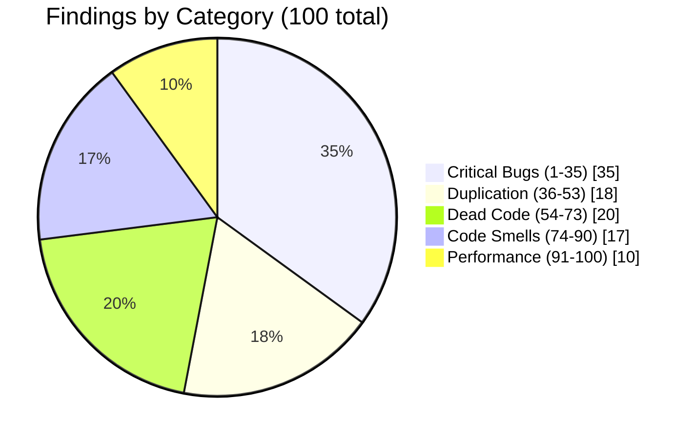
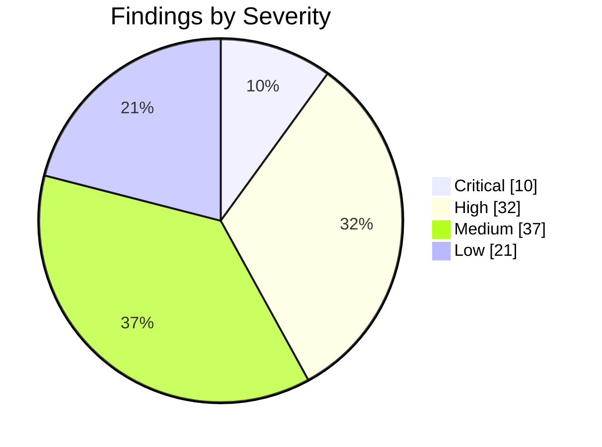

# r4e-ui2 — Code Audit: Top 100 Findings

> **Task:** `[FE] Tenant Actions · [r4e-ui2] · [Audit]` Full code review — code smells, dead code & duplication
>
> Each finding was confirmed against the real `src` code. Every entry below states the issue and the correct fix to apply, with the relevant code snippet. **Report only — no code has been changed.**

**How to read:** each line is one finding — `number · severity — issue`. Click a line to expand the file, the fix, the code to apply, and the supporting evidence.

**Severity:** 🔴 Critical (runtime bug / broken feature) · 🟠 High (correctness / maintainability risk) · 🟡 Medium (cleanup / standardization) · 🟢 Low (cosmetic / latent / no runtime effect)

---

## At a Glance





| Section                                               | Items  |   🔴   |   🟠   |   🟡   |   🟢   |
| ----------------------------------------------------- | :----: | :----: | :----: | :----: | :----: |
| [A. Critical Bugs](#critical-bugs)                    |  1–35  |   10   |   13   |   6    |   6    |
| [B. Duplication — Shared Utils / Hooks](#duplication) | 36–53  |   0    |   4    |   10   |   4    |
| [C. Dead Code Removal](#dead-code)                    | 54–73  |   0    |   6    |   10   |   4    |
| [D. Code Smells & Standardization](#code-smells)      | 74–90  |   0    |   5    |   8    |   4    |
| [E. Performance](#performance)                        | 91–100 |   0    |   4    |   3    |   3    |
| **All sections**                                      | 1–100  | **10** | **32** | **37** | **21** |

---

<a id="critical-bugs"></a>

## A. Critical Bugs — items 1–35

<details>
<summary><b>1 · 🔴 Critical</b> — All three MRR API URLs contain the misspelling `mananged-services` instead of `managed-services`, causing every call to `getMRRAgreement`, `saveMRRAgr…</summary>

> **File:** `src/admin/managed-services/volume-based-rule/MRRAgreements.ts:25,36,48`
>
> **Issue:** All three MRR API URLs contain the misspelling `mananged-services` instead of `managed-services`, causing every call to `getMRRAgreement`, `saveMRRAgreement`, and `searchMRRAgreement` to 404 at runtime. These functions are wired into live UI paths in `VolumeBasedRule.tsx` and `ActionMRRAgreementHistoryDashboard.tsx`, so the MRR Agreements feature is entirely broken in production.
>
> **Fix:** Replace `mananged-services` with `managed-services` at all three URL strings on lines 25, 36, and 48.

```ts
// L25
await axios.get(`/api/tenants/${tenantId}/managed-services/mrr-agreements`, { params });

// L36
await axios.get(`/api/tenants/${tenantId}/managed-services/mrr-agreements/${mrrAgreementID}`, { params });

// L48
await axios.post(`/api/tenants/${tenantId}/managed-services/mrr-agreements`, { ... });
```

> **Evidence:**

```ts
L25: await axios.get(`/api/tenants/${tenantId}/mananged-services/mrr-agreements`, { params });
L36: await axios.get(`/api/tenants/${tenantId}/mananged-services/mrr-agreements/${mrrAgreementID}`, { params });
L48: await axios.post(`/api/tenants/${tenantId}/mananged-services/mrr-agreements`, {...});
```

> **Note:** The backend route spelling (`managed-services`) is inferred from the enclosing directory name `admin/managed-services/`, the AppRoute path `/managed-services/volume-based-mrr`, and every other URL in the repo — it is not directly observable from this frontend-only repo. No existing test pins the misspelled URL, so the fix carries no test-breakage risk.

</details>
<details>
<summary><b>2 · 🔴 Critical</b> — The condition `String(EventType.ReviewResponseElastic).includes(lambda.eventType)` has its operands inverted and uses substring matching instead of eq…</summary>

> **File:** `admin/automation/automation-compose/AutomationCompose.tsx:1009`
>
> **Issue:** The condition `String(EventType.ReviewResponseElastic).includes(lambda.eventType)` has its operands inverted and uses substring matching instead of equality. Because `lambda.eventType` is a runtime string (e.g. "2", "4", "24") and the haystack is the fixed string "24", both Survey ("2") and Ticket ("4") match falsely — causing the 'Create' action to be wrongly appended to those rules before saving, which is a real data-corruption path.
>
> **Fix:** Replace the inverted `.includes` check with `String`-wrapped strict equality, consistent with how `lambda.eventType` is compared throughout the same `saveLambda` function (lines 983, 987):

```tsx
if (lambda.eventType === String(EventType.ReviewResponseElastic)) {
```

> **Evidence:**

```tsx
Line 1009: `if (String(EventType.ReviewResponseElastic).includes(lambda.eventType)) {`
EventType.ReviewResponseElastic = 24 → haystack is "24". lambda.eventType "2" (Survey) and "4" (Ticket) are substrings of "24", so both produce false-positive matches.
```

> **Note:** The fix must use `String(EventType.ReviewResponseElastic)` on the left-hand side — not the raw numeric enum value — because `lambda.eventType` is always a string at runtime (set via `String(eventType.key)` at line 226). Using the bare numeric literal `24 ===` would produce `false` for the legitimate ReviewResponseElastic case.

</details>
<details>
<summary><b>3 · 🔴 Critical</b> — The `valuesEmpty` flag in `validateFilterCriteria` uses `&&` instead of `||`, making the expression always `false` for every possible value of `filter…</summary>

> **File:** `src/admin/integrations2/rep-connect-wizard/filters/exclusion-filters/ExclusionFilters.tsx:172`
>
> **Issue:** The `valuesEmpty` flag in `validateFilterCriteria` uses `&&` instead of `||`, making the expression always `false` for every possible value of `filter.values` (null, empty array, or non-empty array). As a result, filters with null or empty `values` are never flagged as invalid and silently pass validation.
>
> **Fix:** Replace the `&&` with `||` in the `valuesEmpty` assignment so that null and empty arrays are both correctly detected as invalid.

```tsx
const valuesEmpty = !filter?.values || filter.values.length === 0
```

> **Evidence:**

```tsx
const valuesEmpty = !filter?.values && filter?.values?.length === 0
// !null(true) && undefined===0(false) → false;  short-circuits → false;  → false
// valuesEmpty is ALWAYS false — empty/null values are never caught
```

> **Note:** filter.values is typed string[] | null. The || form short-circuits safely: filter.values.length is only evaluated when filter?.values is truthy (a real non-null array), so no null dereference occurs.

</details>
<details>
<summary><b>4 · 🔴 Critical</b> — The `getViews` call hardcodes tenant ID `10`, so every authenticated user fetches views belonging to tenant 10 regardless of which tenant they are act…</summary>

> **File:** `admin/views/Views.tsx:57`
>
> **Issue:** The `getViews` call hardcodes tenant ID `10`, so every authenticated user fetches views belonging to tenant 10 regardless of which tenant they are actually viewing. This is a cross-tenant data exposure bug that affects every user of the Views screen.
>
> **Fix:** Read `tenantId` from the active route via `const { tenantId } = useParams&lt;Params&gt;()`, convert it to a number with `Number(tenantId)` (because `getViews` is typed `(tenantId: number, ...)` and `useParams` returns strings), pass it to `getViews`, and add `tenantId` to the `useEffect` dependency array so the view refetches when the route tenant changes.

```tsx
// admin/views/Views.tsx
interface Params {
  tenantId: string
}

const Views: React.FC = () => {
  const { tenantId } = useParams<Params>()

  useEffect(() => {
    getViews(Number(tenantId), { filters: [] }).then((views) => {
      // handle views
    })
  }, [tenantId])

  // ...
}
```

> **Evidence:**

```tsx
Views.tsx:56-57: `useEffect(() => { getViews(10, { filters: [] }).then((views) => {`
Views.api.ts:6-7: `export const getViews = async (tenantId: number, ...) => { const { data } = await axios.get<View[]>(`/api/tenants/${tenantId}/views`, ...)`
```

> **Note:** The `:tenantId` param is guaranteed to be present in the route — the component is mounted under `/agencies/:agencyId/tenants/:tenantId` (Admin.tsx:11,19) via Tenant.tsx and ViewsRoutes.tsx. The same `useParams&lt;Params&gt;()` + `Number(tenantId)` pattern is already established in Tenant.tsx:333,343. The URL shape `/api/tenants/{id}/views` is unchanged; only the id value is corrected.

</details>
<details>
<summary><b>5 · 🔴 Critical</b> — A `useEffect` at line 355 is called after an early return guard at lines 342-344 (`if (!profile) return &lt;div className="r4e-top-nav" /&gt;`), which…</summary>

> **File:** `common/chrome/top-nav/TopNav.tsx:342-355`
>
> **Issue:** A `useEffect` at line 355 is called after an early return guard at lines 342-344 (`if (!profile) return &lt;div className="r4e-top-nav" /&gt;`), which is a React Rules of Hooks violation. This causes React to see a different number of hook calls depending on the value of `profile`, corrupting the internal hook state and producing unpredictable rendering bugs at runtime. The violation is acknowledged by an `// eslint-disable-next-line react-hooks/rules-of-hooks` comment on line 354.
>
> **Fix:** Move the `useEffect` (line 355) above the `if (!profile)` guard so all hooks are called unconditionally on every render. The effect body already guards its own work internally with `if (profile.hasMultipleAccounts && isEmpty(users))`, so the relocation is behavior-preserving. Remove the `// eslint-disable-next-line react-hooks/rules-of-hooks` comment on line 354 once the hook is repositioned.

```tsx
// Place this useEffect ABOVE the `if (!profile)` guard, alongside the other hooks at lines 334-339:
useEffect(() => {
  if (profile.hasMultipleAccounts && isEmpty(users)) {
    // ... existing effect body unchanged ...
  }
}, [profile])

// Then the early return follows unconditionally:
if (!profile) {
  return <div className='r4e-top-nav' />
}
```

> **Evidence:**

```tsx
Lines 342-344: `if (!profile) {\n    return <div className="r4e-top-nav" />;\n}` is an early return. Lines 354-355: `// eslint-disable-next-line react-hooks/rules-of-hooks\nuseEffect(() => { ... }, [profile]);` — a hook called after the early return.
```

> **Note:** The component author added `// eslint-disable-next-line react-hooks/rules-of-hooks` on line 354, confirming the violation is known. Remove that comment after repositioning the hook. All 6 other hooks (lines 334-339) are already correctly placed above the guard and require no changes.

</details>
<details>
<summary><b>6 · 🔴 Critical</b> — The argument to isNumber is `get(profile,'tenant.id') && !profile.isAgencyUser`. The `&&` short-circuits so that for a non-agency user with a valid (t…</summary>

> **File:** `src/common/chrome/left-nav/nav-tabs/NavTabs.tsx:1798`
>
> **Issue:** The argument to isNumber is `get(profile,'tenant.id') && !profile.isAgencyUser`. The `&&` short-circuits so that for a non-agency user with a valid (truthy) tenant id, the entire expression evaluates to the boolean `!profile.isAgencyUser` (i.e., `true`), and `isNumber(boolean)` is always false. As a result, `getDepartmentHealthSupport` is never called and `supportsDepartments` stays false, causing the RS Impact Report subtab to be suppressed for all non-agency tenant users.
>
> **Fix:** Split the calls so isNumber checks only the tenant id and the agency guard is a separate boolean predicate.

```tsx
if (isNumber(get(profile, 'tenant.id')) && !profile.isAgencyUser) {
```

> **Evidence:**

```tsx
L1798: `if (isNumber(get(profile, 'tenant.id') && !profile.isAgencyUser)) {`  — the `&&` short-circuits inside isNumber(), returning the boolean `!profile.isAgencyUser` (true) for non-agency users with a valid tenant id; isNumber(true) === false, so getDepartmentHealthSupport is never called and supportsDepartments stays false.
```

> **Note:** Agency users still receive the RS Impact Report link via the existing `|| profile.isAgencyUser` branch at line 1197, so they are unaffected. The catch block at L1805 silently swallows all errors (`catch (err) {}`), meaning any future failure in getDepartmentHealthSupport would also leave supportsDepartments false — that is pre-existing and outside this finding.

</details>
<details>
<summary><b>7 · 🔴 Critical</b> — The globalFilter effect (L229-237) dereferences `sortBy[0].id` and `sortBy[0].desc` without guarding against an empty array. Because `disableSortRemov…</summary>

> **File:** `core/table/advanced/TableAdvanced.tsx:233`
>
> **Issue:** The globalFilter effect (L229-237) dereferences `sortBy[0].id` and `sortBy[0].desc` without guarding against an empty array. Because `disableSortRemove` defaults to `false`, users can remove all column sorting — leaving `sortBy=[]` — and then type in the search box, which fires this effect and throws. Additionally, L266 spreads the bare `getTableProps` function reference instead of invoking it, silently dropping react-table's `role="table"` attribute and collapse styles.
>
> **Fix:** 1) L266: invoke the getter — change `{...getTableProps}` to `{...getTableProps()}`. 2) L233-234: optional-chain the sortBy deref so search still fires when no sort is active — replace the bare property accesses with `sortBy?.[0]?.id` and `sortBy?.[0]?.desc`.

```tsx
// L266 — invoke getTableProps
<Table {...getTableProps()}>

// L233-234 — guard the deref with optional chaining
onUpdate({
  sortById: sortBy?.[0]?.id,
  sortByOrder: sortBy?.[0]?.desc ? SortOrder.Desc : SortOrder.Asc,
  // ...other fields unchanged
});
```

> **Evidence:**

```tsx
L266: `<Table {...getTableProps}>` — spreads the function, NOT invoked (contrast L291 `<tbody {...getTableBodyProps()}>` which IS invoked). L233-234: `onUpdate({ sortById: sortBy[0].id, sortByOrder: sortBy[0].desc ? ... })` — no `sortBy.length` guard, unlike L171-172, L191-192, L223.
```

> **Note:** Adding `sortBy.length` to the outer `if` condition instead of optional-chaining would suppress the search request entirely whenever sorting is cleared — a behavior regression. Optional-chaining the deref preserves search-with-no-sort. Callers that pass `disableSortRemove=true` (ListingsAvg, Sentiment, LocationList) are not affected by the crash; Roles, Users, Teams, and Tags callers are exposed. The commented-out useControlledState block (L129-146) already anticipated `sortBy=[]` with an explicit guard, confirming the state is expected.

</details>
<details>
<summary><b>8 · 🔴 Critical</b> — Inside the `withLocale` HOC, `useProfile()` is called conditionally — only when the `locale` prop is falsy. This is a direct Rules-of-Hooks violation:…</summary>

> **File:** `src/core/datepicker/DatePicker.tsx:32-33`
>
> **Issue:** Inside the `withLocale` HOC, `useProfile()` is called conditionally — only when the `locale` prop is falsy. This is a direct Rules-of-Hooks violation: if any of the ~45 call sites toggles the `locale` prop between a truthy value and `undefined` across renders, React's hook count changes and throws "Rendered fewer/more hooks than during the previous render", crashing the affected component tree.
>
> **Fix:** Move the `useProfile()` call unconditionally to the top of the inner render function, then keep the existing `if (!locale)` switch that consumes `profile`. This preserves all current behaviour while obeying the Rules of Hooks.

```tsx
const withLocale = <P extends object>(Component: ComponentType<P>) => {
  return (props: any): JSX.Element => {
    let { locale } = props
    const [{ profile }] = useProfile() // unconditional — moved out of if-block
    if (!locale) {
      switch (
        profile?.user.locale
        // ... existing cases unchanged
      ) {
      }
    }
    return <Component locale={locale} {...props} />
  }
}
```

> **Evidence:**

```tsx
if (!locale) {
  const [{ profile }] = useProfile();   // hook inside conditional
  switch (profile?.user.locale) { ... }
}
```

> **Note:** The fix is safe because `useProfile()` is already called whenever `locale` is falsy today, so a ProfileProvider ancestor must already exist for all current consumers. The unrelated quirk where `{...props}` follows `locale={locale}` in the JSX spread — allowing a `locale` key in props to override the computed value — is pre-existing and out of scope for this fix.

</details>
<details>
<summary><b>9 · 🔴 Critical</b> — Line 128 assigns the entire `existingPrivileges` array to the singular `existingPrivilege` instead of taking element `[0]`. Because arrays have no `.i…</summary>

> **File:** `flex-reports/api/FlexReports.ts:128`
>
> **Issue:** Line 128 assigns the entire `existingPrivileges` array to the singular `existingPrivilege` instead of taking element `[0]`. Because arrays have no `.id` property, the guard `if (existingPrivilege && existingPrivilege.id)` always evaluates to false, so the DELETE request to remove a stale object-privilege is never sent. As a result, setting a report to PRIVATE silently fails to delete the old privilege and the report remains publicly accessible. On the PUBLIC branch, the spread `...(existingPrivilege || {})` copies numeric array indices into the payload and `existingPrivilege?.id` resolves to `undefined`, falling back to `String(dashboardId)`.
>
> **Fix:** Replace the array assignment with an index lookup: `const existingPrivilege = existingPrivileges.length &gt; 0 ? existingPrivileges[0] : null;`. This yields a real privilege object so the `.id` guard passes, the DELETE fires correctly, and the PUBLIC-branch spread copies actual privilege fields rather than array indices.

```ts
const existingPrivilege =
  existingPrivileges.length > 0 ? existingPrivileges[0] : null
```

> **Evidence:**

```ts
L128: const existingPrivilege = existingPrivileges.length > 0 ? existingPrivileges : null;
L131: if (existingPrivilege && existingPrivilege.id) {
L132:     await flexReportsHttp.delete(`/api/tenants/${tenantId}/object-privileges/${existingPrivilege.id}`);
L146: ...(existingPrivilege || {}),
L147: id: existingPrivilege?.id || String(dashboardId),
```

> **Note:** After applying the fix, confirm that the L146 spread `...(existingPrivilege || {})` merging prior privilege fields is intentional — the backend object-privilege endpoint must treat a re-POST with the same id as an upsert for this to be correct.

</details>
<details>
<summary><b>10 · 🔴 Critical</b> — The reconciliation effect guard includes `globalFilters.length === 0` as an early-return condition, causing the entire dashboard to skip widget execut…</summary>

> **File:** `src/flex-reports/dashboards/dashboard/hooks/useReportOrchestrator.ts:126`
>
> **Issue:** The reconciliation effect guard includes `globalFilters.length === 0` as an early-return condition, causing the entire dashboard to skip widget execution whenever a user has no global filters selected. Because `isFiltersReady` already distinguishes the loading state (`propGlobalFilters === undefined`) from a legitimately loaded empty selection (`[]`), an empty filter array is a valid runtime state — not a reason to abort execution.
>
> **Fix:** Remove the `globalFilters.length === 0` clause from the guard at line 126. The remaining conditions (`!report`, `!tenantId`, `!isFiltersReady`, `isWidgetBuilderOpen`, `!globalFilters`) are sufficient. Downstream `executeSingleWidget` → `mergeGlobalAndPanelRunFilters` handles an empty array correctly, so widgets will run with only panel-level filters applied.

```ts
if (
  !report ||
  !tenantId ||
  !isFiltersReady ||
  isWidgetBuilderOpen ||
  !globalFilters
) {
  return
}
```

> **Evidence:**

```ts
if (
    !report ||
    !tenantId ||\n    !isFiltersReady ||
    isWidgetBuilderOpen ||
    !globalFilters ||
    globalFilters.length === 0   // line 126
) {
    return;
}
```

> **Note:** The existing test file covers `useWidgetExecutionOrchestrator` only and does not assert the empty-filter early-return path, so no test changes are required. The fix carries no backend-contract risk: `mergeGlobalAndPanelRunFilters` already tolerates an empty filters array.

</details>
<details>
<summary><b>11 · 🟠 High</b> — The axios GET call passes the params object directly as the second argument instead of wrapping it in `{ params }`. Axios interprets the second argume…</summary>

> **File:** `src/admin/attribute-lookups/AttributeLookups.api.ts:14`
>
> **Issue:** The axios GET call passes the params object directly as the second argument instead of wrapping it in `{ params }`. Axios interprets the second argument as an `AxiosRequestConfig`; since `agencyId`, `tenantId`, `search`, and `args` are not recognized config keys, they are silently dropped and the server receives no query string, causing attribute-lookup fetches to return incorrect or empty results.
>
> **Fix:** Wrap the params variable in a config object so axios serializes it as a query string: replace the bare `params` argument with `{ params }` in the axios.get call, matching the convention used by all 23 sibling API files (e.g. Entities.api.ts:14).

```ts
const response: AxiosResponse = await axios.get(
  `/api/tenants/${tenantId}/attribute-lookups`,
  { params },
)
```

> **Evidence:**

```ts
const params: any = { agencyId, tenantId, search, args }
const response: AxiosResponse = await axios.get(
  `/api/tenants/${tenantId}/attribute-lookups`,
  params,
)
```

> **Note:** The sole caller is CreateLocation.tsx:91. After this fix, agencyId, tenantId, and search will be sent as query parameters for the first time; the endpoint already supports them (as do sibling endpoints), so no backend contract change is needed.

</details>
<details>
<summary><b>12 · 🟠 High</b> — The guard condition that falls back to resolving a selected attribute from survey data uses `&&` to check whether `eventType.value` equals both `Event…</summary>

> **File:** `src/admin/automation/ruleBuilder/trigger-components/AttributeSelection.tsx:151-157`
>
> **Issue:** The guard condition that falls back to resolving a selected attribute from survey data uses `&&` to check whether `eventType.value` equals both `EventType.Survey` (2) and `EventType.ElasticSurvey` (22) simultaneously. Because these are distinct enum values, the condition is always false and the fallback `find(surveyData.current, { name: option.value })` is dead code — survey-sourced attributes whose name is not in the `attributes` prop silently produce a no-op click instead of resolving correctly.
>
> **Fix:** Replace `&&` with `||` in the compound eventType check so the block executes when the event type is either Survey or ElasticSurvey.

```tsx
if (
  !selectedAttribute &&
  (Number(eventType?.value) === EventType.Survey ||
    Number(eventType?.value) === EventType.ElasticSurvey)
) {
  selectedAttribute = find(surveyData.current, { name: option.value })
}
```

> **Evidence:**

```tsx
if (
  !selectedAttribute &&
  Number(eventType?.value) === EventType.Survey &&
  Number(eventType?.value) === EventType.ElasticSurvey
) {
  selectedAttribute = find(surveyData.current, { name: option.value })
}
```

> **Note:** The fix aligns with the existing `SURVEY_TEMPLATE_ENABLED_EVENTS = [EventType.Survey, EventType.ElasticSurvey]` pattern used elsewhere in the same module. `surveyData.current` is populated by `fetchSurveyExpressions` when a survey event is selected, so the corrected branch will have valid data to search at the time it runs.

</details>
<details>
<summary><b>13 · 🟠 High</b> — In admin/integrations2, 10 files across 11 catch-block sites access `error.response.data` (or `(error as any).response.data`) without optional chainin…</summary>

> **File:** `src/admin/integrations2/run-integration/RunIntegration.tsx:39`
>
> **Issue:** In admin/integrations2, 10 files across 11 catch-block sites access `error.response.data` (or `(error as any).response.data`) without optional chaining on `.response`. Axios sets `error.response` to undefined on network failures, CORS errors, timeouts, and cancellations, so `.data` throws a TypeError inside the catch handler — masking the original error, crashing the handler, and leaving the UI in an inconsistent state with no visible error message for run, import, and save flows.
>
> **Scope:** 10 files / 11 catch-block sites: RunIntegration.tsx, ActiveIntegrations.tsx (×2), IntegrationHistory.tsx, IntegrationHistoryModal.tsx, ImportConfig.tsx, RepConnectWizard.tsx, Tabs.tsx, Map.tsx, DataObjectColumns.tsx, useReview.tsx
>
> **Fix:** Add optional chaining at the `.response` boundary on all 11 unsafe sites. Replace bare `error.response.data` and `(error as any).response.data` with `(error as any)?.response?.data?.error?.detail`, and add a generic fallback string when `detail` is undefined. Downstream `?.error?.detail` is already optional-chained, so the success path is unchanged.

```tsx
// Representative fix — apply the same pattern to all 11 sites
} catch (error) {
  const detail =
    (error as any)?.response?.data?.error?.detail ??
    'An unexpected error occurred.';
  // use `detail` for the user-facing message
}
```

> **Evidence:**

```tsx
RunIntegration.tsx:38-39: `} catch (error) {  const detail = error.response.data?.error?.detail;`  ActiveIntegrations.tsx:236-237: `} catch (error) { let text = (error as any).response.data?.error?.detail;`  Same unguarded `.response.data` at Map.tsx:250-251, IntegrationHistory.tsx:242-243, and 6 further sites.
```

> **Note:** Fix is purely defensive — adding `?.` has no effect on the success path and carries no backend-contract assumption. Files that already use `error?.response?.data` or `response?.data` (TestRun.tsx, AdvancedScript.tsx, CustomSftp.ts, ReputationSftp.ts, useDataPreviewGenerator.ts, Lookups.tsx, integration-scripts) are unaffected and require no change.

</details>
<details>
<summary><b>14 · 🟠 High</b> — When loading a saved integration into wizard state, `isValid: savedIntegration.cleanupPolicy?.enabled === false || true` is unconditionally `true` due…</summary>

> **File:** `admin/integrations2/rep-connect-wizard/Integration.store.tsx:222`
>
> **Issue:** When loading a saved integration into wizard state, `isValid: savedIntegration.cleanupPolicy?.enabled === false || true` is unconditionally `true` due to operator precedence — the `=== false` comparison is dead. This means a malformed saved cleanup policy (cleanup enabled but no strategy set) is never flagged as invalid on load, allowing a broken configuration to pass UI gating in the edit flow.
>
> **Fix:** Replace the hardcoded expression with the real validity rule that mirrors the component's own logic in CleanupModule.tsx: valid when cleanup is not enabled, or when it is enabled and a strategy is present. Use the code below.

```ts
isValid: !savedIntegration.cleanupPolicy?.enabled || !!savedIntegration.cleanupPolicy?.strategy,
```

> **Evidence:**

```ts
integrationState.cleanUpForm = {
  isValid: savedIntegration.cleanupPolicy?.enabled === false || true,
  formValues: cleanupFormValues,
}
```

> **Note:** cleanUpForm.isValid gates UI in Filters.tsx:150 (`invalid={cleanUpForm ? !cleanUpForm.isValid : false}`) and the Tabs.tsx review/save flow, so this only affects the edit path for already-persisted integrations, not the new-creation flow (governed by CleanupModule.onFormChange). Verify that CleanupPolicy.strategy is the sole required field when enabled — consult RepConnect.types.ts:4715 and hasConfiguredValues (CleanupModule.tsx:85-88) before finalizing the check.

</details>
<details>
<summary><b>15 · 🟠 High</b> — The publishing toggle's onChange handler calls setAuditing(e.target.checked) instead of setPublishing(e.target.checked). This immediately and incorrec…</summary>

> **File:** `src/admin/listings/sources/Sources.tsx:398`
>
> **Issue:** The publishing toggle's onChange handler calls setAuditing(e.target.checked) instead of setPublishing(e.target.checked). This immediately and incorrectly flips the auditing optimistic state at toggle time, corrupting the auditing UI, while the publishing state is never updated optimistically — so the publishing switch and its ON/OFF label remain stale until the async save resolves (and are silently left wrong if the save fails).
>
> **Fix:** Replace setAuditing with setPublishing in the publishing toggle's onChange handler so the optimistic state update targets the correct state variable.

```tsx
onChange={(e: any): void => {
    setPublishing(e.target.checked);
    saveSettings(e.target.checked, id, ModuleId.DirectoryManaging);
}}
```

> **Evidence:**

```tsx
onChange={(e: any): void => {
    setAuditing(e.target.checked);
    saveSettings(e.target.checked, id, ModuleId.DirectoryManaging);
}}
```

> **Note:** saveSettings() on async success calls both setAuditing(toggle) and setPublishing(toggle), which partially masks the bug once the save resolves. The fix only corrects the optimistic update and does not change the saveSettings callback. The separate concern that saveSettings sets both states to the same toggle value is out of scope for this fix.

</details>
<details>
<summary><b>16 · 🟠 High</b> — Six entries in NewStackRoutes have broken regexes that match nothing at runtime. Lines 97–101 each contain a stray literal `}` character (e.g., `/acti…</summary>

> **File:** `src/core/util/Route.ts:97-101,127`
>
> **Issue:** Six entries in NewStackRoutes have broken regexes that match nothing at runtime. Lines 97–101 each contain a stray literal `}` character (e.g., `/actions/agents}`) so the pattern can never match a real path. Line 127 uses `^/score2$/` where the `$` anchor followed by `/` is unsatisfiable, and even `^/score2$` alone would block sub-routes like `/score2/targets` and `/score2/components`. Because `Routing.isNewStackRoute` calls `route.test(path)`, all six `/actions/*` and `/score2` navigations fall through to `REACT_APP_OLD_STACK_HOST` instead of staying in the new stack.
>
> **Fix:** Remove the stray `}` from the five `/actions/*` patterns on lines 97–101, making them plain prefix matches. For line 127, replace the pattern with `new RegExp(\`^\${Route.Score2}\`)`(drop both the`$`anchor and the trailing`/`) so that `/score2`and all its sub-routes are correctly matched by the prefix. Update the mirrored regexes in`src/core/util/Route.test.ts` lines 101–105 and 131 at the same time, or the snapshot equality check will fail.

```ts
// lines 97-101 — remove stray `}` from each pattern
new RegExp(`${Route.Actions}/agents`),
new RegExp(`${Route.Actions}/overview2`),
new RegExp(`${Route.Actions}/agency-tickets`),
new RegExp(`${Route.Actions}/lookback`),
new RegExp(`${Route.Actions}/mrr-dashboard`),

// line 127 — prefix match only, no $ anchor, no trailing /
new RegExp(`^${Route.Score2}`),
```

> **Evidence:**

```ts
new RegExp(`${Route.Actions}/agents}`), `${Route.Actions}/overview2}`, `${Route.Actions}/agency-tickets}`, `${Route.Actions}/lookback}`, `${Route.Actions}/mrr-dashboard}`). Line 127: new RegExp(`^${Route.Score2}$/`)
```

> **Note:** Using `^/score2$` (dropping only the trailing `/`) would be a behavior regression: it matches `/score2` exactly but sends `/score2/targets`, `/score2/components`, and `/score2/targets/create` (all defined in `src/score/Score.tsx` and `src/score/targets-container/TargetsRoutes.tsx`) to the old stack. The prefix form `^${Route.Score2}` is required. The snapshot in `src/core/util/Route.test.ts:101-105,131` mirrors the buggy regexes and must be updated alongside this fix.

</details>
<details>
<summary><b>17 · 🟠 High</b> — The `useEffect` in `HttpInterceptor` registers a new `axios.interceptors.request.use` and `axios.interceptors.response.use` pair on the global axios s…</summary>

> **File:** `src/core/util/Http.tsx:33-147`
>
> **Issue:** The `useEffect` in `HttpInterceptor` registers a new `axios.interceptors.request.use` and `axios.interceptors.response.use` pair on the global axios singleton every time `profile`, `dispatch`, `t`, or `dispatchTicketReloadModal` changes, but returns no cleanup function and never ejects the interceptors. Because the component is mounted for the entire session, interceptors accumulate and each stacked response interceptor fires independently on a single error, producing duplicate error toasts and duplicate 401 redirects.
>
> **Fix:** Capture both interceptor IDs and eject them in the effect's cleanup return. Replace the effect body's registration and closing lines with the snippet below.

```tsx
useEffect(() => {
  const reqId = axios.interceptors.request.use(
    (config) => {
      // existing request handler body (unchanged)
      return config
    },
    (error) => Promise.reject(error),
  )

  const resId = axios.interceptors.response.use(
    (response) => response,
    (error) => {
      // existing response error handler body (unchanged)
      return Promise.reject(error)
    },
  )

  setInterceptorRegistered(true)

  return () => {
    axios.interceptors.request.eject(reqId)
    axios.interceptors.response.eject(resId)
  }
}, [profile, dispatch, t, dispatchTicketReloadModal])
```

> **Evidence:**

```tsx
useEffect(() => {
  axios.interceptors.request.use(...)
  axios.interceptors.response.use(...)
  setInterceptorRegistered(true);
}, [profile, dispatch, t, dispatchTicketReloadModal]);
// no eject, no cleanup return — interceptors accumulate on the global singleton
```

> **Note:** Both IDs must be ejected — ejecting only one still leaks the other. The `isInterceptorRegistered` flag gates child rendering only and does not prevent re-registration, so it provides no mitigation for this leak. The cleanup return does not affect the children rendering gate.

</details>
<details>
<summary><b>18 · 🟠 High</b> — addToList builds a newList array and correctly invokes onChange, but never calls setList(newList), so the component's internal list state is never upd…</summary>

> **File:** `core/list-builder/ListBuilder.tsx:72-99`
>
> **Issue:** addToList builds a newList array and correctly invokes onChange, but never calls setList(newList), so the component's internal list state is never updated. Because the rendered bubbles read from that internal state (line 210), newly added items are silently discarded from the UI until an external defaultList change triggers the effect at line 65. Additionally, the reset of entered values mutates the inputValues state array in place instead of going through setInputValues, causing React to skip the re-render that should clear the input fields.
>
> **Fix:** Inside the `if (Object.keys(listItem).length)` block, add `setList(newList)` after pushing the item. Replace the in-place mutation of inputValues with `setInputValues(prev =&gt; prev.map((v, i) =&gt; inputValues[i] ? '' : v))` (or a fresh reset array via setInputValues). This mirrors the existing removeFromList pattern at lines 101-109.

```tsx
// inside addToList, within the if (Object.keys(listItem).length) block:
newList.push(listItem)
setList(newList) // was missing — update internal state
setSelectedOption({})
if (onChange) {
  onChange(newList)
}

// replace the in-place mutation at line 81:
setInputValues(inputValues.map(() => '')) // immutable reset; do NOT do inputValues[i] = ''
```

> **Evidence:**

```tsx
const newList = [...list]; ... forEach(inputMetadata, (inputItem, inputIndex) => { if (inputValues[inputIndex]) { listItem[inputItem.id] = inputValues[inputIndex]; inputValues[inputIndex] = '';  // direct mutation ... }}); if (Object.keys(listItem).length) { newList.push(listItem); setSelectedOption({}); if (onChange) { onChange(newList); } }  // setList never called
```

> **Note:** Rendered bubbles come from internal `list` state (line 210). The consumer (Recipient.tsx line 190-224) passes defaultList={populatedDefaultList}, which is only recomputed from [defaultList, profile] and does not feed on onChange output, so the missing setList call means added items never appear until an unrelated external change triggers the defaultList effect. The fix is consistent with removeFromList (line 101-109) and will not regress that path.

</details>
<details>
<summary><b>19 · 🟠 High</b> — User-supplied automation rule parameter values (including free-text fields such as acknowledgement e-mail subject and body) are interpolated directly …</summary>

> **File:** `src/admin/automation/ruleBuilder/ActionsComposer.tsx:180`
>
> **Issue:** User-supplied automation rule parameter values (including free-text fields such as acknowledgement e-mail subject and body) are interpolated directly into a dangerouslySetInnerHTML template without sanitization, creating a stored XSS surface. Any malicious payload stored in those parameters is injected into the DOM when ActionPreview renders.
>
> **Fix:** Sanitize each user-supplied array element with DOMPurify before interpolating into the HTML string. DOMPurify (dompurify ^2.4.2) is already a project dependency. Apply it to the individual value elements so the intentional structural markup (the `&lt;strong&gt;` wrapper and literal join tokens) is preserved while malicious payloads are stripped.

```tsx
import DOMPurify from 'dompurify'

// Inside ActionPreview render:
{
  values.map((value: any, valueIndex) => (
    <div
      dangerouslySetInnerHTML={{
        __html: `<strong>${value
          .map((v: string) => DOMPurify.sanitize(v))
          .join('</strong> as ')}`,
      }}
      key={`valueIndex-${valueIndex}`}
    />
  ))
}
```

> **Evidence:**

```tsx
values.map((value: any, valueIndex) => ( <div dangerouslySetInnerHTML={{ __html: `<strong>${value.join('</strong> as ')}` }} key={`valueIndex-${valueIndex}`} /> )). The `value` elements originate from action.parameters / paramMeta labels including free-text fields; no sanitization is applied before interpolation.
```

> **Note:** The practical blast radius depends on trust model: if only the authoring admin ever views their own preview this is self-XSS. If rule previews are visible to other users or if lower-trust actors can influence parameter values, the impact is higher. Sanitize each element individually — the literal `&lt;/strong&gt; as ` join tokens are part of the intended template structure and must not be treated as user input.

</details>
<details>
<summary><b>20 · 🟠 High</b> — Async IIFEs and async callbacks across admin/inbox/surveys/tickets (e.g. Stages.tsx:35, Integrations2.tsx:42, ActionsTicket.tsx:126) await API calls w…</summary>

> **File:** `src/inbox/stages/Stages.tsx:35`
>
> **Issue:** Async IIFEs and async callbacks across admin/inbox/surveys/tickets (e.g. Stages.tsx:35, Integrations2.tsx:42, ActionsTicket.tsx:126) await API calls with no try/catch. Because no global unhandledrejection handler exists and React ErrorBoundaries do not catch async rejections, a rejected promise silently fails to update UI state. At sites that set a manual loading flag without a finally block, a rejection also leaves the spinner permanently active.
>
> **Fix:** For each unguarded IIFE or async callback (after confirming it has no existing try/catch), wrap the body in try/catch/finally: dispatch ShowError in catch, and clear any manual loading flag in finally. Skip sites that are already guarded (e.g. DuplicateListing.tsx:117) to avoid double-handling. For sites using react-promise-tracker's trackPromise the finally block is not needed for spinner cleanup — add only the catch + ShowError. Apply the fix incrementally per site; do not attempt a single sweeping codemod across the entire codebase.

```tsx
;(async () => {
  try {
    const result = await getStages(currentConversation.tenantID)
    setStageOptions(result)
    // ... other state updates
  } catch (err) {
    dispatch(ShowError('Failed to load stages.'))
  } finally {
    setLoading(false) // only needed where a manual loading flag exists
  }
})()
```

> **Evidence:**

```tsx
Stages.tsx:35 `(async () => { const result = await getStages(currentConversation.tenantID); setStageOptions(result); ... })();` — no try/catch. ActionsTicket.tsx:126 bare `(async () => { ... const locationsResponse = await getLocations(...); ... })()` — no try/catch. Integrations2.tsx:42 `(async () => { setTenant(await getTenant()); })();` — no try/catch.
```

> **Note:** The affected count is materially lower than the originally claimed ~133 files: ~229 async IIFE occurrences exist in non-test files but a non-trivial subset already include try/catch (e.g. DuplicateListing.tsx:117). A proposed useAsyncAction shared hook does not exist in the repo and would need to be designed and built before any migration to it; treat that as a future improvement, not a prerequisite for this fix.

</details>
<details>
<summary><b>21 · 🟠 High</b> — Every OAuth connect or reauth click registers a new anonymous `window.addEventListener('message', ...)` handler that is never removed. Handlers accumu…</summary>

> **File:** `src/common/popup-window/popup-window.tsx:16-41`
>
> **Issue:** Every OAuth connect or reauth click registers a new anonymous `window.addEventListener('message', ...)` handler that is never removed. Handlers accumulate across attempts and stale listeners re-fire on future postMessage events. None of the four files validate `event.origin`, trusting only `data.app === 'r4e-ui2'`, so any window able to craft that payload shape can trigger the OAuth success path.
>
> **Fix:** Store the listener as a named reference and call `removeEventListener` with that same reference after the popup resolves, rejects, or the component unmounts. Add an `event.origin` allowlist check using the app origin from `configContainer.config.urls.app` (the same URL passed to `openOAuthWindow`/`popup`) before processing any message. In React components, register and clean up the listener inside a `useEffect` (with the popup window as a dependency) so React's cleanup cycle handles teardown automatically. Extract a shared `useOAuthMessageListener` hook to consolidate the five registration sites.

```ts
// popup-window.tsx — illustrative named-ref + origin-check pattern
export function popup(url: string, name: string): Promise<MessageEvent> {
  return new Promise((resolve, reject) => {
    const authWindow = window.open(url, name /* features */)
    if (!authWindow) {
      reject(new Error('popup blocked'))
      return
    }

    const expectedOrigin = new URL(url).origin

    function onMessage(e: MessageEvent) {
      if (e.origin !== expectedOrigin) return
      if (!authWindow || e.data?.app !== 'r4e-ui2') return
      cleanup()
      resolve(e)
    }

    function cleanup() {
      window.removeEventListener('message', onMessage, false)
    }

    window.addEventListener('message', onMessage, false)

    // also clean up if the popup is closed without posting a message
    const poll = setInterval(() => {
      if (authWindow.closed) {
        clearInterval(poll)
        cleanup()
        reject(new Error('popup closed'))
      }
    }, 500)
  })
}
```

> **Evidence:**

```ts
popup-window.tsx:22 `eventer(messageEvent, (e)=>{ if(authWindow){ if(e.data.app !== 'r4e-ui2'){return;} ... } }, false);` — no removeEventListener, no e.origin check. CredentialsAccountss.tsx:453 `window.addEventListener('message', async (event)=>{ ... }, false);` registered from click handler, never removed. grep for removeEventListener and `.origin` across all 4 files: 0 matches.
```

> **Note:** Five listener-registration sites across four files must all be updated: popup-window.tsx (x1), CredentialsAccountss.tsx (x1), PageTokenAccounts.tsx (x2), OauthLoginCard.tsx (x1). The origin check must derive the allowed origin from `configContainer.config.urls.app` at runtime — a hardcoded literal will silently break the OAuth callback in non-production environments. Inline arrow functions cannot be detached via `removeEventListener`; each site must bind the handler once to a named reference (or store it in a `useRef`) before registering it.

</details>
<details>
<summary><b>22 · 🟠 High</b> — The `OthersConversations` filter at line 121 uses `||` instead of `&&`, making it the logical inverse of a complement: it passes nearly every conversa…</summary>

> **File:** `src/inbox/Inbox.store.tsx:85,121`
>
> **Issue:** The `OthersConversations` filter at line 121 uses `||` instead of `&&`, making it the logical inverse of a complement: it passes nearly every conversation (any not assigned to the current user, plus the user's own when their id is absent from rIDs), so the "Others" view is effectively broken. Separately, the localStorage key builder at line 85 contains a stray `}` producing the suffix `...${locale}}`, producing an inconsistent key relative to the sort key at line 89.
>
> **Fix:** Change the `||` on line 121 to `&&` so OthersConversations is the true logical complement of MyConversations. Remove the stray `}` on line 85; note that this changes the persisted localStorage key, so existing users will see their saved filter reset to the default once (one-time, harmless).

```ts
// Line 121 — fix || → &&
case FilterName.OthersConversations: {
  return (
    conversation.assignee?.id !== profile.user.id &&
    !includes(profile.user.rIDs, conversation.assignee?.id)
  );
}

// Line 84-85 — remove stray }
const getConversationsFilterKey = (profile) => {
  return `r4e-inbox-conversations-filter-${profile.user.id}-${profile.user.locale}`;
};
```

> **Evidence:**

```ts
case FilterName.OthersConversations: { return ( conversation.assignee?.id !== profile.user.id || !includes(profile.user.rIDs, conversation.assignee?.id) ); }
// line 85:
return `r4e-inbox-conversations-filter-${profile.user.id}-${profile.user.locale}}`;
```

> **Note:** The stray-`}` fix silently invalidates already-persisted filter selections for existing users (one-time reset to DEFAULT_SELECTED_FILTER) because the localStorage key changes. Filter persistence is not currently broken — the read and write paths both call the same `getConversationsFilterKey`, so the round-trip is symmetric today; the extra brace is a cosmetic inconsistency relative to the sort key.

</details>
<details>
<summary><b>23 · 🟠 High</b> — setLocationUid is a copy-paste of setActiveQuestionId and writes state.activeQuestionId instead of state.locationUid, so locationUid is never updated.…</summary>

> **File:** `surveys-public/store/survey-plan/SurveyPlanReducers.ts:35-37`
>
> **Issue:** setLocationUid is a copy-paste of setActiveQuestionId and writes state.activeQuestionId instead of state.locationUid, so locationUid is never updated. If the action is ever dispatched, it will silently corrupt activeQuestionId (typed QuestionID | null) with a string | null value while leaving locationUid permanently at its initial null.
>
> **Fix:** Replace state.activeQuestionId with state.locationUid inside setLocationUid so the reducer writes the correct field.

```ts
export const setLocationUid = (
  state: SurveyPlanState,
  action: PayloadAction<string | null>,
) => {
  state.locationUid = action.payload
}
```

> **Evidence:**

```ts
export const setLocationUid = (
  state: SurveyPlanState,
  action: PayloadAction<string | null>,
) => {
  state.activeQuestionId = action.payload
}
```

> **Note:** No callsite currently dispatches setLocationUid, so runtime blast radius today is zero. The fix carries no regression risk, but the selector selectLocationUid (SurveyPlanSlice.ts:142) will only return meaningful values once the action is actually dispatched.

</details>
<details>
<summary><b>24 · 🟡 Medium</b> — Inside `getSftpAutomationReviewDetails`, the block at lines 710-712 calls `automationReviewDetails.filter(...)` and discards the return value. `Array.…</summary>

> **File:** `src/admin/integrations2/rep-connect-wizard/Util.ts:710-712`
>
> **Issue:** Inside `getSftpAutomationReviewDetails`, the block at lines 710-712 calls `automationReviewDetails.filter(...)` and discards the return value. `Array.prototype.filter` never mutates the original array, so the entire `if (integrationType === IntegrationType.SurveyExport)` block is a pure no-op — introduced as dead code in commit 364a6b696 (RC-1685). Because the return value is rendered directly as the automation review card list (via `useReview.tsx:143`), any future attempt to "fix" this by naively assigning the result back would silently drop the SFTP_DETAILS card from the SurveyExport review page.
>
> **Fix:** Delete the entire dead-code block (lines 710-712). This preserves current runtime behavior (SurveyExport shows both SFTP_DETAILS and FILE_DETAILS cards) while removing the misleading no-op. Only reintroduce a filtering step if a product requirement explicitly confirms SurveyExport should display only the FILE_DETAILS card.

```ts
// Lines 710-712 deleted:
// if (integrationType === IntegrationType.SurveyExport) {
//     automationReviewDetails.filter((details) => details.name === t('FILE_DETAILS'));
// }
return automationReviewDetails
```

> **Evidence:**

```ts
if (integrationType === IntegrationType.SurveyExport) {
  automationReviewDetails.filter(
    (details) => details.name === t('FILE_DETAILS'),
  )
}
return automationReviewDetails
```

> **Note:** The function's return value is consumed at hooks/useReview.tsx:143 and rendered as the automation review card list. Confirm with the PR author (p04singh, RC-1685) before introducing any assign-back variant — doing so would remove the SFTP_DETAILS card from the SurveyExport review page, a visible behavior change not supported by the commit history.

</details>
<details>
<summary><b>25 · 🟡 Medium</b> — The `getTransformedValue` switch (line 753) has no `case MapFunction.CAMEL_CASE`, so any CAMEL_CASE mapping falls through to the default branch and re…</summary>

> **File:** `src/admin/integrations2/rep-connect-wizard/mapping/Util.ts:753-776`
>
> **Issue:** The `getTransformedValue` switch (line 753) has no `case MapFunction.CAMEL_CASE`, so any CAMEL_CASE mapping falls through to the default branch and returns the input value unchanged. This silently breaks the in-app field-mapping preview for CAMEL_CASE — the user sees no transformation applied — while the routing switch at line 421 already correctly delegates CAMEL_CASE into `getTransformedValue`.
>
> **Fix:** Add the missing case to the `getTransformedValue` switch before the `default` branch, and add `camelCase` to the existing lodash import on line 2. Without the import the TypeScript build will fail.

```ts
// line 2 — extend existing lodash import
import { camelCase, capitalize, map, split } from 'lodash';

// inside getTransformedValue switch, before `default:`
case MapFunction.CAMEL_CASE:
    return camelCase(inputValues[0]);
```

> **Evidence:**

```ts
getTransformedValue switch (line 753): UPPER_CASE→toUpperCase(); LOWER_CASE→toLowerCase(); TITLE_CASE→map(split(…),capitalize).join(' '); FORMAT_US_ZIP_CODE; FORMAT_URL; CONCAT; FIND_AND_REPLACE; SPLIT; FORMAT_DATE; then `default: return inputValues[0];`. No `case MapFunction.CAMEL_CASE`. Line 2 imports capitalize/map/split but NOT camelCase.
```

> **Note:** The fix only affects the previously-unreachable CAMEL_CASE branch; all other cases are unchanged. The actual server-side transform is unaffected — this gap is limited to the client-side preview value shown in the mapping UI.

</details>
<details>
<summary><b>26 · 🟡 Medium</b> — The Cell renderers inside the mappingColumns useMemo are anonymous inline closures, so their function identity changes on every dependency update. Bec…</summary>

> **File:** `admin/integrations2/rep-connect-wizard/surveyExportComponents/map/MappingTable.tsx:182-338`
>
> **Issue:** The Cell renderers inside the mappingColumns useMemo are anonymous inline closures, so their function identity changes on every dependency update. Because React uses component identity to decide whether to reconcile or remount, a new identity forces a full unmount/remount of the cell subtree, silently destroying local useState values (text edits, checkbox state) and losing textarea focus. Realistic deps — includeInExportMap (a new object on every checkbox toggle) and tableWidth (every resize) — trigger this regularly, meaning in-progress text edits can be lost on any checkbox click or window resize.
>
> **Fix:** Extract each Cell renderer (ColumnHeader Cell at L182–255 and IncludeInExport Cell at L318–338) into standalone module-level named components. This gives each a stable function identity so React can reconcile instead of remounting, preserving useState and focus across dependency changes. Pass per-cell data and handlers as props, or read useMappingContext inside the extracted component. Optionally prune unstable deps from the useMemo dep array so the columns array identity is itself stable.

```tsx
// Extracted to module level — stable identity, hooks remain valid
const ColumnHeaderCell = ({
  row: { original },
  value,
}: CellProps<SurveyMapping>): ReactNode => {
  const surveyId = original.surveyId
  const [text, setText] = useState(getTextFromTextRef(surveyId) ?? value)
  const textareaRef = useRef<HTMLTextAreaElement>(null)

  useEffect(() => {
    setText(getTextFromTextRef(surveyId) ?? value)
  }, [value, surveyId])

  useEffect(() => {
    // one-time setup …
  }, [])

  // … render …
}

const IncludeInExportCell = ({
  row: { original },
}: CellProps<SurveyMapping>): ReactNode => {
  const [checked, setChecked] = useState(/* … */)
  // … render …
}

// Inside mappingColumns useMemo — reference by name, not inline
const mappingColumns = useMemo<Column<SurveyMapping>[]>(
  () => [
    {
      // …
      Cell: ColumnHeaderCell,
    },
    {
      // …
      Cell: IncludeInExportCell,
    },
  ],
  [
    /* pruned deps */
  ],
)
```

> **Evidence:**

```tsx
L147 `const mappingColumns = useMemo<Column<SurveyMapping>[]>(() => [ ...` then L182 `Cell: ({ row: { original }, value }): ReactNode => { const [text, setText] = useState(...); const textareaRef = useRef(null); useEffect(...) }` and L318 `Cell: ({ row: { original } }): ReactNode => { const [checked, setChecked] = useState(...) }`
```

> **Note:** The IncludeInExport Cell at L318–338 is also affected (useState L320), not only the ColumnHeader Cell. The file path has no extra mapping/ segment: the correct path is .../rep-connect-wizard/surveyExportComponents/map/MappingTable.tsx (a separate .../rep-connect-wizard/mapping/MappingTable.tsx exists but is a different file).

</details>
<details>
<summary><b>27 · 🟡 Medium</b> — In all three table call sites, `initialSortByOrder` is passed `TableDefaultConfigs.pageSize` (10 or 50) instead of `TableDefaultConfigs.sortByOrder` (…</summary>

> **File:** `admin/listings/category-override/CategoryOverrideList.tsx:404, admin/listings/source-settings/apple/AppleSourceSettings.tsx:402, directory/listings/listing-posts/common/location-viewer/LocationViewer.tsx:264`
>
> **Issue:** In all three table call sites, `initialSortByOrder` is passed `TableDefaultConfigs.pageSize` (10 or 50) instead of `TableDefaultConfigs.sortByOrder` (SortOrder.Desc = 2). Because `pageSize !== SortOrder.Desc`, the `desc: initialSortByOrder === SortOrder.Desc` check inside TableAdvanced always evaluates to false, so every table initializes in ascending order despite the intended descending default.
>
> **Fix:** Replace `TableDefaultConfigs.pageSize` with `TableDefaultConfigs.sortByOrder` in the `initialSortByOrder` prop at all three call sites.

```tsx
// CategoryOverrideList.tsx:404, AppleSourceSettings.tsx:402, LocationViewer.tsx:264
// Change in each file:
initialSortByOrder={TableDefaultConfigs.sortByOrder}
```

> **Evidence:**

```tsx
initialSortByOrder={TableDefaultConfigs.pageSize}  // all 3 sites; pageSize is 10 or 50, SortOrder.Desc is 2 — the equality check desc: initialSortByOrder === SortOrder.Desc is always false
```

> **Note:** This is a visible behavior change: initial sort direction flips from ascending to descending (the intended state). No compile-time error surfaces because SortOrder is a numeric enum and pageSize is also a number, so the wrong field passes type-checking silently.

</details>
<details>
<summary><b>28 · 🟡 Medium</b> — L271 dereferences `localProfile.isImpersonated` and `localProfile.user.system` without a null guard, while the rest of the function consistently uses …</summary>

> **File:** `src/auth/Auth.tsx:271`
>
> **Issue:** L271 dereferences `localProfile.isImpersonated` and `localProfile.user.system` without a null guard, while the rest of the function consistently uses optional chaining (`localProfile?.actions` at L274, `localProfile?.featureFlags` at L309, etc.). If `isAuthorized()` is called with `allowSystemUser: true` before the async profile fetch at L252 completes, this throws a TypeError. Only 2 of 715 call sites pass `allowSystemUser: true`, but both exist and the defensive inconsistency is a latent crash risk in that narrow path.
>
> **Fix:** Replace the bare dereference at L271 with optional chaining to match the rest of the function: `const allowSystemUser = auth.allowSystemUser && localProfile?.isImpersonated && localProfile?.user.system;`

```tsx
const allowSystemUser =
  auth.allowSystemUser &&
  localProfile?.isImpersonated &&
  localProfile?.user.system
```

> **Evidence:**

```tsx
L184: `let localProfile: Profile;` (undefined until async fetch at L252). L271: `const allowSystemUser = auth.allowSystemUser && localProfile.isImpersonated && localProfile.user.system;` — unguarded dereference, while L274: `if (localProfile?.actions)` and L309: `if (localProfile?.featureFlags)` both use optional chaining.
```

> **Note:** When `localProfile` is defined the guard is a no-op. When it is undefined the expression yields `undefined` (falsy), matching the existing "nothing authorized when no profile" behavior of the surrounding checks — no behavior regression.

</details>
<details>
<summary><b>29 · 🟡 Medium</b> — In `getCommentHistories`, `addSantizeTextArg` is applied to `searchCommentHistoriesRequest` instead of `args`, so `sanitizeText` is placed in the wron…</summary>

> **File:** `common/comments2/Comments2.tsx:606`
>
> **Issue:** In `getCommentHistories`, `addSantizeTextArg` is applied to `searchCommentHistoriesRequest` instead of `args`, so `sanitizeText` is placed in the wrong payload field and never reaches the field the backend reads. Every other call site in the file (7 occurrences at lines 61, 81, 96, 111, 179, 266, 281) passes `args` to `addSantizeTextArg`, making this one endpoint an outlier that silently omits the sanitize default.
>
> **Fix:** At line 606, apply `addSantizeTextArg` to `args` (not to `searchCommentHistoriesRequest`), then pass the result as `args` in the params object, matching the file-wide convention.

```tsx
const withSanitizeTextArg = addSantizeTextArg(args);
// ...
params: { searchCommentHistoriesRequest, args: withSanitizeTextArg },
```

> **Evidence:**

```tsx
Line 606: `const withSanitizeTextArg = addSantizeTextArg(searchCommentHistoriesRequest);` then line 610: `params: { searchCommentHistoriesRequest: withSanitizeTextArg, args }`. Contrast: lines 61/81/96/111/179/266/281 all do `addSantizeTextArg(args)`.
```

> **Note:** This change starts sending `sanitizeText` in the `args` field where it was previously absent for this endpoint; if the backend was already defaulting `sanitizeText` differently for the history endpoint, behavior may change. Verify the history endpoint reads `sanitizeText` from `args` like its siblings.

</details>
<details>
<summary><b>30 · 🟢 Low</b> — Line 378 assigns `aID = currentContext!.tenantId` instead of `currentContext!.agencyId`, meaning the variable named and used as an agency ID is popula…</summary>

> **File:** `admin/credentials/credentials-accounts/CredentialPages.tsx:378`
>
> **Issue:** Line 378 assigns `aID = currentContext!.tenantId` instead of `currentContext!.agencyId`, meaning the variable named and used as an agency ID is populated with the tenant ID. The sibling accept handler at line 349 correctly uses `currentContext!.agencyId`, so this is an intent/consistency defect. No API behavior is affected because the imported `unMatchMatcherResultV2` never reads the `agencyId` parameter — the rejection endpoint URL is built solely from `tenantId`.
>
> **Fix:** Change line 378 to use `currentContext!.agencyId` so the variable's value matches its name and aligns with the accept handler at line 349.

```tsx
const tID = currentContext!.tenantId
const aID = currentContext!.agencyId
const promise = unMatchMatcherResultV2(aID, tID, args)
```

> **Evidence:**

```tsx
const tID = currentContext!.tenantId
const aID = currentContext!.tenantId // aID assigned tenantId, not agencyId
const promise = unMatchMatcherResultV2(aID, tID, args)
// contrast accept handler line 349: const aID = currentContext!.agencyId;
```

> **Note:** The `agencyId` parameter of `unMatchMatcherResultV2` is dead across all three definitions (LocationMatcherTable.api.ts:18, MatcherResults.api.ts:260, common/MatcherResults.api.ts:298); the fix carries no behavior change. Optionally, the unused `agencyId` parameter could be removed from all three definitions to prevent future confusion. `currentContext!.agencyId` exists and is used elsewhere (line 489), so the fix compiles under strict TypeScript.

</details>
<details>
<summary><b>31 · 🟢 Low</b> — DrChronoAutomation passes connectorType={ConnectorType.ENQUIRE_ALINE} to the DayRange component — a copy-paste leftover from enquire-automation — whil…</summary>

> **File:** `src/admin/integrations2/rep-connect-wizard/drchrono-automation/DrChronoAutomation.tsx:114`
>
> **Issue:** DrChronoAutomation passes connectorType={ConnectorType.ENQUIRE_ALINE} to the DayRange component — a copy-paste leftover from enquire-automation — while every other usage in this file correctly uses ConnectorType.DR_CHRONO. Although DayRange does not currently read the prop (making the impact zero at runtime), the wrong value is a consistency defect that would silently misbehave if DayRange is ever updated to act on connectorType.
>
> **Fix:** Change the connectorType prop on the DayRange element at line 114 to ConnectorType.DR_CHRONO, matching the established per-wizard pattern used elsewhere in the file. Optionally, also remove connectorType from DayRange's Props declaration (line 28) to eliminate the dead prop and prevent future confusion.

```tsx
connectorType={ConnectorType.DR_CHRONO}
```

> **Evidence:**

```tsx
<DayRange mode={mode} contextKey={contextKey} connectorType={ConnectorType.ENQUIRE_ALINE} ...>  // line 114 — should be DR_CHRONO; every other DR_CHRONO usage in the file (lines 43, 95, 155) is correct
```

> **Note:** DayRange never reads connectorType — the prop appears only in its Props type declaration (DayRange.tsx:28) and is absent from the destructure and component body — so this fix has no runtime effect today. DR_CHRONO=21 and ENQUIRE_ALINE=20 both exist in RepConnect.types.ts:166, so neither the current nor the corrected code throws.

</details>
<details>
<summary><b>32 · 🟢 Low</b> — At line 231 the component stores an already-localized string into `errorMessage` state via `setErrorMessage(t(foldersResponse.errorMessage))`, then at…</summary>

> **File:** `src/admin/integrations2/rep-connect-wizard/automation/custom-sftp/CustomSftp.tsx:231,256`
>
> **Issue:** At line 231 the component stores an already-localized string into `errorMessage` state via `setErrorMessage(t(foldersResponse.errorMessage))`, then at line 256 passes that value through `t()` a second time, producing an effective `t(t(key))`. Today this has near-zero user-visible impact because the translated values for the four SFTP error keys contain no `.` or `:`, so the second call returns its input unchanged; however the pattern is latent-incorrect and will silently mangle output if any future translated string contains those characters.
>
> **Fix:** Store the raw error key in state at line 231 and keep the single `t()` call at render time (line 256). Replace the state-setter expression so it holds the untranslated key, matching the correct pattern already used by `SftpFolderSelect` in the same file.

```tsx
// Line 231 — store the raw key, not the translated string
setErrorMessage(foldersResponse.errorMessage || undefined)

// Line 256 — single translation at render (unchanged)
{
  !!errorMessage && t(errorMessage)
}
```

> **Evidence:**

```tsx
Line 231: `setErrorMessage(foldersResponse.errorMessage ? t(foldersResponse.errorMessage) : undefined);`
Line 256: `{!!errorMessage && t(errorMessage)}`
API returns `errorMessage: SftpErrorType` — a raw key enum (ENOTFOUND/ECONNREFUSED/EACCES/ERR_GENERIC_CLIENT).
```

> **Note:** The double translation is split across the state setter (line 231) and the JSX render (line 256), so a naive `grep` for `t(t(` misses it. `getFolders` returns `errorMessage: ''` on success, so `!!errorMessage` at line 256 remains correct after the fix. No backend-contract changes required.

</details>
<details>
<summary><b>33 · 🟢 Low</b> — The alt-save button has a misspelled type attribute (`type="sumbit"`). Per the HTML5 spec the invalid value still resolves to the submit state, so for…</summary>

> **File:** `src/core/form/builder/FormBuilder.tsx:605`
>
> **Issue:** The alt-save button has a misspelled type attribute (`type="sumbit"`). Per the HTML5 spec the invalid value still resolves to the submit state, so form submission is not broken, but the typo will trip lint/jsx-a11y rules and may cause confusion during code review.
>
> **Fix:** Change `type="sumbit"` to `type="submit"` on the alt-save Button at line 605.

```tsx
<Button
  variant='secondary'
  type='submit'
  onClick={(): void => setIsAltSave(true)}
  disabled={isSaveDisabled || false}
>
  {altSaveLabel || t('SAVE')}
</Button>
```

> **Evidence:**

```tsx
{enableAltSave ? (
    <Button
        variant="secondary"
        type="sumbit"
        onClick={(): void => setIsAltSave(true)}
        disabled={isSaveDisabled || false}
    >
```

> **Note:** Runtime behavior is unchanged by this fix — the button already submits the form correctly because the HTML5 invalid-value default for the type enumerated attribute is the submit state. The fix is a spelling cleanup that eliminates lint noise and reviewer confusion.

</details>
<details>
<summary><b>34 · 🟢 Low</b> — Line 66 builds a malformed viewBox string with literal curly braces — e.g. `{0 0 150 150}` — because the template literal wraps the interpolation in `…</summary>

> **File:** `core/progress/Progress.tsx:66`
>
> **Issue:** Line 66 builds a malformed viewBox string with literal curly braces — e.g. `{0 0 150 150}` — because the template literal wraps the interpolation in `{…}` characters that are not part of template syntax. The attribute is invalid SVG; browsers currently ignore it and fall back to an identity coordinate system that matches the explicit `width`/`height`, so rendering is unaffected today, but the attribute is non-conformant and will become a real defect if the explicit dimensions are ever removed.
>
> **Fix:** Replace the template literal so the curly braces are removed: `const viewBox = \`0 0 ${sqDim} ${sqDim}\`;`. The resulting value (e.g. `0 0 150 150`) is a valid SVG viewBox that is an identity mapping to the existing explicit width/height, so visual output is unchanged.

```tsx
const viewBox = `0 0 ${sqDim} ${sqDim}`
```

> **Evidence:**

```tsx
Line 66: `const viewBox = \`{0 0 ${sqDim} ${sqDim}}\`;` — the `{` and `}` are literal characters in the produced string, so the attribute value becomes e.g. `{0 0 150 150}`. Used line 71: `<svg className="ring" width={sqDim} height={sqDim} viewBox={viewBox}>`.
```

> **Note:** The fix carries no behavior regression because the corrected viewBox equals the existing explicit width/height. Component is consumed in ~14 places; no other code reads the viewBox value.

</details>
<details>
<summary><b>35 · 🟢 Low</b> — Two selectors use `state?.count || []` to read a numeric store value, defaulting it to an empty array instead of a number. This is a type-mismatch sme…</summary>

> **File:** `src/tickets/actions2/TicketsListView.tsx:51`
>
> **Issue:** Two selectors use `state?.count || []` to read a numeric store value, defaulting it to an empty array instead of a number. This is a type-mismatch smell: when `count` is `0` (falsy), the selector yields `[]` rather than `0`. JavaScript coercion keeps downstream expressions like `Math.ceil([] / ticketsPerPage)` and `[] &gt; N` numerically correct in practice (both evaluate to `0`/`false`), but the wrong type pollutes TypeScript inference and masks the intent.
>
> **Fix:** Replace `state?.count || []` with `state?.count ?? 0` at both selector sites — TicketsListView.tsx:51 and TicketList/index.tsx:28. The nullish-coalescing operator substitutes only for `null`/`undefined`, preserving the real numeric value including `0`, and aligns the selector's return type with the store's declared `count: number`.

```tsx
// TicketsListView.tsx:51  (same change applies to TicketList/index.tsx:28)
const count = useSelector((state: any) => state?.count ?? 0)
```

> **Evidence:**

```tsx
TicketsListView.tsx:51: `const count = useSelector((state: any) => state?.count || []);`
TicketList/index.tsx:28: same selector pattern.
Store declaration: `count: number` (actions-store.ts:57), initialised `count: 0` (L110), written `count: count || 0` (L219).
```

> **Note:** No runtime NaN or pagination breakage occurs: the store always holds a number, the pagination block is gated on `ticketList.length !== 0`, and JS coercion of `[]/N` yields 0. This is a type-correctness cleanup only.

</details>

---

<a id="duplication"></a>

## B. Duplication — Shared Utils / Hooks — items 36–53

<details>
<summary><b>36 · 🟠 High</b> — 132 exported symbols are duplicated between the legacy Integrations2.types.ts (8 importers) and the canonical RepConnect.types.ts (194 importers), and…</summary>

> **File:** `src/admin/integrations2/Integrations2.types.ts`
>
> **Issue:** 132 exported symbols are duplicated between the legacy Integrations2.types.ts (8 importers) and the canonical RepConnect.types.ts (194 importers), and the two files have silently diverged. Key enum values differ — IntegrationType.GOOGLE_DATA_STUDIO is 15 in the legacy file vs 115 in the canonical one, IntegrationType.Instruction is 7 vs 50, and the Day enum is fully renumbered (Mon=1 vs Sun=1). Additionally, the legacy SampleData interface carries two extra optional props (enableSmartWrap, customTooltipClassName) that RepConnect.types.ts omits but SampleDataTable.tsx actively consumes, making deletion a hard type-break without a prerequisite merge.
>
> **Fix:** Treat RepConnect.types.ts as authoritative — its values (GOOGLE_DATA_STUDIO=115, Instruction=50) were chosen deliberately to avoid backend conflicts and are what all canonical consumers use. Before deleting Integrations2.types.ts: (1) merge the two extra optional props from the legacy SampleData into RepConnect's SampleData interface, otherwise SampleDataTable.tsx will fail type-check; (2) verify ReputationSftp.ts against RepConnect's RequestSftpInputs (it adds a Name key — confirm the extra key is acceptable); (3) the remaining 6 shared symbols (ModifyStatus, WizardMode, Folder, ListFolders, DisableIntegrationType, Transformation) are byte-identical and safe to migrate immediately. After those prerequisites, re-point all 8 legacy importers to RepConnect.types.ts and delete Integrations2.types.ts.

```ts
// In RepConnect.types.ts — merge the two extra props into the existing SampleData interface
export interface SampleData {
  // ... existing fields ...
  enableSmartWrap?: boolean
  customTooltipClassName?: string
}
```

> **Evidence:**

```ts
Integrations2.types.ts:114 `GOOGLE_DATA_STUDIO = 15,` | RepConnect.types.ts:159 `GOOGLE_DATA_STUDIO = 115, // Just to make sure this doesn't conflict with sources sync from BE`. IntegrationType.Instruction = 7 (Int2:98) vs 50 (RC:142); Day enum Int2:298 `Mon = 1` vs RC:1141 `Sun = 1`. SampleData in Int2:560-561 has `enableSmartWrap?` + `customTooltipClassName?` which RC's SampleData lacks.
```

> **Note:** No active code currently imports a diverging enum (GOOGLE_DATA_STUDIO, Instruction, Day) from the legacy file, so there is no wrong-value bug today — the risk is latent. The SampleData prop divergence is a hard type-break that must be resolved before the legacy file can be deleted.

</details>
<details>
<summary><b>37 · 🟠 High</b> — Across ~28 files, `debounce(fn, ms)` is recreated on every render — either passed directly as a JSX prop (e.g. `onUpdate={debounce(handleUpdate, 300)}…</summary>

> **File:** `src/core/hooks/useDebouncedFunction.tsx`
>
> **Issue:** Across ~28 files, `debounce(fn, ms)` is recreated on every render — either passed directly as a JSX prop (e.g. `onUpdate={debounce(handleUpdate, 300)}`, `loadOptions={debounce(searchUsers, 300)}`) or declared as a bare `const` in the component body without `useMemo`/`useCallback`. Because a fresh debounce instance is created each render, the timer is always reset and debouncing never takes effect, so search, filter, and dispatch callbacks fire on every keystroke instead of being rate-limited. A correct canonical hook (`useDebouncedFunction`, memoized with cancel cleanup) exists but has only one external consumer.
>
> **Scope:** ~28 files with per-render debounce recreation; useDebouncedFunction has exactly 1 external importer (TablePagination.tsx)
>
> **Fix:** Replace each broken site with `useDebouncedFunction` (or `useMemo(() =&gt; debounce(fn, ms), [stable deps])` with a cancel-cleanup `useEffect`). Three categories of existing usages are already correct and must not be changed: module-level `export const … = debounce(…)` (e.g. `SurveyBuilderUtils.ts:474`), usages already inside `useMemo(() =&gt; debounce(…), [])` (e.g. `ReportSortableItem.tsx:30`), and `debounce(…)` created inside a `useEffect` body (e.g. `useEcharts.ts:82`). For react-select `loadOptions` callbacks that return a Promise, the canonical hook's `F extends (…args) =&gt; void` signature is incompatible — use a local `useMemo` wrapper that preserves the return value instead. When memoizing handlers that close over props (e.g. the surveys `onStateChangeHandler` pattern and `ImpersonationSwitcher.tsx:243`), include all closed-over values in the dependency array to avoid stale-closure bugs.

```tsx
// Pattern A — void callbacks: replace bare debounce with the canonical hook
// Before (broken — new debounce each render):
//   onUpdate={debounce(handleUpdate, 300)}
// After:
const debouncedHandleUpdate = useDebouncedFunction(handleUpdate, 300)
// ...
;<SomeComponent onUpdate={debouncedHandleUpdate} />

// Pattern B — component-body const (surveys / roles / etc.)
// Before (broken):
//   const onStateChangeHandler = debounce((field, value) => { … }, 500);
// After (include all closed-over props in deps to avoid stale closures):
const onStateChangeHandler = useMemo(
  () =>
    debounce((field: string, value: unknown) => {
      /* handler body */
    }, 500),
  [title, description, widget, onStateChange], // all captured props/state
)
useEffect(
  () => () => {
    onStateChangeHandler.cancel()
  },
  [onStateChangeHandler],
)

// Pattern C — react-select loadOptions (returns Promise; canonical hook incompatible)
const debouncedSearch = useMemo(
  () =>
    debounce((inputValue: string, callback: (opts: Option[]) => void) => {
      searchUsers(inputValue).then(callback)
    }, 300),
  [], // searchUsers must be stable (useCallback) or included here
)
useEffect(
  () => () => {
    debouncedSearch.cancel()
  },
  [debouncedSearch],
)
// ...
;<AsyncSelect loadOptions={debouncedSearch} />
```

> **Evidence:**

```tsx
admin/users/users/Users.tsx:257 `onUpdate={debounce(handleUpdate, 300)}`; tickets/.../TicketInfo.tsx:541 `loadOptions={debounce(searchUsers, 300)}`; surveys/.../LabelQuestion.tsx:48 `const onStateChangeHandler = debounce(...)`; roles/Step1RoleDetails.tsx:77 `const debouncedUpdateStore = debounce((field, value)=>{...},500)`; ImpersonationSwitcher.tsx:243 `useCallback(debounce(search,100),[])`
```

> **Note:** The canonical hook is typed `F extends (...args) =&gt; void` and cannot directly wrap react-select `loadOptions` callbacks that return a Promise — those sites need the `useMemo`+cancel pattern (Pattern C above). Handlers that close over props require all closed-over values in the memoization dependency array; using `[]` introduces a stale-closure bug (already latent in `ImpersonationSwitcher.tsx:243`).

</details>
<details>
<summary><b>38 · 🟠 High</b> — All 20 flat filter components in src/tickets/filters/ contain verbatim-identical `&lt;SelectedFilter&gt;` shell markup and a FilterDefinition useMemo …</summary>

> **File:** `src/tickets/filters/*.tsx (20 components); cache-or-fetch copies: AgencyFilter.tsx, AssignedToFilter.tsx, ContentStrategyFilter.tsx, SourceFilter.tsx, StageFilter.tsx, SurveyTemplateFilter.tsx`
>
> **Issue:** All 20 flat filter components in src/tickets/filters/ contain verbatim-identical `&lt;SelectedFilter&gt;` shell markup and a FilterDefinition useMemo block, and 6 of those components additionally duplicate the same cache-or-fetch pattern (useLocalStorage/useSessionStorage + isFetchingRef guard). This 20-file duplication creates a high maintenance burden: any change to the shared shape (e.g. a new FilterDefinition field, a storage-key convention, or the noop-onRemove comment) must be applied manually in every copy.
>
> **Fix:** Extract a `&lt;SimpleSelectFilter&gt;` wrapper component (accepting objectFieldName, name, label, values, onChange) and a `useFilterOptions` hook covering three call patterns — (a) cache-backed fetchers with configurable storage key and key suffix, (b) the two uncached fetch-on-mount fetchers (QueuesFilter, TagsFilter), and (c) pure synchronous option builders (TicketType, Sentiment, ProductType) — into a new directory src/tickets/filters/common/ (does not yet exist). Replace all 20 boilerplate render blocks with `&lt;SimpleSelectFilter&gt;` and migrate the 6 cache-or-fetch blocks to `useFilterOptions`. Preserve each filter's selected/selectedOptions reconciliation and the FixListingsUrl/PostReviewResponse special-casing.

```tsx
// src/tickets/filters/common/SimpleSelectFilter.tsx
import React, { useMemo } from 'react'
import SelectedFilter from '../../../common/filters/filter-bar/selected-filter/SelectedFilter'
import { DataType, WidgetType } from '../../types'

interface SimpleSelectFilterProps {
  objectFieldName: string
  name: string
  label: string
  values: unknown[]
  onChange: (filter: unknown) => void
}

const SimpleSelectFilter: React.FC<SimpleSelectFilterProps> = ({
  objectFieldName,
  name,
  label,
  values,
  onChange,
}) => {
  const filterDefinition = useMemo(
    () => ({
      objectFieldName,
      name,
      label,
      group: '',
      dataType: DataType.List,
      widgetType: WidgetType.MultiSelect,
      order: 1,
      groupOrder: 0,
      values,
      valuesCount: 0,
      selected: true,
      locked: true,
    }),
    [objectFieldName, name, label, values],
  )

  return (
    <div className='r4e-app'>
      <SelectedFilter
        filter={filterDefinition}
        onChange={onChange}
        onRemove={() => {
          /* component requires it */
        }}
      />
    </div>
  )
}

export default SimpleSelectFilter

// src/tickets/filters/common/useFilterOptions.ts
import { useEffect, useRef } from 'react'
import { useLocalStorage } from '../../../hooks/useLocalStorage'
import { trackPromise } from 'react-promise-tracker'

type FetcherMode =
  | {
      kind: 'cached'
      storageKey: string
      keySuffix?: string
      fetcher: () => Promise<unknown[]>
      toOptions: (raw: unknown[]) => unknown[]
    }
  | {
      kind: 'uncached'
      fetcher: () => Promise<unknown[]>
      toOptions: (raw: unknown[]) => unknown[]
    }
  | { kind: 'sync'; builder: () => unknown[] }

export function useFilterOptions(
  mode: FetcherMode,
  setOptions: (opts: unknown[]) => void,
) {
  const isFetchingRef = useRef<string | false>(false)

  useEffect(() => {
    if (mode.kind === 'sync') {
      setOptions(mode.builder())
      return
    }
    if (mode.kind === 'cached') {
      const stored = /* read from storage */ null as unknown[] | null
      if (stored && stored.length) {
        setOptions(mode.toOptions(stored))
        return
      }
    }
    const fetchKey = mode.kind === 'cached' ? mode.storageKey : 'uncached'
    if (isFetchingRef.current === fetchKey) return
    isFetchingRef.current = fetchKey
    ;(async () => {
      const raw = await trackPromise(mode.fetcher())
      setOptions(mode.toOptions(raw))
      isFetchingRef.current = false
    })()
    // eslint-disable-next-line react-hooks/exhaustive-deps
  }, [])
}
```

> **Evidence:**

```tsx
`<div className="r4e-app"><SelectedFilter filter={filterDefinition} onChange={onChange} onRemove={() => {/* we don't need this function but component requires it */}}/></div>` — repeated verbatim in 20 files. Cache-or-fetch shape (SourceFilter.tsx:40): `if (stored && stored.length) { setSources(filterOptions(updatedStored)); } else { isFetchingRef.current = fetchKey; (async()=>{ const sources = await trackPromise(getSources(...)); setStored(sourceOptions); })(); }`
```

> **Note:** src/tickets/filters/common/ does not yet exist — the target path is free. The shared SelectedFilter component itself is already extracted into src/common/filters/; this refactor addresses only the per-filter wrapper boilerplate. The hook must handle three distinct call patterns (cached, uncached, sync) to cover all 20 filters without regression. Preserve FixListingsUrl and PostReviewResponse special-casing present in specific filter fetchers.

</details>
<details>
<summary><b>39 · 🟠 High</b> — Eighty-eight sites across 39 files use inline `JSON.parse(JSON.stringify())` for deep cloning with no shared utility, and 18 unguarded `JSON.parse(loc…</summary>

> **File:** `core/util/LocalStorage.ts:38`
>
> **Issue:** Eighty-eight sites across 39 files use inline `JSON.parse(JSON.stringify())` for deep cloning with no shared utility, and 18 unguarded `JSON.parse(localStorage.getItem(...))` calls across 9 non-test files (including the central `core/util/LocalStorage.ts` helper itself) will throw and crash initialization if localStorage contains corrupted or non-JSON data.
>
> **Scope:** deepClone: 88 sites / 39 files. localStorage unguarded parse: 18 sites / 9 non-test files.
>
> **Fix:** Add `deepClone&lt;T&gt;` and `safeJsonParse&lt;T&gt;` helpers in `core/util`, then harden `core/util/LocalStorage.ts:38` to use `safeJsonParse`. The `deepClone&lt;T&gt;` implementation must use a JSON round-trip (not `lodash.cloneDeep`) to preserve existing behavior-identical semantics (lossy coercion of `undefined`/`Date`/functions). Each direct `JSON.parse(localStorage.getItem(...))` call site should be migrated to `safeJsonParse` or the `LocalStorage` helper once it is hardened.

```ts
// core/util/safeJsonParse.ts
export function safeJsonParse<T>(raw: string | null | undefined, fallback: T): T {
  if (raw == null) return fallback;
  try {
    return JSON.parse(raw) as T;
  } catch {
    return fallback;
  }
}

// core/util/deepClone.ts
export function deepClone<T>(value: T): T {
  return JSON.parse(JSON.stringify(value)) as T;
}

// core/util/LocalStorage.ts — harden getItem (line 38)
getItem<T>(key: string, fallback: T): T {
  const data = localStorage.getItem(key);
  return safeJsonParse<T>(data, fallback);
}
```

> **Evidence:**

```ts
LocalStorage.ts:37-39 `if (data) { return JSON.parse(data); }` — central util parse is itself unguarded.  Http.tsx:42 `JSON.parse(localStorage.getItem('selectedTicket') || '{}')`.  Reviews.store.tsx:238-240 `cloneDeep(JSON.parse(localStorage.getItem(reviewsPerPageKey)!))`.  FilterOptionModal.tsx:153 `JSON.parse(JSON.stringify(filterOpt))`.
```

> **Note:** Introducing a `fallback` in `safeJsonParse` changes silent-crash behavior to a silent-default; confirm per key that swallowing parse errors is acceptable rather than surfacing them. `deepClone` must stay JSON round-trip (not `lodash.cloneDeep`) to preserve lossy coercion semantics at all 88 sites — audit any site whose objects contain `Date`, `undefined`, or non-plain types before switching implementations.

</details>
<details>
<summary><b>40 · 🟡 Medium</b> — Two genuinely pervasive duplicated patterns exist across the codebase and are rarely co-located: (1) fire-and-forget self-invoked async IIFEs inside u…</summary>

> **File:** `src/directory/common/agency-actions/Bl-Listings/DuplicateListing.tsx:116`
>
> **Issue:** Two genuinely pervasive duplicated patterns exist across the codebase and are rarely co-located: (1) fire-and-forget self-invoked async IIFEs inside useEffect with ad-hoc try/catch error handling (~73 non-test files), and (2) hand-rolled catch blocks that dispatch error actions — predominantly dispatch({ type: MessageActionType.ShowError, text: formatErrorMessage(...) }) — with secondary variants using DashboardsActionType.SHOW_TOAST, notification.\*, or local setError (~199 files). Both patterns scatter error-handling logic, make it hard to apply consistent UX behavior, and require parallel changes whenever the error-display contract evolves.
>
> **Scope:** ~73 files (async IIFE pattern); ~199 files (catch→dispatch error pattern); strict union ~92 files, broad union ~231 files
>
> **Fix:** Add a pluggable useAsyncAction hook (or a small family of hooks) in the existing src/common/hooks/. The hook must accept a configurable onError/dispatch strategy rather than hard-coding a single error-action shape, because the error sinks vary widely across the codebase. Start migration with the highest-density sites (MessageActionType.ShowError catch blocks). Migrate incrementally; no behaviour changes are needed in non-migrated sites.

```ts
// src/common/hooks/useAsyncAction.ts
import { useCallback, useState } from 'react'

type OnError = (err: unknown) => void

interface UseAsyncActionOptions {
  onError?: OnError
}

export function useAsyncAction<T>(
  fn: () => Promise<T>,
  { onError }: UseAsyncActionOptions = {},
) {
  const [loading, setLoading] = useState(false)

  const run = useCallback(async () => {
    setLoading(true)
    try {
      return await fn()
    } catch (err) {
      onError?.(err)
    } finally {
      setLoading(false)
    }
  }, [fn, onError])

  return { run, loading }
}
```

> **Evidence:**

```ts
DuplicateListing.tsx:116 `useEffect(() => { (async () => { try { ... } catch (err) { console.error('Error fetching locations for DuplicateListing', err); } })(); }, [...])`. UserVoice.tsx:101 `catch (error) { dispatch({ type: MessageActionType.ShowError, text: formatErrorMessage(error.response?.data?.error?.detail) }); }`
```

> **Note:** src/common/hooks/ already exists — no new directory needed. The fix is a refactor direction and incremental migration; no behaviour regression or backend-contract risk. Do not assume a single error-action shape: the codebase uses MessageActionType.ShowError, DashboardsActionType.SHOW_TOAST, notification.\*, and local setError, so the hook's onError callback must remain caller-supplied.

</details>
<details>
<summary><b>41 · 🟡 Medium</b> — A canonical `formatDateTime(dt: number)` helper exists at `tickets/actions2/common/tenant-util.ts:6`, but it is re-declared inline in 12 components. T…</summary>

> **File:** `src/tickets/actions2/common/tenant-util.ts:6`
>
> **Issue:** A canonical `formatDateTime(dt: number)` helper exists at `tickets/actions2/common/tenant-util.ts:6`, but it is re-declared inline in 12 components. The copies are not all identical: two behaviorally distinct variants exist. Variant A (canonical: `month:'short'` + `hour12:true`, e.g. "Jun 10, 2026 2:30 PM") matches the canonical and appears in `actions2/TicketDetailTabs/TicketNotes.tsx` and `TicketHistory.tsx`. Variant B (`month:'long'` + bare `toLocaleTimeString`, e.g. "June 10, 2026 2:30:45 PM" — long month, includes seconds) appears in all 3 action-plans files, all 5 `tickets/ticket` files, `actions2/TicketDetailTabs/TicketContacts.tsx`, and `admin/users/User.tsx`. The duplication inflates maintenance surface and the inconsistent formats silently produce different output across screens.
>
> **Scope:** 12 inline re-declarations across action-plans, tickets/ticket, actions2/TicketDetailTabs, and admin/users
>
> **Fix:** Consolidate in two steps. First, resolve the format divergence: pick one canonical output (the existing `month:'short'` + `hour12:true` form in `tenant-util.ts` is recommended), obtain design sign-off that the 10 Variant-B screens may lose the long month and seconds. Second, move the agreed helper to a shared module (e.g. `src/common/util/dateUtil.ts`), import it in all 12 inline sites, and delete the local copies. The 2 Variant-A copies (`TicketNotes.tsx:68`, `TicketHistory.tsx:43`) are byte-identical to the canonical and can be swapped immediately. The 10 Variant-B copies require format reconciliation before replacement. Do not consolidate the `formatDateTime(date: Date)` helper in `admin/integrations2/.../surveyExportComponents/utility.ts` — it has a different signature and is a separate utility.

```ts
// src/common/util/dateUtil.ts  (new shared location)
export function formatDateTime(dt: number): string {
  const options: Intl.DateTimeFormatOptions = {
    year: 'numeric',
    month: 'short',
    day: 'numeric',
  }
  const timeOptions: Intl.DateTimeFormatOptions = {
    hour: 'numeric',
    minute: '2-digit',
    hour12: true,
  }
  return `${new Date(dt).toLocaleDateString('en-US', options)} ${new Date(dt).toLocaleTimeString('en-US', timeOptions)}`
}

// In each of the 12 inline-declaring components, replace the local declaration with:
import { formatDateTime } from 'src/common/util/dateUtil'
```

> **Evidence:**

```ts
Variant B inline copy (ActionPlanNotes.tsx:38, tickets/ticket/Notes.tsx:53, etc): const formatDateTime = useCallback((dt:number)=>{ const options={year:'numeric',month:'long',day:'numeric'}; return `${new Date(dt).toLocaleDateString('en-US',options)} ${new Date(dt).toLocaleTimeString('en-US')}`; },[]) — month:'long' and NO timeOptions, so output includes seconds and long month.
```

> **Note:** The 10 Variant-B sites produce visibly different date strings (long month + seconds) compared to the canonical. Swapping them without design sign-off changes rendered output for end users. Update any UI or snapshot tests that assert on formatted date strings. The same-name helper in `admin/integrations2/.../surveyExportComponents/utility.ts:59` takes a `Date` object (not `number`) and must be excluded from this consolidation.

</details>
<details>
<summary><b>42 · 🟡 Medium</b> — The empty-state `&lt;div className="no-data"&gt;` block is duplicated across 21 module renderers under reports/common/report-module/modules (22 occurr…</summary>

> **File:** `src/reports/common/report-module/modules/** (~21 .tsx files), e.g. experience/sentiment/renderer/SentimentViewRenderer.tsx:15`
>
> **Issue:** The empty-state `&lt;div className="no-data"&gt;` block is duplicated across 21 module renderers under reports/common/report-module/modules (22 occurrences) and 30 files / 32 occurrences across all of src. The variants are not byte-identical: most nest the block inside a `no-data-container` div with the key `NO_DATA_TO_DISPLAY`, while others use a bare div, a `&lt;Col&gt;` wrapper, or the key `NO_DATA_AVAILABLE` / a namespaced key — meaning any unparameterized extraction would silently change rendered markup or displayed copy at the variant sites.
>
> **Scope:** 21 files under reports/common/report-module/modules; 30 files across src
>
> **Fix:** Extract a shared `NoData` component that accepts a `label` (translation key) prop and an optional `wrapperClassName` or `wrapper` flag to cover the no-data-container, bare-div, and Col-wrapper variants. Before creating a new file, evaluate promoting the existing component at `src/surveys/common/components/no-data/NoData.tsx` (it already supports `className` and `label` props) to a shared location. Each call site must pass the correct translation key to preserve current copy.

```tsx
// Option A: promote existing surveys NoData or create in e.g. src/reports/common/components/no-data/NoData.tsx
import React from 'react'
import { useTranslation } from 'react-i18next'

interface NoDataProps {
  translationKey?: string
  /** renders the block inside <div className="no-data-container"> when true (default) */
  withContainer?: boolean
  className?: string
}

const NoData: React.FC<NoDataProps> = ({
  translationKey = 'NO_DATA_TO_DISPLAY',
  withContainer = true,
  className,
}) => {
  const { t } = useTranslation()
  const inner = (
    <div className={`no-data${className ? ` ${className}` : ''}`}>
      {t(translationKey)}
    </div>
  )
  return withContainer ? (
    <div className='no-data-container'>{inner}</div>
  ) : (
    inner
  )
}

export default NoData
```

> **Evidence:**

```tsx
Canonical block: `<div className="no-data-container">\n  <div className="no-data">{t('NO_DATA_TO_DISPLAY')}</div>\n</div>`. Variants: ScoreInsightsRenderer.tsx:60 `<Col><div className="no-data">{t('NO_DATA_AVAILABLE')}</div></Col>`; ScoreOverTimeRenderer.tsx:23 bare `<div className="no-data">{t('NO_DATA_AVAILABLE')}</div>`; CategoryLeaderboardViewRenderer.tsx:33 key `reports/experience:NO_DATA_TO_DISPLAY`.
```

> **Note:** Each call site must pass the exact translation key currently in use (NO_DATA_TO_DISPLAY, NO_DATA_AVAILABLE, or the namespaced reports/experience:NO_DATA_TO_DISPLAY) to avoid changing displayed copy. Sites using a Col wrapper (ScoreInsightsRenderer) need the withContainer=false variant wrapped in their own Col. An existing NoData component at src/surveys/common/components/no-data/NoData.tsx should be evaluated for promotion/reuse before a new file is written.

</details>
<details>
<summary><b>43 · 🟡 Medium</b> — Approximately 38–39 inline confirm/delete `&lt;Modal&gt;` definitions exist across `src` — concentrated in `admin/actions` (stage/reason/queue/root-ca…</summary>

> **File:** `src/common/confirm-modal/ConfirmModal.tsx:1-50`
>
> **Issue:** Approximately 38–39 inline confirm/delete `&lt;Modal&gt;` definitions exist across `src` — concentrated in `admin/actions` (stage/reason/queue/root-cause delete modals), `admin/listings` (map-ranking and competitive-insights DeleteKeyword/DeleteCampaign modals), and `directory/listings/pages` (PagesTable, BulkDrafts) — none of which import the already widely-adopted shared `common/confirm-modal/ConfirmModal`. The shared component is missing the features those inline modals rely on (a `ButtonVariant.Danger` confirm button, a warning icon, and in-modal Overlay loading state), so a direct swap-in would regress the delete button appearance and remove the loading indicator.
>
> **Scope:** ~13–39 inline confirm/delete modals across admin/actions, admin/listings, directory/listings/pages
>
> **Fix:** Extend `ConfirmModal` with `confirmVariant?: ButtonVariant`, `icon?: string`, and a `busy?` / `overlayArea?` prop before migrating call sites, then incrementally replace each inline delete modal. Preserve the existing delete callback, success `MessageBar` dispatch, and Overlay loading behavior at every call site. Screenshot-verify each migrated site for the red Delete button, warning icon, and loading spinner. Exclude add/edit/action modals (AddKeywordModal, EditCampaignModal, RunCampaignModal, ImportKeywordModal, LocationsSelectorPopup) from the migration target — only pure confirm/delete dialogs (DELETE_WARNING / DELETE_CONFIRM body + Danger footer) should be consolidated.

```tsx
// src/common/confirm-modal/ConfirmModal.tsx — extended props interface
export interface ConfirmModalProps {
  title: string
  body: string
  confirmButtonLabel: string
  cancelButtonLabel?: string
  size?: ModalProps['size']
  cancel?: () => void
  confirm?: () => void
  /** Variant for the confirm button. Defaults to ButtonVariant.Primary. */
  confirmVariant?: ButtonVariant
  /** Optional icon class to render before the body text, e.g. "icon-exclamation-triangle". */
  icon?: string
  /** When true, shows an Overlay over the modal body (async delete in progress). */
  busy?: boolean
}

// Inside render, replace the hardcoded confirm button variant and add icon + Overlay:
// <Button variant={confirmVariant ?? ButtonVariant.Primary} onClick={confirm}>
//   {confirmButtonLabel}
// </Button>
//
// Body example:
// {icon && <i className={`icon ${icon}`} />}
// {busy && <Overlay area="confirm-modal-body" />}
// <span className="description">{ReactHTMLParser(body)}</span>
```

> **Evidence:**

```tsx
Shared ConfirmModal Props{title,body,confirmButtonLabel,cancelButtonLabel?,size?,cancel?,confirm} renders centered text-center body via ReactHTMLParser with variant="link"/variant="primary" buttons — no destructive(danger) variant, no warning icon, no Overlay. Inline duplicates: `<Button variant={ButtonVariant.Danger}>{t('DELETE')}</Button>` + `<i className="icon icon-exclamation-triangle" />` — neither prop exists on the shared component.
```

> **Note:** The shared ConfirmModal's body passes strings through html-react-parser; this is safe for static i18n keys but would be an XSS vector if any future caller passes user-controlled text — keep body restricted to static translation keys. Add/edit/action modals counted in the broader 38–39 total are out of scope for this consolidation.

</details>
<details>
<summary><b>44 · 🟡 Medium</b> — Approximately 19 non-test files hand-roll click-outside and Escape-key listeners with inconsistent event choices: some attach to 'click' with `.closes…</summary>

> **File:** `src/admin/automation/automation-compose/actions/ActionTemplate.tsx:191`
>
> **Issue:** Approximately 19 non-test files hand-roll click-outside and Escape-key listeners with inconsistent event choices: some attach to 'click' with `.closest()` (CredentialPages.tsx), others to 'mousedown' with `ref.contains()` (Menu.tsx); some listen on `window` for keydown (setup-modal.tsx), others on `document`; and key checks vary between `event.key === 'Escape'` and `[event.code, event.key].includes('Escape')`. Additionally, ActionTemplate.tsx defines a `useOutsideAlerter` hook inside the component body, causing it to be recreated on every render. A partial shared abstraction already exists (`common/outside-click/OutsideClick.tsx`) but most files bypass it, leaving no single source of truth.
>
> **Scope:** ~19 non-test files
>
> **Fix:** Extract `useClickOutside(ref, fn)` and `useEscapeKey(fn)` hooks in `common/hooks`, standardizing on `mousedown` + `ref.contains()` and `event.key === 'Escape'`. Reimplement `common/outside-click/OutsideClick.tsx` on top of `useClickOutside` so there is one source of truth, then migrate call sites incrementally. When migrating CredentialPages.tsx, verify the dropdown still closes correctly because it currently relies on `closest('.dropdown')` class matching and `click` timing rather than ref containment and `mousedown`.

```ts
// src/common/hooks/useClickOutside.ts
import { RefObject, useEffect } from 'react'

export function useClickOutside<T extends HTMLElement>(
  ref: RefObject<T>,
  handler: () => void,
): void {
  useEffect(() => {
    function handleMouseDown(event: MouseEvent) {
      if (ref.current && !ref.current.contains(event.target as Node)) {
        handler()
      }
    }
    document.addEventListener('mousedown', handleMouseDown)
    return () => document.removeEventListener('mousedown', handleMouseDown)
  }, [ref, handler])
}

// src/common/hooks/useEscapeKey.ts
import { useEffect } from 'react'

export function useEscapeKey(handler: () => void): void {
  useEffect(() => {
    function handleKeyDown(event: KeyboardEvent) {
      if (event.key === 'Escape') {
        handler()
      }
    }
    document.addEventListener('keydown', handleKeyDown)
    return () => document.removeEventListener('keydown', handleKeyDown)
  }, [handler])
}
```

> **Evidence:**

```ts
CredentialPages.tsx:116 `document.addEventListener('click', handleClickOutside);` (uses .closest('.dropdown')) vs Menu.tsx:34 `document.addEventListener('mousedown', handleClickOutside);` (uses menuRef.current.contains). setup-modal.tsx:42 `window.addEventListener('keydown', handleKeyDown);` vs tenant-subscription.tsx:108 `document.addEventListener('keydown', handleKeyDown);`. ActionTemplate.tsx:191 `function useOutsideAlerter(ref: any) { useEffect(() => { ... }, [ref]); }` defined inside the component body.
```

> **Note:** When migrating CredentialPages.tsx from `click`+`.closest('.dropdown')` to `mousedown`+`ref.contains`, verify the dropdown still closes correctly — this is a behavior change in both event timing and containment strategy. The new hooks should subsume the existing `common/outside-click/OutsideClick.tsx` wrapper rather than introducing a third pattern.

</details>
<details>
<summary><b>45 · 🟡 Medium</b> — The axios error-detail extraction logic (`error.response?.data?.error?.detail`, unwrap array first element, fallback to `error.message`) is defined as…</summary>

> **File:** `directory/listings/pages/util/Utils.tsx:1-13`
>
> **Issue:** The axios error-detail extraction logic (`error.response?.data?.error?.detail`, unwrap array first element, fallback to `error.message`) is defined as `getErrorMsg` in 3 separate util files — two of which (Utils.tsx and TemplatesUtil.tsx) are byte-identical — and additionally copy-pasted inline into at least 7 component bodies (CategoryOverrideList, AppleSourceSettings, Locator, Configuration, Versions, FilterOptionModal, handleError.ts). Any future change to error-shape handling must be made in 10+ places, making divergence and silent regressions inevitable. Note: UrlRedirectUtil.tsx carries a near-identical variant that reads `.error?.message` instead of `.error?.detail`, so it is not byte-identical to the others.
>
> **Scope:** 3 named util files + 7+ inline component copies (~10 sites total)
>
> **Fix:** Create `src/common/util/ErrorUtil.ts` and export a single `getErrorMsg(error: any): string` implementation. Migrate the two byte-identical copies (Utils.tsx, TemplatesUtil.tsx) and the seven-plus inline component copies to import from this shared module. For UrlRedirectUtil.tsx, preserve the `.error?.message` field path — either keep its call site importing a distinct helper or extend `getErrorMsg` with an optional `field` param (defaulting to `'detail'`) so the url-redirect screen continues reading the correct backend field.

```ts
// src/common/util/ErrorUtil.ts
export const getErrorMsg = (
  error: any,
  field: 'detail' | 'message' = 'detail',
): string => {
  let errorMessage = error.response?.data?.error?.[field]
  if (errorMessage && errorMessage.constructor.name === 'Array') {
    errorMessage = errorMessage[0].message
  }
  if (!errorMessage) {
    errorMessage = error.message
  }
  return errorMessage
}
```

> **Evidence:**

```ts
export const getErrorMsg = (error: any): string => {
  let errorMessage = error.response?.data?.error?.detail
  if (errorMessage && errorMessage.constructor.name === 'Array') {
    errorMessage = errorMessage[0].message
  }
  if (!errorMessage) {
    errorMessage = error.message
  }
  return errorMessage
}
```

> **Note:** UrlRedirectUtil.tsx reads `.error?.message` (not `.detail`) — a direct drop-in replacement with the detail-only signature would silently change which backend field that screen reads. Passing `field: 'message'` at the url-redirect call sites (or keeping a thin local wrapper) is required to preserve current behaviour. The destination directory `src/common/util/` already exists.

</details>
<details>
<summary><b>46 · 🟡 Medium</b> — Three utility functions — calcDueDateTime, getDueDateClass, and copyToClipboard — have tested canonicals in reusable-functions/ but are duplicated at …</summary>

> **File:** `src/tickets/util/Util.ts:9-42`
>
> **Issue:** Three utility functions — calcDueDateTime, getDueDateClass, and copyToClipboard — have tested canonicals in reusable-functions/ but are duplicated at call-site level. For Util.ts specifically, calcDueDateTime (lines 9–42) is a redundant local re-implementation of the canonical in reusable-functions/due-date.utils.ts:27; DueDateForm.tsx imports from Util.ts rather than the canonical, so the canonical is bypassed. getDueDateClass and copyToClipboard are not in Util.ts but are independently duplicated: getDueDateClass exists in ticketDetail.utils.ts:12, ticketWidgetHelpers.ts:31, an inline in TicketsListView.tsx:155, and the canonical due-date.utils.ts:65; copyToClipboard has a tested canonical in ticketWidgetHelpers.ts:52 plus 8 inline component copies. Divergent guard logic (lodash isNaN vs strict === undefined) across copies creates a latent correctness risk whenever inputs change.
>
> **Scope:** calcDueDateTime: 2 named defs + 2 inline copies. getDueDateClass: 4 defs. copyToClipboard: 9 defs (1 canonical + 8 inline). 3 function families across ~15 files total.
>
> **Fix:** In Util.ts, delete the local calcDueDateTime implementation and re-export from the canonical. The canonical's extra optional `now` parameter is backward-compatible with the single 1-arg caller (DueDateForm.tsx), so no caller changes are needed for that function. For getDueDateClass, update ticketDetail.utils.ts and ticketWidgetHelpers.ts to import from due-date.utils.ts and delete their local copies; update TicketsListView.tsx to use the same import instead of inlining. For copyToClipboard, migrate each of the 8 inline component copies to import from ticketWidgetHelpers.ts (or move the canonical into reusable-functions first), verifying that no copy has divergent error-handling before deleting it.

```ts
// src/tickets/util/Util.ts — replace local calcDueDateTime impl with re-export
export { calcDueDateTime } from '../util/reusable-functions/due-date.utils'
```

> **Evidence:**

```ts
Util.ts:9 `export const calcDueDateTime = ({ dueInUnit, dueInValue })` (uses lodash `isNaN(dueInValue) || isNaN(dueInUnit)`); canonical due-date.utils.ts:27 same fn with `now` param, header comment says "Extracted from: tickets/util/Util.ts (calcDueDateTime)".
```

> **Note:** Each inline copyToClipboard copy must be checked for divergent error handling before deletion. The lodash-isNaN vs === undefined guard difference in calcDueDateTime does not change behavior for real DurationUnit enum inputs but should be validated if input validation is ever loosened. ticketDetail.utils.ts and ticketWidgetHelpers.ts are the currently-tested importers for getDueDateClass; their tests will need import-path updates after consolidation.

</details>
<details>
<summary><b>47 · 🟡 Medium</b> — The `getColorbyValue` switch function is verbatim-duplicated across all three MRR dashboards (`ActionMRRDashboard.tsx`, `ActionMRRAgreementHistoryDash…</summary>

> **File:** `src/tickets/action-internal/ActionMRRDashboard.tsx:384-401`
>
> **Issue:** The `getColorbyValue` switch function is verbatim-duplicated across all three MRR dashboards (`ActionMRRDashboard.tsx`, `ActionMRRAgreementHistoryDashboard.tsx`, `ActionMRRLocationDashboard.tsx`) even though the equivalent `getMRRUtilisationColorClass` already exists in `mrr-dashboard.utils.ts` — it was never imported by any dashboard. Separately, `ActionMRRDashboard.tsx:368` passes the untranslated raw key `'MRR_LIMIT_EXCEEDED_REASON'` as `closingReason` while the other two dashboards pass `t('MRR_LIMIT_EXCEEDED_REASON')`, creating a silent i18n inconsistency in the outgoing payload.
>
> **Scope:** 3 files
>
> **Fix:** Delete the inline `getColorbyValue` in all three dashboards and import `getMRRUtilisationColorClass` from `mrr-dashboard.utils.ts` instead (thresholds are identical, the swap is safe). Before adopting `getMRRStatus` from the same util, note two behavioral differences: (1) the util treats `closingReason === undefined` as INACTIVE while the inline code only checks `=== null`, so `undefined` would change from STOPPED to INACTIVE; (2) the util returns raw strings (`'ACTIVE'` etc.) so callers must wrap the result in `t()` to preserve i18n. Extract a `useMRRActions` hook to deduplicate `handleMRRAlertTrigger` / `handleMRRDeactivate`. As part of that extraction, deliberately unify the `closingReason` value — choose either the translated form `t('MRR_LIMIT_EXCEEDED_REASON')` (consistent with the other two dashboards) or the raw key throughout; the correct choice is `t('MRR_LIMIT_EXCEEDED_REASON')` to keep i18n consistent.

```ts
// mrr-dashboard.utils.ts already provides this — import and use it directly
import { getMRRUtilisationColorClass } from 'src/tickets/util/reusable-functions/mrr-dashboard.utils'

// Replace getColorbyValue call sites:
// Before: getColorbyValue(utilisationPct)
// After:
getMRRUtilisationColorClass(utilisationPct)

// In ActionMRRDashboard.tsx:368, fix the closingReason to use the translated form:
closingReason: t('MRR_LIMIT_EXCEEDED_REASON')
```

> **Evidence:**

```ts
ActionMRRDashboard.tsx:384 `const getColorbyValue = (value: number): string => { switch (true) { case value >= 100: return 'progress-100'; ... default: return 'progress-default'; }}` — verbatim at ActionMRRAgreementHistoryDashboard.tsx:296 and ActionMRRLocationDashboard.tsx:367. ActionMRRDashboard.tsx:368 `closingReason: 'MRR_LIMIT_EXCEEDED_REASON'` vs the other two `closingReason: t('MRR_LIMIT_EXCEEDED_REASON')`.
```

> **Note:** Adopting `getMRRStatus` from the util shifts the `undefined`-closingReason edge case (STOPPED → INACTIVE) and strips i18n from the returned value — both must be handled before swapping in the util's status helper. The util was authored but never wired in; this is unfinished refactor cleanup, not a regression.

</details>
<details>
<summary><b>48 · 🟡 Medium</b> — Several backend-contract literals — the four role ObjectIDs, the GM tenant ID (11743), the OPEN_STAGE_ID and closedStageId stage ObjectIDs, and the ag…</summary>

> **File:** `tickets/action-internal/ActionAgents.tsx:67; common/chrome/top-nav/TopNav.tsx:99; tickets/util/reusable-functions/agent-metrics.utils.ts:13`
>
> **Issue:** Several backend-contract literals — the four role ObjectIDs, the GM tenant ID (11743), the OPEN_STAGE_ID and closedStageId stage ObjectIDs, and the agencyId sentinel (-1) — are inlined as magic literals in at least 55 non-test source files. The role IDs are the most concrete proof of hand-syncing: AGENT_ROLE_IDS is already extracted in agent-metrics.utils.ts yet the same ObjectIDs are re-declared inline in ActionAgents.tsx and VolumeBasedRule.tsx, meaning a backend change requires three-way manual updates with no compiler enforcement.
>
> **Fix:** Centralize all duplicated backend-contract literals into shared constants files. Move the four role ObjectIDs into agent-metrics.utils.ts (already exists) and delete the inline re-declarations in ActionAgents.tsx and VolumeBasedRule.tsx. Move the stage ObjectIDs into a tickets domain-constants file and the GM tenant ID into CommonConstants.ts (or the relevant domain file), then replace every inline usage with the named import. Define an UNASSIGNED_AGENCY_ID = -1 constant and replace the 44 agencyId/-1 sentinel sites with it. Do not alter the literal values — they are backend contracts.

```ts
// tickets/util/reusable-functions/agent-metrics.utils.ts
// Single source of truth for role ObjectIDs (already exists — remove duplicates elsewhere)
export const AGENT_ROLE_IDS = {
  ReviewAdmin: '61b8cf913453c26ee055513f',
  BLAdmin: '61b8d07b3453c26ee0555140',
  ReviewAgent: '61b8d16adae66009a43873da',
  BLAgent: '61b8d107dae66009a43873d8',
} as const

// tickets/slice/ticketConstants.ts  (new shared file)
export const OPEN_STAGE_ID = '5d4862d75b3068d063a3e712'
export const CLOSED_STAGE_ID = '5d48656dbeee8a258cdcb7b1'
export const UNASSIGNED_AGENCY_ID = -1

// directory/common/util/CommonConstants.ts  (existing file, replace inline 11743)
export const GM_TENANT_ID = 11743
```

> **Evidence:**

```ts
Role IDs duplicated 3×: ActionAgents.tsx:67 `const ReviewAdmin = '61b8cf913453c26ee055513f';` AND agent-metrics.utils.ts:13 `export const AGENT_ROLE_IDS = { ReviewAdmin: '61b8cf913453c26ee055513f', ... }` AND VolumeBasedRule.tsx:207 `const managedServicesAdminReviewsRole = '61b8cf913453c26ee055513f';`
```

> **Note:** This is a pure refactor — copy the exact same literal values to the constant declarations; do not change them. Story/mock files (~125 other hex literals in \*.stories.tsx, notifications.data.ts, etc.) contain unrelated ObjectIDs and should not be included in this centralization pass.

</details>
<details>
<summary><b>49 · 🟡 Medium</b> — An identical 7-field `Props` interface (`currentTab`, `onBack`, `mode`, `onTabChange`, `saveAsDraft`, `saveAndEnable`, `onFinishStep`) is declared byt…</summary>

> **File:** `src/admin/integrations2/rep-connect-wizard/tabs/steppers/*.tsx:20`
>
> **Issue:** An identical 7-field `Props` interface (`currentTab`, `onBack`, `mode`, `onTabChange`, `saveAsDraft`, `saveAndEnable`, `onFinishStep`) is declared byte-for-byte in 22 of 23 stepper files. `WorkatoRequest.tsx` repeats the same 7 fields plus 2 extras, making it a superset. This duplication means any shape change must be applied to all 23 files individually, risking drift and type inconsistency.
>
> **Scope:** 23 files
>
> **Fix:** Add `StepperProps` to the already-shared `admin/integrations2/RepConnect.types.ts` (imported by every stepper), then replace each local `interface Props { ... }` with `import { StepperProps }` and a `type Props = StepperProps` alias. For `WorkatoRequest.tsx`, use `interface Props extends StepperProps { connectorType: ConnectorType; integrationType: IntegrationType; }` so its two extra required fields are preserved.

```ts
// In admin/integrations2/RepConnect.types.ts — add this export:
export interface StepperProps {
  currentTab: TabType
  onBack: () => void
  mode: WizardMode
  onTabChange: (tab: TabType) => void
  saveAsDraft: () => Promise<void>
  saveAndEnable: () => Promise<void>
  onFinishStep: () => Promise<void>
}

// In each of the 22 identical steppers — replace the local interface with:
import { StepperProps } from 'admin/integrations2/RepConnect.types'
type Props = StepperProps

// In WorkatoRequest.tsx — replace with:
import { StepperProps } from 'admin/integrations2/RepConnect.types'
interface Props extends StepperProps {
  connectorType: ConnectorType
  integrationType: IntegrationType
}
```

> **Evidence:**

```ts
interface Props {
  currentTab: TabType
  onBack: () => void
  mode: WizardMode
  onTabChange: (tab: TabType) => void
  saveAsDraft: () => Promise<void>
  saveAndEnable: () => Promise<void>
  onFinishStep: () => Promise<void>
}
```

> **Note:** WorkatoRequest.tsx must use `extends StepperProps` rather than being flattened to the base type — it genuinely requires `connectorType` and `integrationType`, and collapsing it would drop required props from callers. All constituent types (`TabType`, `WizardMode`, etc.) are already in `RepConnect.types.ts`, so no new import dependency is introduced.

</details>
<details>
<summary><b>50 · 🟢 Low</b> — The filter and sort switch blocks are duplicated within two distinct backend pairs: Reviews.tsx and ReviewsDownload.tsx are near-identical (~95% copy,…</summary>

> **File:** `src/reviews2/feed/reviews/Reviews.tsx, src/reviews2/feed/reviews-download/ReviewsDownload.tsx, src/reviews2/feed/reviews-yeti/ReviewsYeti.tsx, src/reviews2/feed/reviews-download-yeti/ReviewsDownloadYeti.tsx`
>
> **Issue:** The filter and sort switch blocks are duplicated within two distinct backend pairs: Reviews.tsx and ReviewsDownload.tsx are near-identical (~95% copy, targeting the Reviews2/Comments backend with FieldName/FQFieldName/SortName enums), and ReviewsYeti.tsx and ReviewsDownloadYeti.tsx are near-identical to each other (targeting the Reviews3 backend with Reviews3FieldName/Reviews3SortOrder). This intra-pair duplication increases maintenance risk — a case added to one file must be manually mirrored in its pair.
>
> **Fix:** Extract two helper pairs, one per backend family. For the non-Yeti pair extract buildReviewsFilterClauses and buildReviewsSortClauses (shared by Reviews.tsx and ReviewsDownload.tsx). For the Yeti pair extract buildReviews3FilterClauses and buildReviews3SortClauses (shared by ReviewsYeti.tsx and ReviewsDownloadYeti.tsx). Each helper should return the clause array so the caller can append it (Reviews.tsx pushes onto search.filters/search.sorts; the Download variants build a local array). Do not merge both families into a single shared function — the two families use different enums (Reviews3FieldName vs FieldName/FQFieldName), different SystemLabel values, and different sort types (Reviews3SortOrder casts vs plain SortOrder).

```ts
// reviews2/feed/reviews/reviewsFilterSort.util.ts
// Non-Yeti (Reviews2 / Comments backend) helpers

import { FieldName, FQFieldName, SortName, SortOrder, SystemLabel } from 'common/comments2/Comments2.types';
import type { FilterOption, SortOption } from '../Reviews.types';
import type { SearchClause, SortClause } from '../Reviews.types';

export function buildReviewsFilterClauses(selectedFilter: FilterOption | undefined): SearchClause[] {
  const clauses: SearchClause[] = [];
  switch (selectedFilter?.value) {
    case SystemLabel.HasComment:
      clauses.push({ field: FieldName.Text, /* ... */ });
      break;
    // ... remaining cases using FieldName / FQFieldName / SystemLabel
  }
  return clauses;
}

export function buildReviewsSortClauses(selectedSort: SortOption | undefined): SortClause[] {
  const clauses: SortClause[] = [];
  switch (selectedSort?.value) {
    case SortName.UpdatedDate:
      clauses.push({ order: SortOrder.Desc, /* ... */ });
      break;
    // ... remaining cases
  }
  return clauses;
}

// reviews2/feed/reviews-yeti/reviewsYetiFilterSort.util.ts
// Yeti (Reviews3 backend) helpers

import { Reviews3FieldName, Reviews3SortOrder } from '../Reviews.types';
import type { SortOrder, FilterOption, SortOption, SearchClause, SortClause } from '../Reviews.types';

export function buildReviews3FilterClauses(selectedFilter: FilterOption | undefined): SearchClause[] {
  const clauses: SearchClause[] = [];
  switch (selectedFilter?.value) {
    // cases: All, HasComment, HasMedia, Updated, Flagged, Unread, Pending, NeedsResponse, NoResponseRequired
    // using Reviews3FieldName.Text / .Media / .Labels
    break;
  }
  return clauses;
}

export function buildReviews3SortClauses(selectedSort: SortOption | undefined): SortClause[] {
  const clauses: SortClause[] = [];
  switch (selectedSort?.value) {
    // using Reviews3SortOrder.Desc as unknown as SortOrder
    break;
  }
  return clauses;
}
```

> **Evidence:**

```ts
All 4 files contain a `switch (selectedReviewsFilter?.value)` + `switch (selectedReviewsSort?.value)` pair. NON-YETI pair (Reviews.tsx/ReviewsDownload.tsx): cases All,HasComment,HasMedia,Pending,Responded,Unresponded,Updated,NotRespondable,Flagged,Unread using FieldName/FQFieldName/SortName/SortOrder. YETI pair (ReviewsYeti.tsx/ReviewsDownloadYeti.tsx): cases All,HasComment,HasMedia,Updated,Flagged,Unread,Pending,NeedsResponse,NoResponseRequired using Reviews3FieldName/Reviews3SortOrder.
```

> **Note:** The absence of Responded/Unresponded/NotRespondable cases in the Yeti pair reflects an intentional backend-capability difference (Reviews3 does not expose those SystemLabel values), not accidental drift — do not add those cases when de-duping. Each util file should live beside its family (reviews/reviewsFilterSort.util.ts and reviews-yeti/reviewsYetiFilterSort.util.ts) to avoid co-locating two backend contracts in one file.

</details>
<details>
<summary><b>51 · 🟢 Low</b> — Five files (ObjectiveAssign.tsx, ActionPlanObjectiveCard.tsx, ActionPlanObjectiveWidget.tsx, ResponseCard.tsx, ResponseCardNew.tsx) each declare a loc…</summary>

> **File:** `src/tickets/actions2/common/tenant-util.ts:28`
>
> **Issue:** Five files (ObjectiveAssign.tsx, ActionPlanObjectiveCard.tsx, ActionPlanObjectiveWidget.tsx, ResponseCard.tsx, ResponseCardNew.tsx) each declare a local `getInitials` helper that is not equivalent to the shared `getInitials` in `tenant-util.ts`: the local copies accept an object plus an optional key, return two characters for single-word names, and fall back to `t('SYSTEM_USER')` for missing assignees or responders — none of which the shared util does. Three of the action-plans local copies are byte-identical apart from the parameter name, representing the real deduplication opportunity.
>
> **Fix:** Extract a new shared helper — distinct from the existing `tenant-util.getInitials(fullName)` — that accepts a pre-resolved `string` and returns two initials for single-word names. Each component then computes its own `displayName ?? t('SYSTEM_USER')` string (preserving its existing fallback logic) and passes it to the shared helper. The three byte-identical action-plans implementations can be replaced immediately; the two response-card variants follow the same pattern. Do not modify or replace the existing `tenant-util.getInitials` signature, as four call sites already depend on its current single-char single-word behavior.

```ts
// src/tickets/actions2/common/tenant-util.ts  (new export, leave existing getInitials untouched)

/**
 * Returns up to two uppercase initials from a display name string.
 * Single-word names produce two characters (first two letters); multi-word
 * names produce first + last initial.  Empty string returns ''.
 */
export const getDisplayInitials = (fullName: string): string => {
  const trimmed = fullName.trim()
  if (!trimmed) return ''
  const parts = trimmed.split(' ')
  const first = parts[0]
  if (parts.length === 1) {
    return (first.charAt(0) + first.charAt(1)).toUpperCase()
  }
  const last = parts[parts.length - 1]
  return (first.charAt(0) + last.charAt(0)).toUpperCase()
}

// --- usage pattern in each component (replace the local getInitials body) ---
// import { getDisplayInitials } from 'tickets/actions2/common/tenant-util';
//
// const name = objective[key]?.displayName ?? t('SYSTEM_USER');
// const initials = getDisplayInitials(name);
```

> **Evidence:**

```ts
Shared (tenant-util.ts:28): `export const getInitials = (fullName: string) => { ... if (names.length === 1) return firstInitial; ... return firstInitial + lastInitial; }`. Local (ActionPlanObjectiveCard.tsx:61): `const getInitials = (objective: any, key: string) => { const parts = objective[key] ? objective[key].displayName?.split(' ') : t('SYSTEM_USER').split(' '); ... return parts[0].charAt(0).toUpperCase() + parts[0].charAt(1).toUpperCase(); }`
```

> **Note:** The three action-plans local copies (ObjectiveAssign, ActionPlanObjectiveCard, ActionPlanObjectiveWidget) are byte-identical aside from the param name and can be consolidated in one pass. ResponseCard and ResponseCardNew read from `response.responder.name` instead of `objective[key].displayName`; their name-extraction line differs but the initials logic is the same. Existing `tenant-util.getInitials` callers (user-select.tsx, content-strategies.ts, ModalTicketList.tsx, TicketListItemUI.tsx) must not be touched unless intentionally migrated to the new helper.

</details>
<details>
<summary><b>52 · 🟢 Low</b> — Five files redeclare a local useQuery (URLSearchParams wrapper) that core/util/Hook.ts:31 already exports as the canonical implementation. The duplica…</summary>

> **File:** `core/util/Hook.ts:31`
>
> **Issue:** Five files redeclare a local useQuery (URLSearchParams wrapper) that core/util/Hook.ts:31 already exports as the canonical implementation. The duplicates create maintenance risk and subtle behavioral differences: the canonical version and one copy are memoized with useMemo, while the other three are not, producing a fresh URLSearchParams object on every render.
>
> **Scope:** 5 files redeclaring + up to 5 consumer files if UrlSearchParams.ts is removed
>
> **Fix:** Replace each local useQuery declaration with an import from core/util/Hook. For the four in-component duplicates (ProfileDetail.tsx, ResultsDeepLinkRoute.tsx, FlexReportPrint.tsx, ReportPrint.tsx) this is a direct drop-in replacement. For surveys-public/util/UrlSearchParams.ts, either re-export Hook's useQuery from that module to keep its five consumers unchanged, or repoint all five importers directly to core/util/Hook. The pattern is already proven: social/social-post/SocialPost.tsx and reviews2/Reviews.routes.tsx both import useQuery from core/util/Hook today.

```ts
// In each of the four in-component files, remove the local declaration and add:
import { useQuery } from 'core/util/Hook'

// For surveys-public/util/UrlSearchParams.ts, either re-export:
export { useQuery } from 'core/util/Hook'
// …or update the 5 consumers (SurveyStart, SurveyRun, ButtonNextQuestion,
// NotFoundRouteWithDemo, EnsureQSPs) to import from 'core/util/Hook' directly.
```

> **Evidence:**

```ts
// surveys-public/util/UrlSearchParams.ts:4
export function useQuery(): URLSearchParams {
  return new URLSearchParams(useLocation().search)
}
// ProfileDetail.tsx:43
const useQuery = (): URLSearchParams => {
  const { search } = useLocation()
  return useMemo(() => new URLSearchParams(search), [search])
}
// ResultsDeepLinkRoute.tsx:34 / FlexReportPrint.tsx:22 / ReportPrint.tsx:17
const useQuery = (): URLSearchParams => {
  return new URLSearchParams(useLocation().search)
}
```

> **Note:** Adopting the memoized canonical version changes referential identity of the returned URLSearchParams object. This is safe: in all three non-memoized files (ResultsDeepLinkRoute, ReportPrint, FlexReportPrint) the query object is only read via query.get(...) inside effect/render bodies and never appears in a hook dependency array, so there is no effect-cadence regression. The surveys-public re-export path is the lowest-churn option for its five consumers.

</details>
<details>
<summary><b>53 · 🟢 Low</b> — Client-side ID/key generation via `Math.random().toString(36)` is duplicated across 16 files (36 total call sites), with 7 occurrences in Lookups.tsx …</summary>

> **File:** `src/core/util/Util.ts`
>
> **Issue:** Client-side ID/key generation via `Math.random().toString(36)` is duplicated across 16 files (36 total call sites), with 7 occurrences in Lookups.tsx alone. Implementations vary cosmetically across `.substr(2,9)`, `.substring(2,9)`, `.slice(2)`, and `.slice(2,11)`, creating unnecessary inconsistency and maintenance surface, though there is no behavioral bug since these are ephemeral client-side keys not persisted or sent to the backend.
>
> **Scope:** 16 files, 36 call sites under src/
>
> **Fix:** Add a `generateId` helper to `src/core/util/Util.ts` that accepts an optional prefix and replace all 36 call sites with it. Use `.slice(2, 11)` as the canonical slice. For the two sites that compose `Date.now()` with the random part (AdvancedFilter L224, GalleryPreview L125), preserve that composition rather than replacing it with the bare helper, so key uniqueness is not weakened.

```ts
// src/core/util/Util.ts  (add alongside existing helpers)
export const generateId = (prefix = ''): string =>
  `${prefix}${Math.random().toString(36).slice(2, 11)}`
```

> **Evidence:**

```ts
L387 `clientId: \`client_${Math.random().toString(36).substring(2, 9)}\`` L643 `clientId: f.clientId ?? \`client_${Math.random().toString(36).substring(2, 9)}\`` — pattern repeated 7× in Lookups.tsx; 36 total occurrences across 16 files with four different slice variants.
```

> **Note:** Two call sites (AdvancedFilter L224, GalleryPreview L125) prepend `Date.now().toString(36)` or `Date.now()` for stronger uniqueness — those compositions must be preserved when replacing. Prefixed sites (e.g. `new_`, `client_`, `widget-analysis-`) should pass the prefix as the argument rather than string-concatenating around the helper call. No existing `generateId` or uuid utility exists in the repo today.

</details>

---

<a id="dead-code"></a>

## C. Dead Code Removal — items 54–73

<details>
<summary><b>54 · 🟠 High</b> — A 228-line hardcoded demo fixture with zero importers is bundled into production. The file exports `notificationHistories`, which is never imported an…</summary>

> **File:** `command-center/components/ProactNotifications/notifications.data.ts:1-228`
>
> **Issue:** A 228-line hardcoded demo fixture with zero importers is bundled into production. The file exports `notificationHistories`, which is never imported anywhere in the codebase, and it embeds internal PII — real email addresses (e.g. `nkgoud@reputation.com`), tenant IDs, and user IDs — directly in the shipped bundle.
>
> **Fix:** Delete the file `command-center/components/ProactNotifications/notifications.data.ts`. It has no importers and no barrel re-export, so removal has zero behavior impact. The same-named `notificationHistories` variable in `NotificationTray.tsx:84` is an unrelated local `useState` variable.

> **Evidence:**

```ts
export const notificationHistories: NotificationHistory[] = [ ... ]; // 228 lines of hardcoded demo records: tenantID '1173', userID '606651521', to.email 'nkgoud@reputation.com', payload 'Review volume dropped 40% for one location this month'
```

> **Note:** The sibling `ProactNotifications.tsx` does not import this file, so deletion is safe with no behavior change. Confirmed 0 importers across the full source tree.

</details>
<details>
<summary><b>55 · 🟠 High</b> — The file exports a `saveCredential(tenantId, credential)` function that posts to `/credentials`, but zero source files import it. The only live caller…</summary>

> **File:** `admin/integrations2/api/Yardi.ts`
>
> **Issue:** The file exports a `saveCredential(tenantId, credential)` function that posts to `/credentials`, but zero source files import it. The only live caller, `CreateCredential.tsx`, imports a distinct four-argument `saveCredential` from `admin/credentials/Credentials2` that posts to `/credentials2`; the Yardi variant is permanently unreachable.
>
> **Fix:** Delete admin/integrations2/api/Yardi.ts entirely. There are no source importers and no barrel re-export, so removal has no runtime or type-check side effects.

> **Evidence:**

```ts
export const saveCredential = async (
  tenantId: number,
  credential: Credential,
): Promise<string> => {
  const response: AxiosResponse = await axios.post(
    `/api/tenants/${tenantId}/credentials`,
    credential,
  )
  return response.data
}
```

> **Note:** Verified by grep: zero source files import `integrations2/api/Yardi`. The only references are in audit/plan markdown files. No barrel `index.ts` in the `api/` directory re-exports this file.

</details>
<details>
<summary><b>56 · 🟠 High</b> — The `Users` component in `admin/users/users/Users.tsx` is dead code with zero importers anywhere in the source tree. The active application routes thr…</summary>

> **File:** `src/admin/users/users/Users.tsx:29`
>
> **Issue:** The `Users` component in `admin/users/users/Users.tsx` is dead code with zero importers anywhere in the source tree. The active application routes through the successor component at `admin/users/users-list/Users.tsx`, making this file unreachable and a maintenance hazard that can mislead future developers.
>
> **Fix:** Delete `src/admin/users/users/Users.tsx`. Leave the sibling files `AddUsersModal.tsx` and `AddUsersModal.test.tsx` in place — they are actively used by `users-list/Users.tsx` and are unaffected by this deletion.

> **Evidence:**

```ts
export const Users = ({ roleId = '' }) => {  // line 29 — zero importers of path admin/users/users/Users exist in src; active route uses: const Users = lazy(() => import('admin/users/users-list/Users')...)
```

> **Note:** The many `admin/users/Users` imports elsewhere all resolve to the data module `src/admin/users/Users.ts` (exports `getUsers`, `countUsers`, `FieldName`, `User`) — not this component. Confirm the correct path before deletion to avoid confusing the two similarly named paths.

</details>
<details>
<summary><b>57 · 🟠 High</b> — The three-file unit under src/directory/listings/traffic/export/ is a fully orphaned island with zero external importers. The component has been super…</summary>

> **File:** `src/directory/listings/traffic/export/ExportsMenu.tsx, src/directory/listings/traffic/export/ExportsMenu.scss, src/directory/listings/traffic/export/export.api.ts`
>
> **Issue:** The three-file unit under src/directory/listings/traffic/export/ is a fully orphaned island with zero external importers. The component has been superseded by ReportMenu, which is already imported and used throughout the traffic directory and ~20 other sites, making ExportsMenu and its supporting api/styles dead code that adds maintenance surface for no benefit.
>
> **Fix:** Delete the directory src/directory/listings/traffic/export/ (all 3 files: ExportsMenu.tsx, ExportsMenu.scss, export.api.ts).

> **Evidence:**

```ts
grep -rn "ExportsMenu" src returns ONLY self-references: ExportsMenu.tsx:3 `import 'directory/listings/traffic/export/ExportsMenu.scss';` and ExportsMenu.tsx:17 `export const ExportsMenu: FunctionComponent<{}> = ...`. No external importer exists. export.api.ts sole export `exportMapRankingInsights` is consumed only inside ExportsMenu.tsx.
```

> **Note:** Before deleting, confirm that i18n keys (EXPORT_JOB_SUCCEEDED, EXPORT_JOB_FAILED, DOWNLOAD_CSV from common/chrome namespace) and the backend route /api/tenants/{id}/ranking-insights/export are not relied on by any other UI surface. These are external concerns and not blockers to removing the 3 UI files themselves.

</details>
<details>
<summary><b>58 · 🟠 High</b> — ExampleJson.ts exports a 405-line hardcoded survey JSON object (`exampleJson`) that has no importers anywhere in the codebase. The file is entirely un…</summary>

> **File:** `src/surveys/builder/components/json-editor/ExampleJson.ts:1-405`
>
> **Issue:** ExampleJson.ts exports a 405-line hardcoded survey JSON object (`exampleJson`) that has no importers anywhere in the codebase. The file is entirely unreachable at runtime, adding dead weight to the bundle build surface and maintenance burden with no benefit.
>
> **Fix:** Delete the file src/surveys/builder/components/json-editor/ExampleJson.ts entirely. It has zero TS imports, no barrel re-exports, and no references of any file type across the src tree.

> **Evidence:**

```ts
export const exampleJson = { id: '67a298288fa00a626a948ac9', agencyID: 1, tenantID: 1234, ... name: 'Survey For Summer 2025', ... }
```

> **Note:** Deletion is safe with no behavior impact. No barrel index.ts exists in the json-editor directory; the sibling JsonEditor.tsx does not import this file.

</details>
<details>
<summary><b>59 · 🟠 High</b> — Two dev/demo test fixtures are wired into production routing with no NODE_ENV guard. The screenshots fixture (`src/screenshots/test/Test.tsx`) is the …</summary>

> **File:** `src/screenshots/Screenshots.tsx:14,19,26-32`
>
> **Issue:** Two dev/demo test fixtures are wired into production routing with no NODE_ENV guard. The screenshots fixture (`src/screenshots/test/Test.tsx`) is the more serious case: it is registered in `RendererMapper[Type.Test]` and rendered via a plain `&lt;Route&gt;` inside `PublicContent`, placing it on an unauthenticated URL (`/screenshots?type=test`) that requires no login. The social fixture (`src/social/test/Test.tsx`) is less severe — its `/test` sub-route carries no internal guard, but the parent `&lt;AuthRoute&gt;` at `Content.tsx:324-326` restricts access to authenticated sessions, making it a dead/demo-route hygiene issue rather than a public-exposure risk.
>
> **Fix:** Remove both fixtures entirely. For the screenshots fixture: delete `src/screenshots/test/Test.tsx`, remove the import at `Screenshots.tsx:14`, remove enum member `Type.Test` (L19), and remove the `RendererMapper` entry (L27). For the social fixture: delete `src/social/test/Test.tsx`, remove the import at `Social.tsx:17`, and remove the route block at `Social.tsx:74-76`. No other consumers exist for either file. If these fixtures must be retained for local development, wrap each registration and route entry in `if (process.env.NODE_ENV === 'development')` — CRA inlines NODE_ENV so the dead branch is tree-shaken from production bundles.

```tsx
// screenshots/Screenshots.tsx — after removal
// Delete: import Test from './test/Test';          (L14)
// Delete: Test = 'test',                           (Type enum, L19)
// Delete: [Type.Test]: Test,                       (RendererMapper, L27)

// social/Social.tsx — after removal
// Delete: import Test from './test/Test';          (L17)
// Delete: <ReactRouterRoute path={`${path}/test`}> (L74-76)
//           <Test />
//         </ReactRouterRoute>

// If keeping for dev only, guard each registration instead:
if (process.env.NODE_ENV === 'development') {
  // screenshots: add Type.Test to RendererMapper here
  // social: render the /test route here
}
```

> **Evidence:**

```tsx
Screenshots.tsx:26-32 `const RendererMapper = { [Type.Test]: Test, ... }` selected by `query.get('type')`. Content.tsx:394-396 `<Route path={AppRoute.Screenshots}><Screenshots/></Route>` — plain Route, no AuthRoute. Route.ts:67 lists `/screenshots` in PublicRoutes. Social.tsx:74-76 `<ReactRouterRoute path={\`${path}/test\`}><Test /></ReactRouterRoute>` (no guard).
```

> **Note:** High severity applies to the screenshots fixture only (unauthenticated route). The screenshots/test/Test component is static and presentational with no data fetching, so concrete exploit risk is low. The social fixture is auth-gated and is a hygiene issue only. Both files have exactly one importer each, so removal carries no regression risk.

</details>
<details>
<summary><b>60 · 🟡 Medium</b> — MockData.ts is unreferenced dev scaffolding — all three exports (MockReportPanels, getDelayData, ReportData) have zero importers across the entire sou…</summary>

> **File:** `src/reports/MockData.ts:1-244`
>
> **Issue:** MockData.ts is unreferenced dev scaffolding — all three exports (MockReportPanels, getDelayData, ReportData) have zero importers across the entire source tree (.ts/.tsx/.js/.json/.mdx). Shipping this file adds dead weight to the bundle and leaves test fixtures in production code with no way to reach them.
>
> **Fix:** Delete src/reports/MockData.ts entirely. All three exports are unused, there is no barrel re-export in src/reports/index.ts, and no dynamic or string-based reference exists anywhere in the repo.

> **Evidence:**

```ts
export const MockReportPanels = [ ... ]; export const getDelayData = (delay: number): any => { ... resolve(ReportData || getRandomData()); }; export const ReportData: PanelData = { headers: [...], rows: [...] };
```

> **Note:** All three exports are unused. Deletion is safe — no importers, no barrel re-export, and no dynamic or string-based reference anywhere under src.

</details>
<details>
<summary><b>61 · 🟡 Medium</b> — This file is a stale, unreferenced duplicate of the canonical SurveyResultSuspect.tsx in the same directory. It exports a component named `SurveyResul…</summary>

> **File:** `src/surveys/result/components/detail-property/suspects/SurveyTakerSuspect.tsx:1-39`
>
> **Issue:** This file is a stale, unreferenced duplicate of the canonical SurveyResultSuspect.tsx in the same directory. It exports a component named `SurveyResultSuspect` — colliding with the canonical export symbol — but omits the canonical file's `reportViewMode` / `Survey3FraudProtection` authorization gating. No file in the entire src tree imports it; deletion poses zero regression risk.
>
> **Fix:** Delete src/surveys/result/components/detail-property/suspects/SurveyTakerSuspect.tsx entirely. There are zero static imports, no barrel re-export, and no dynamic import referencing this path.

> **Evidence:**

```tsx
export const SurveyResultSuspect: FunctionComponent<Props> = ({ className, suspect, isDisplayIcon }) => {...}
// filename is SurveyTakerSuspect.tsx — export name diverges from filename and shadows the canonical SurveyResultSuspect.tsx in the same directory
```

> **Note:** The canonical SurveyResultSuspect.tsx (same directory) is actively imported by SurveyResultSuspectsList.tsx:6 and SurveyResultSuspect.test.tsx:6 and includes authorization gating absent from this dead file. Deletion is safe — grep for "TakerSuspect" across src returns no matches.

</details>
<details>
<summary><b>62 · 🟡 Medium</b> — Two dead-code accumulations exist in TopNav.tsx. First, the InternalEmailer UI wiring (import at L26, useState at L338, render at L573) is permanently…</summary>

> **File:** `src/common/chrome/top-nav/TopNav.tsx:206-331`
>
> **Issue:** Two dead-code accumulations exist in TopNav.tsx. First, the InternalEmailer UI wiring (import at L26, useState at L338, render at L573) is permanently inert: the only call to setShowInternalEmailer(true) lives inside a commented-out Dropdown.Item (L545-553, removed per CORE-2990), so the component is always rendered with show=false and can never be opened. Second, ResourcesDropdown is a fully commented-out FunctionComponent spanning L206-331 (126 lines) with zero live references anywhere in src.
>
> **Fix:** Delete the InternalEmailer import (L26), the showInternalEmailer useState declaration (L338), the commented Dropdown.Item trigger block (L545-553), and the InternalEmailer render (L573). Also delete the L206-331 commented ResourcesDropdown block. Because TopNav.tsx is the sole importer of InternalEmailer across all of src, extend the cleanup to delete the entire src/common/chrome/top-nav/internal-emailer/ directory as well. Confirm CORE-2990 is closed before merging.

```tsx
// L26 — remove:
// import InternalEmailer from './internal-emailer/InternalEmailer';

// L338 — remove:
// const [showInternalEmailer, setShowInternalEmailer] = useState(false);

// L206-331 — delete the entire commented ResourcesDropdown block:
// const ResourcesDropdown: FunctionComponent ...
// ... (126 lines) ...
// };

// L545-553 — delete the commented trigger:
// {/* Removing Internal Emailer option for all users as per CORE-2990 */}
// {/* {!profile.isAgencyUser ? (<Dropdown.Item href="" onClick={...}>...</Dropdown.Item>) : null} */}

// L573 — remove:
// <InternalEmailer show={showInternalEmailer} onClose={(): void => setShowInternalEmailer(false)} />

// Also delete the orphaned directory:
// src/common/chrome/top-nav/internal-emailer/
```

> **Evidence:**

```tsx
L338: const [showInternalEmailer, setShowInternalEmailer] = useState(false) // never set true on a live path. L545-553 (commented): {/* {!profile.isAgencyUser ? (<Dropdown.Item href="" onClick={(): void => setShowInternalEmailer(true)}>... */} L573 (live): <InternalEmailer show={showInternalEmailer} onClose={(): void => setShowInternalEmailer(false)} />
```

> **Note:** TopNav.tsx is the sole importer of InternalEmailer in all of src, so removing the wiring orphans the entire internal-emailer/ component directory — include that directory deletion in the same PR. Confirm CORE-2990 is closed before merging.

</details>
<details>
<summary><b>63 · 🟡 Medium</b> — The yeti-variant ReviewForward file exports `Forward` and `ForwardReview` but has zero code importers across the entire repository. All live consumers…</summary>

> **File:** `src/reviews2/feed/review-forward-yeti/ReviewForward.tsx`
>
> **Issue:** The yeti-variant ReviewForward file exports `Forward` and `ForwardReview` but has zero code importers across the entire repository. All live consumers import the identically-named symbols from the non-yeti sibling path `reviews2/feed/review-forward/ReviewForward`, making this file unreachable dead code that adds maintenance surface with no runtime value.
>
> **Fix:** Delete the file `src/reviews2/feed/review-forward-yeti/ReviewForward.tsx`. No import site, dynamic import, barrel re-export, or webpack alias references this path, so removal has no behavioral impact.

> **Evidence:**

```ts
export const ForwardReview: FunctionComponent<Props> = ...  // L99, yeti variant — zero importers; live code uses reviews2/feed/review-forward/ReviewForward instead
```

> **Note:** Deleting the file is safe: static imports, dynamic imports, barrel/index re-exports, and webpack-alias indirection were all checked under src with no matches. The live code path continues to use the identically-named symbols in reviews2/feed/review-forward/ReviewForward.tsx.

</details>
<details>
<summary><b>64 · 🟡 Medium</b> — Both ReplyReplies.tsx copies (review/ and review-yeti/) are dead code with zero importers anywhere in src — they are unreachable from the rest of the …</summary>

> **File:** `src/reviews2/feed/review/reply/replies/ReplyReplies.tsx and src/reviews2/feed/review-yeti/reply/replies/ReplyReplies.tsx`
>
> **Issue:** Both ReplyReplies.tsx copies (review/ and review-yeti/) are dead code with zero importers anywhere in src — they are unreachable from the rest of the app. Compounding the issue, the per-reply list rendering is stubbed out: the map at line 41 returns an empty fragment instead of rendering ReviewReply, meaning that even if the components were mounted, they would fetch replies via a show-more Button but never display them.
>
> **Fix:** Delete both files and their now-empty replies/ directories. Zero importers exist (grep across all .ts/.tsx in src returns only the two self-declarations), no barrel/index files reference them, and no tests cover them. The deletion is non-regressing.

> **Evidence:**

```tsx
{replies?.map((reply) => { return <></>; // <ReviewReply context={context} reply={reply} />; })}
```

> **Note:** The two files are byte-identical except for the import path of ReviewReply.types (review vs review-yeti). Removing the replies/ directories entirely is optional but keeps the tree clean.

</details>
<details>
<summary><b>65 · 🟡 Medium</b> — ButtonNextQuestion.tsx inside the button-next/ directory is a near-byte-for-byte duplicate of ButtonNext.tsx with zero importers — it is never importe…</summary>

> **File:** `src/surveys-public/components/button-next/ButtonNextQuestion.tsx`
>
> **Issue:** ButtonNextQuestion.tsx inside the button-next/ directory is a near-byte-for-byte duplicate of ButtonNext.tsx with zero importers — it is never imported by any file in the codebase. It also exports the wrong symbol name (ButtonNext instead of ButtonNextQuestion), making it a confusing stale artifact that adds dead code to the bundle surface and risks future accidental imports of the wrong component.
>
> **Fix:** Delete src/surveys-public/components/button-next/ButtonNextQuestion.tsx. The real ButtonNextQuestion component lives at src/surveys-public/components/button-next-question/ButtonNextQuestion.tsx and is the one Survey.tsx imports; that file must not be touched.

> **Evidence:**

```ts
export const ButtonNext: FunctionComponent<Props> = ({ className, onClick: onClickProps, translationKey }) => {...}
// inside a file named ButtonNextQuestion.tsx — wrong symbol, zero importers, near-byte-for-byte copy of ButtonNext.tsx
```

> **Note:** Delete button-next/ButtonNextQuestion.tsx only. Do not touch button-next-question/ButtonNextQuestion.tsx (the live container imported by Survey.tsx) or button-next/ButtonNext.tsx.

</details>
<details>
<summary><b>66 · 🟡 Medium</b> — SelectOneOptions has zero production importers. All references to it are confined entirely within its own directory (the component itself, its test, a…</summary>

> **File:** `src/surveys/builder/components/web-survey-components/select-one-options/SelectOneOptions.tsx:20`
>
> **Issue:** SelectOneOptions has zero production importers. All references to it are confined entirely within its own directory (the component itself, its test, and its story). The component is dead weight that adds maintenance surface without contributing to any production render path.
>
> **Fix:** Delete the entire directory src/surveys/builder/components/web-survey-components/select-one-options/, removing SelectOneOptions.tsx, SelectOneOptions.test.tsx, SelectOneOptions.stories.tsx, and SelectOneOptions.scss (imported only by the dead component and otherwise orphaned).

> **Evidence:**

```tsx
rg "SelectOneOptions" --glob '!**/select-one-options/**' across all of src returns nothing (exit 1). The component, test, and story all live under the same directory and only reference each other. No barrel re-export exposes the path externally.
```

> **Note:** The entire 4-file directory is safe to delete: zero importers, no barrel re-export, no dynamic/lazy/require references verified. SelectOneOptions.scss must be included in the deletion — it is imported only by the dead component and has no other consumers.

</details>
<details>
<summary><b>67 · 🟡 Medium</b> — Tenants.types.ts is an unreachable duplicate: it exports an AccountType enum that is byte-for-byte identical to the one already exported from Tenants.…</summary>

> **File:** `src/admin/tenants/Tenants.types.ts`
>
> **Issue:** Tenants.types.ts is an unreachable duplicate: it exports an AccountType enum that is byte-for-byte identical to the one already exported from Tenants.tsx (lines 62-73), and has zero importers across the entire src tree. The file is pure dead weight and its existence creates a maintenance hazard where the two definitions can silently diverge.
>
> **Fix:** Delete the file. With zero importers and Tenants.tsx as the single source of truth for AccountType, removal is safe and has no runtime effect. Every existing AccountType consumer (Onboarder.tsx, Auth.tsx, Tenants.test.tsx) imports from admin/tenants/Tenants — the .tsx — and will be unaffected.

> **Evidence:**

```ts
export enum AccountType {
  Current = 1,
  Demo = 2,
  Delinquent = 3,
  Benchmark = 4,
  Competitor = 5,
  FTC = 6,
  QA = 7,
  FreeTrial = 8,
  Sandbox = 9,
  Competitor2 = 10,
}
```

> **Note:** Tenants.test.tsx independently redeclares its own expected AccountType enum and asserts equality against the Tenants.tsx export; it does not import from Tenants.types.ts and will not be affected by deletion.

</details>
<details>
<summary><b>68 · 🟡 Medium</b> — TicketTags.tsx is a near-exact duplicate of TicketInfoChips.tsx, differing only in the exported function name on line 12. The component has zero impor…</summary>

> **File:** `src/tickets/actions2/TicketDetailContainer/TicketTags.tsx`
>
> **Issue:** TicketTags.tsx is a near-exact duplicate of TicketInfoChips.tsx, differing only in the exported function name on line 12. The component has zero importers — it is never rendered anywhere in the application — making it dead, duplicated code that adds maintenance burden with no live functionality.
>
> **Fix:** Delete src/tickets/actions2/TicketDetailContainer/TicketTags.tsx. No module imports this component, no barrel or index file re-exports it, and the live UI uses TicketInfoChips. The deletion is safe.

> **Evidence:**

```tsx
TicketTags.tsx line 12: `export default function TicketTags({ ticket, stage }: { ticket: Ticket; stage?: Stage }) {` — every other line is identical to TicketInfoChips.tsx. `rg "from ['\"].*TicketTags['\"]" src` returns zero results; no component import exists.
```

> **Note:** Searching for "TicketTags" in the codebase also matches the unrelated ActionId.TicketTags permission enum in Actions.ts — do not remove that. Only the TicketTags.tsx component file should be deleted.

</details>
<details>
<summary><b>69 · 🟡 Medium</b> — Both CredentialsOauthSources.tsx and CredentialsNonOauthSources.tsx are dead code: the production CredentialsSources.tsx renders only their *New repla…</summary>

> **File:** `admin/credentials/credentials-sources/CredentialsOauthSources.tsx:42, admin/credentials/credentials-sources/CredentialsNonOauthSources.tsx:41`
>
> **Issue:** Both CredentialsOauthSources.tsx and CredentialsNonOauthSources.tsx are dead code: the production CredentialsSources.tsx renders only their \*New replacements, so the old components are never executed. They are referenced exclusively by test files — their own dedicated test files and stale jest.mock/mockReturnValue calls in CredentialsSources.test.tsx — but those mocks are already no-ops because the component-under-test no longer renders the old components.
>
> **Fix:** Delete CredentialsOauthSources.tsx and CredentialsNonOauthSources.tsx along with their two dedicated test files (CredentialsOauthSources.test.tsx and CredentialsNonOauthSources.test.tsx). In CredentialsSources.test.tsx, remove the dangling imports (lines 9-10), the two jest.mock() calls (lines 12 and 14), and the two mockReturnValue lines (147-148). Optionally add jest.mock calls for the \*New variants to preserve the original test-isolation intent. No production code path, barrel export, or dynamic import references the old components, so removal is safe.

> **Evidence:**

```tsx
CredentialsSources.tsx line 14: `import { CredentialsNonOauthSourcesNew } from './CredentialsNonOauthSourcesNew';` line 15: `import { CredentialsOauthSourcesNew } from './CredentialsOauthSourcesNew';`. CredentialsSources.test.tsx line 9: `import { CredentialsNonOauthSources } from './CredentialsNonOauthSources';` line 12: `jest.mock('./CredentialsNonOauthSources');` line 14: `jest.mock('./CredentialsOauthSources');` line 147: `(CredentialsNonOauthSources as jest.Mock).mockReturnValue(...)`
```

> **Note:** The only importers of the old components outside their own source files are 3 test files (CredentialsSources.test.tsx, CredentialsOauthSources.test.tsx, CredentialsNonOauthSources.test.tsx). The mockReturnValue calls in CredentialsSources.test.tsx are already no-ops because the SUT renders the \*New variants, confirming that removal does not change any assertion outcome.

</details>
<details>
<summary><b>70 · 🟢 Low</b> — OauthLoginCardOld.tsx is dead code with zero importers across the entire repository. LoginCardFactory already wires in the replacement OAuthLoginCard …</summary>

> **File:** `admin/credentials/credentials-connect-new-accounts/LoginCard/OauthLoginCardOld.tsx:23`
>
> **Issue:** OauthLoginCardOld.tsx is dead code with zero importers across the entire repository. LoginCardFactory already wires in the replacement OAuthLoginCard from OauthLoginCard.tsx, so this file is never executed and only adds maintenance surface.
>
> **Fix:** Delete the file admin/credentials/credentials-connect-new-accounts/LoginCard/OauthLoginCardOld.tsx entirely.

> **Evidence:**

```tsx
OauthLoginCardOld.tsx:23 `export const OauthLoginCardOld: FunctionComponent<{ source: Source }>...` — repo-wide grep returns only this self-declaration; LoginCardFactory.ts line 6 imports OAuthLoginCard from the new file instead.
```

> **Note:** The sibling OauthLoginCard.tsx (exporting OAuthLoginCard) remains in place and is the active component. No barrel, test, or dynamic import references the old file, so deletion is safe.

</details>
<details>
<summary><b>71 · 🟢 Low</b> — This file is a pure CommonJS/Node module (bare `require` calls, `module.exports`) that has zero importers anywhere in the React src tree and is theref…</summary>

> **File:** `src/admin/profile-pages/components/url-redirect-management/UrlRedirectDownLoader.js`
>
> **Issue:** This file is a pure CommonJS/Node module (bare `require` calls, `module.exports`) that has zero importers anywhere in the React src tree and is therefore never bundled. It is independently broken — `_` is used but never declared, and `header` is referenced inside `downloadRedirectFormat` but never defined in scope — so it cannot execute correctly even in a Node environment. The live CSV-download feature is handled entirely by `UrlRedirectImport.tsx` via `react-csv`.
>
> **Fix:** Delete the file. It is unreachable dead code with no importers, and its removal has zero impact on any live functionality.

> **Evidence:**

```ts
var Q = require('q'), downloader = require('common/downloader/downloader'), logger = require('common/util/logger').logger('comment'), impl = require('common/util/impl'); ... module.exports = { downloadRedirectFormat };
```

> **Note:** Real download behavior lives in UrlRedirectImport.tsx (same folder) using react-csv CSVLink. Deleting this file is safe and zero-risk.

</details>
<details>
<summary><b>72 · 🟢 Low</b> — The `CustomerHistory` component has zero live importers across the entire codebase — its only call site in `CustomerContainer.tsx` is fully commented …</summary>

> **File:** `src/inbox/customer-history/CustomerHistory.tsx:19`
>
> **Issue:** The `CustomerHistory` component has zero live importers across the entire codebase — its only call site in `CustomerContainer.tsx` is fully commented out (both the import on line 7 and the JSX on line 121). The companion stylesheet `CustomerHistory.scss` and the `.r4e-customer-history` style block nested in `CustomerContainer.scss:9` are likewise orphaned and ship dead bytes to every bundle.
>
> **Fix:** Delete the entire `src/inbox/customer-history/` directory (removes `CustomerHistory.tsx` and `CustomerHistory.scss`). Remove the two commented lines in `CustomerContainer.tsx` (line 7 import, line 121 JSX). Remove the now-dead `.r4e-customer-history { … }` nested block at `CustomerContainer.scss:9`.

> **Evidence:**

```tsx
CustomerContainer.tsx:7 `// import { CustomerHistory } from 'inbox/customer-history/CustomerHistory';` and :121 `{/* <CustomerHistory currentConversation={currentConversation} /> */}`. CustomerHistory.tsx:19 `export const CustomerHistory: FunctionComponent<Props> = ({ currentConversation }) => {`
```

> **Note:** Safe to delete: a repo-wide grep confirms zero live importers, no barrel re-exports, no dynamic imports, and no test references. Two orphaned artifacts beyond the component file itself must also be removed: `CustomerHistory.scss` and the `.r4e-customer-history` block in `CustomerContainer.scss:9`.

</details>
<details>
<summary><b>73 · 🟢 Low</b> — The file is verbatim stock Create React App PWA boilerplate (141 lines) that exports `register` and `unregister` but is never imported at runtime. The…</summary>

> **File:** `src/serviceWorker.ts:1-141`
>
> **Issue:** The file is verbatim stock Create React App PWA boilerplate (141 lines) that exports `register` and `unregister` but is never imported at runtime. The only references to it in the codebase are two already-commented-out lines in `src/index.tsx`, meaning the module ships in the repository but contributes nothing to the build or runtime.
>
> **Fix:** Delete `src/serviceWorker.ts` entirely, then remove the two commented-out lines in `src/index.tsx`: line 9 (`// import * as serviceWorker from "./serviceWorker";`) and line 35 (`// serviceWorker.unregister();`).

> **Evidence:**

```ts
serviceWorker.ts header: "// register() is not called by default." / "https://bit.ly/CRA-PWA"; exports `register` (L26) and `unregister` (L130). index.tsx L9: `// import * as serviceWorker from "./serviceWorker";` and L35: `// serviceWorker.unregister();` — the only two references, both commented out.
```

> **Note:** Deleting a file with zero live importers and removing two already-commented-out lines has no runtime effect. No webpack/CRA config, barrel exports, or backend contract references this module.

</details>

---

<a id="code-smells"></a>

## D. Code Smells & Standardization — items 74–90

<details>
<summary><b>74 · 🟠 High</b> — Two components mutate React state in place and then call setState with the same reference, causing React's Object.is bail-out and stale UI: AgentLocat…</summary>

> **File:** `admin/inbox/brands/agent/AgentLocations.tsx:377-416; admin/labels/labels/Labels.tsx:65-71; common/matcher-results/matcher-results-table/MatcherResultsTable.tsx:558; common/filters/filter-bar/FilterBar.tsx:1040-1080`
>
> **Issue:** Two components mutate React state in place and then call setState with the same reference, causing React's Object.is bail-out and stale UI: AgentLocations.tsx aliases the useState Map without copying it, mutates via .set/.delete, and passes the same Map reference back to setSelectedAgentLocations; Labels.tsx uses lodash remove() to mutate the state array in place and then calls setLabels with that same array reference. MatcherResultsTable and FilterBar also mutate state objects in place, but because their setState calls wrap the result in a new array via spread or orderBy, React does re-render — these are correctness/shared-object-mutation hazards rather than live stale-UI bugs.
>
> **Fix:** Apply immutable updates at each offending site. For AgentLocations, copy the Map before mutating so setState always receives a fresh reference. For Labels, replace the lodash remove() call with a filtered array. For MatcherResultsTable and FilterBar, replace index-based property assignment with a mapped copy to eliminate the shared-object mutation hazard. See the corrected snippets below.

```tsx
// AgentLocations.tsx — selectLocation (l377-416)
// Copy both Maps before mutating, then setState with the new references
const currentList = new Map(selectedAgentLocations)
const removedList = new Map(removedAgentLocations)
// ... existing .set / .delete calls on currentList / removedList ...
setSelectedAgentLocations(currentList)
setRemovedAgentLocations(removedList)

// Labels.tsx — removeLabel (l65-71)
// Replace lodash remove() + same-ref setState with a filtered array
label.active = false // if this side-effect is still needed, note it mutates shared object — prefer immutable update
setLabels(labels!.filter((l) => l.id !== label.id))

// MatcherResultsTable.tsx — in-place property mutation (l558)
// Replace: matcherResults[index].selected = selected;
//          setMatcherResults([...matcherResults]);
// With:
setMatcherResults(
  matcherResults.map((r, i) => (i === index ? { ...r, selected } : r)),
)

// FilterBar.tsx — removeFilter (l1040+)
// Replace in-place filterDefinitions[i].selected = false / selectedFilterDefinitions.splice(...)
// With mapped copies:
const updatedDefs = filterDefinitions.map((f, i) =>
  i === targetIndex ? { ...f, selected: false } : f,
)
setFilterDefinitions(updatedDefs)
```

> **Evidence:**

```tsx
AgentLocations.tsx:377-378 `const currentList = selectedAgentLocations; const removedList = removedAgentLocations;` (no copy) then l399 `currentList.set(...)` l407 `currentList.delete(...)` l415-416 `setSelectedAgentLocations(currentList); setRemovedAgentLocations(removedList);` — same Map ref → React Object.is bail-out. Labels.tsx:69 `remove(labels!, {id:label.id});` (lodash, mutates in place) l71 `setLabels(labels);` same array ref.
```

> **Note:** The MatcherResultsTable and FilterBar fixes are smell hardening — those components currently re-render correctly because setState receives a new array via spread or orderBy. Fixing them eliminates shared-object mutation that could silently break if the wrapping spread is ever removed. The ConversationLabels reduce accumulator pattern is already immutable and must not be changed.

</details>
<details>
<summary><b>75 · 🟠 High</b> — Debug `console.log` statements are shipped to production across ~104+ non-test files (260 occurrences). Several leak PII and sensitive payloads: `prev…</summary>

> **File:** `src/social-curation/components/preview.tsx:114`
>
> **Issue:** Debug `console.log` statements are shipped to production across ~104+ non-test files (260 occurrences). Several leak PII and sensitive payloads: `preview.tsx` logs `profileName`, `profileImageUrl`, `message`, and `mediaUrls`; `Result.tsx` logs `tenantId` and survey results; `SocialCuration.tsx` logs raw API error responses; and `social-curation.api.ts` logs full responses from `getPost`, `getContentTaskStats`, and `createSocialPost`. These are visible in any browser DevTools session and are never gated.
>
> **Fix:** Remove PII content logs in `preview.tsx` and `Result.tsx` outright. Gate catch-block and diagnostic logs in `social-curation.api.ts` and `SocialCuration.tsx` behind the existing `SHOW_LOGS` flag (`process.env.REACT_APP_FF_LOGS === 'true'`, confirmed in `FeatureFlags.ts:174`), or route them through `common/util/LoggerUtility.ts`. Apply the same treatment to all ~104 production files containing unguarded `console.log` calls. Skip the already-commented lines in `TableAdvanced.tsx` (134, 142).

```tsx
// preview.tsx — remove PII content logs entirely
// DELETE these lines:
// console.log('profile data', { profileName, profileImageUrl, fullProfileUrl });
// console.log('message', message);
// console.log('media Urls', mediaUrls);

// Result.tsx — remove PII log entirely
// DELETE: console.log('handleUpdateFlag', surveyResultUpdated, tenantId);

// social-curation.api.ts — gate API-response logs
if (SHOW_LOGS) {
  console.log('getPost response', response)
}
if (SHOW_LOGS) {
  console.log('getContentTaskStats response', response)
}
if (SHOW_LOGS) {
  console.log('createSocialPost response', response)
}

// SocialCuration.tsx:1092 — gate error payload log
if (SHOW_LOGS) {
  console.log('Error with message', {
    message: err.message,
    details: err.customDetails || err.response?.data,
  })
}
```

> **Evidence:**

```tsx
preview.tsx:114 `console.log('profile data', { profileName, profileImageUrl, fullProfileUrl });` :117 `console.log('message', message);` :123 `console.log('media Urls', mediaUrls);` — leaks profile PII. Result.tsx:322 `console.log('handleUpdateFlag', surveyResultUpdated, tenantId);` — leaks tenantId. social-curation.api.ts:65 `console.log('getPost response', response);`
```

> **Note:** The cleanup scope is ~104–114 production files / 260 occurrences — substantially broader than the named examples. The `SHOW_LOGS` gate (`FeatureFlags.ts:174`) already exists and is feasible to use. During the sweep, verify that no log being removed is the sole side-effect in an arrow function body before deleting it.

</details>
<details>
<summary><b>76 · 🟠 High</b> — Components declared inside render bodies cause React to see a new component type on every render, unmounting and remounting the entire subtree — losin…</summary>

> **File:** `src/admin/customers/contacts/CustomerContacts.tsx:61`
>
> **Issue:** Components declared inside render bodies cause React to see a new component type on every render, unmounting and remounting the entire subtree — losing local state, DOM nodes, focus, and scroll position. Confirmed in CustomerContacts (OptInCell, MutedCell, TagsCell, ActionsCell), JourneyPageContainer (JourneyContent), Messages (MessageTime), and MappingTable (RenderRow — most severe: it owns useRef/useEffect and is the react-window row renderer, so remounting every render defeats virtualization and resets row measurements).
>
> **Scope:** 4 confirmed files / 27 sites across the codebase (strict pattern: capitalized const typed JSX.Element or FunctionComponent, indented inside a render body)
>
> **Fix:** Hoist each in-render component to module scope and pass the values it currently closes over through explicit props. For CustomerContacts, thread setDisplaySourcesModal/setSourceData as props; for JourneyContent, pass journey/sortDropdownOptions/canRenderSplineChart/onStageLabelChange; for MessageTime, pass classnames/date (already in its signature). For MappingTable.RenderRow, hoist it to module scope and supply rows/prepareRow/columns/setRowHeight via react-window's itemData prop or a stable memoized reference — never recreate it each render or the list re-instantiates every row.

```tsx
// CustomerContacts.tsx — hoist to module scope, pass closed-over values as props
interface OptInCellProps {
  customerItem: CustomerItem
  setDisplaySourcesModal: (v: boolean) => void
  setSourceData: (data: SourceData) => void
}
const OptInCell = ({
  customerItem,
  setDisplaySourcesModal,
  setSourceData,
}: OptInCellProps): JSX.Element => {
  // ... existing body unchanged ...
}

// MappingTable.tsx — hoist RenderRow; supply shared data via itemData
interface RowItemData {
  rows: Row[]
  columns: Column[]
  prepareRow: (row: Row) => void
  setRowHeight: (index: number, size: number) => void
}
const RenderRow: FunctionComponent<ListChildComponentProps<RowItemData>> = ({
  index,
  style,
  data,
}) => {
  const { rows, columns, prepareRow, setRowHeight } = data
  const rowRef = useRef<HTMLDivElement>(null)
  useEffect(() => {
    if (rowRef.current)
      setRowHeight(index, rowRef.current.getBoundingClientRect().height)
  }, [index, setRowHeight])
  // ... existing render logic using rows[index] ...
}

// In the parent render — pass itemData instead of closing over variables
;<VariableSizeList
  itemData={{ rows, columns, prepareRow, setRowHeight }}
  itemCount={rows.length}
  // ...other props
>
  {RenderRow}
</VariableSizeList>
```

> **Evidence:**

```tsx
CustomerContacts.tsx:61 `const OptInCell = ({ customerItem }: any): JSX.Element => {` rendered at :184. JourneyPageContainer.tsx:248 `const JourneyContent = (): JSX.Element => {` returned at :345. Messages.tsx:206 `const MessageTime = ({ classnames, date }: any): JSX.Element => {` rendered at :347. MappingTable.tsx:699 `const RenderRow: FunctionComponent<ListChildComponentProps> = ({ index, style }) => {` (owns useRef/useEffect) passed at :801 to <VariableSizeList>.
```

> **Note:** core/select/Select.tsx is not affected — its sub-components (MenuList, Option, ValueContainer, CustomCreateOption, SelectMenuList) are defined at module scope and require no changes. MappingTable.RenderRow is the highest-priority fix: the react-window itemData pattern must be used to keep the reference stable, otherwise the list re-instantiates and remeasures every row on each parent render.

</details>
<details>
<summary><b>77 · 🟠 High</b> — Tickets.ts exposes ~14 ticket operations twice in a single module: as RTK Query endpoints with hooks (L80–302) and as raw axios functions (L304–449). …</summary>

> **File:** `src/tickets/api/Tickets.ts:80-449`
>
> **Issue:** Tickets.ts exposes ~14 ticket operations twice in a single module: as RTK Query endpoints with hooks (L80–302) and as raw axios functions (L304–449). For the mutation operations — saveTicket, bulkSaveTickets, assignTickets, setFlagged, setPublished, and deleteSourceListings — this is a correctness hazard: the raw axios versions perform the same writes but bypass the RTK `invalidatesTags` declarations, leaving cached ticket lists, counts, and logs stale for any caller that uses the raw function. 17 of 36 importing modules still pull a raw axios fn.
>
> **Fix:** Migrate mutation call sites first (saveTicket, bulkSaveTickets, assignTickets, setFlagged, setPublished, deleteSourceListings) since those silently skip cache invalidation. In React components replace with the existing RTK hooks. For non-component/imperative call sites where hooks are illegal (e.g. actions2/common/actions-hook.ts, AddNoteToMultipleTicketsModal, ActionPlanCreate, CustomerQuotes), dispatch via `store.dispatch(ticketsApi.endpoints.&lt;op&gt;.initiate(args))` so `invalidatesTags` still fires. Read-only raw functions (getTickets, countTickets, getMetrics, etc.) are a lower-priority smell; migrate them to RTK hooks where possible but allow imperative usage via initiate() where hooks are not legal. Only after all callers are migrated, remove the raw axios exports.

```ts
// Non-component / imperative mutation call sites — replace raw axios with:
import { store } from 'store'
import { ticketsApi } from 'tickets/api/Tickets'

// instead of: await saveTicket(tenantId, payload)
await store
  .dispatch(ticketsApi.endpoints.saveTicket.initiate({ tenantId, ...payload }))
  .unwrap()

// instead of: await bulkSaveTickets(tenantId, tickets)
await store
  .dispatch(
    ticketsApi.endpoints.bulkSaveTickets.initiate({ tenantId, tickets }),
  )
  .unwrap()

// instead of: await assignTickets(tenantId, payload)
await store
  .dispatch(
    ticketsApi.endpoints.assignTickets.initiate({ tenantId, ...payload }),
  )
  .unwrap()
```

> **Evidence:**

```ts
export const saveTicket = async(...) => axios.post('/api/tenants/${tenantId}/tickets', {...})  // L335 — no invalidatesTags
export const bulkSaveTickets = async(...) => axios.post('.../bulksavetickets')                  // L394 — no invalidatesTags
export const assignTickets = async(...) => axios.patch('.../assign-tickets')                    // L346 — no invalidatesTags
```

> **Note:** ~14 operations duplicated; 17 of 36 importing modules still use a raw axios fn. Read-only raw fns (getTickets ×7, countTickets ×4, getMetrics, getReportCounts, getLambdaImpacts/Trend, getTicket, exportTickets) miss caching and dedup but are not correctness bugs — several are intentionally used imperatively in non-component code where hooks are illegal, so a blanket migration without the store.dispatch(initiate()) pattern would break those call sites.

</details>
<details>
<summary><b>78 · 🟠 High</b> — Hardcoded QA URLs and tenant-ID allow-lists are embedded directly in component and service code across ~5 source sites. The tenant-ID allow-lists in C…</summary>

> **File:** `src/admin/integrations2/rep-connect-wizard/hooks/useEntitiesDownload.tsx:62-66; src/inbox/conversation-create/ConversationCreate.tsx:293-301`
>
> **Issue:** Hardcoded QA URLs and tenant-ID allow-lists are embedded directly in component and service code across ~5 source sites. The tenant-ID allow-lists in ConversationCreate.tsx and ConversationContainer.tsx gate live business flows (attestation prompt, label-edit permissions), meaning changes to eligible tenants require code deploys and risk silent regressions. Hardcoded QA/prod URLs in useEntitiesDownload.tsx, custom-fields.utils.ts, and ticket.service.ts create environment-coupling that breaks portability and complicates testing.
>
> **Scope:** ~5 source sites: ConversationCreate.tsx:294, ConversationContainer.tsx:66, useEntitiesDownload.tsx:63, custom-fields.utils.ts:107-114, ticket.service.ts:76-81
>
> **Fix:** Address the two sub-problems separately. For the hardcoded QA/prod URLs (useEntitiesDownload.tsx:63, custom-fields.utils.ts:107-114, ticket.service.ts:76-81): replace the literal URL strings with a REACT*APP*\* base-URL env var, preserving the existing host-detection fallback so that an unset env var does not break downloads. For the tenant-ID allow-lists (ConversationCreate.tsx:294, ConversationContainer.tsx:66): extract each list to a single named constant in a shared config module as an immediate step, then migrate to server-driven feature flags once a flag-evaluation backend exists — this is a behavior-affecting change requiring backend coordination and must not be done as a find-and-replace.

```ts
// config/tenantFeatureFlags.ts  – centralise allow-lists
import { TenantId } from 'path/to/tenant-id-enum'

/** Tenants for which the attestation prompt is shown */
export const ATTESTATION_TENANT_ALLOWLIST: TenantId[] = [
  TenantId.FordDirect,
  TenantId.QATestSudha,
  TenantId.QAAutomation,
  TenantId.QAAutomation2,
]

/** Tenants for which label editing is permitted */
export const LABEL_EDIT_TENANT_ALLOWLIST: TenantId[] = [
  TenantId.FordDirect,
  TenantId.QATestMessage,
  TenantId.QATestSudha,
]

// useEntitiesDownload.tsx – replace hardcoded QA URL
const BASE_URL = process.env.REACT_APP_REPUTATION_BASE_URL ?? ''
// ...
if (window.location.hostname === 'localhost' && BASE_URL) {
  downloadFile(`${BASE_URL}${uri}`, true)
} else {
  downloadFile(uri)
}
```

> **Evidence:**

```ts
useEntitiesDownload.tsx L62-66: `if (window.location.hostname === 'localhost') { downloadFile(`https://app.qa.reputation.com/${uri}`, true); }`. ConversationCreate.tsx L293-301: `if ([TenantId.FordDirect, TenantId.QATestSudha, TenantId.QAAutomation, TenantId.QAAutomation2].includes(tenantId!) && data.customer?.label === data.customer?.value) {`
```

> **Note:** The tenant-ID allow-list extraction is a behavior migration. Promoting to server-driven flags requires a flag-evaluation backend that is not present in this repo — backend coordination is a prerequisite. Any env-var URL swap must preserve current host-detection fallbacks to avoid regressing asset and report downloads.

</details>
<details>
<summary><b>79 · 🟡 Medium</b> — Four React components (SocialCuration 1492L, MediaLibrary 1857L, TicketWidget 1927L, WebSurveyContainer 1719L) are oversized single components that mi…</summary>

> **File:** `social-curation/SocialCuration.tsx, social-curation/components/MediaLibrary.tsx, tickets/ticket/TicketWidget.tsx, surveys/builder/containers/survey-container/web-survey-container/WebSurveyContainer.tsx, admin/integrations2/rep-connect-wizard/Util.ts`
>
> **Issue:** Four React components (SocialCuration 1492L, MediaLibrary 1857L, TicketWidget 1927L, WebSurveyContainer 1719L) are oversized single components that mix data-fetching, local state, validation, and render logic, with stateful hook declaration counts of 45–97 each (e.g. MediaLibrary has 97: 49 useState, 33 useCallback, 7 useEffect). Additionally, rep-connect-wizard/Util.ts (2852L) is a god utility module with ~90 exported functions and no cohesive grouping by concern, making it difficult to navigate, test, and maintain.
>
> **Scope:** 5 files
>
> **Fix:** For the four React components, decompose into custom hooks (extract data-fetching and state management into useXxx hooks) plus focused presentational sub-components. For rep-connect-wizard/Util.ts, split the ~90-function utility module into smaller modules grouped by concern — this file has no hooks or JSX and needs modular file decomposition, not hook/sub-component extraction.

> **Evidence:**

```ts
SocialCuration.tsx:59 `export const SocialCuration: FunctionComponent = () => {` — one 1492-line component; hook counts: SocialCuration 70, MediaLibrary 97, TicketWidget 45, WebSurveyContainer 55. Mixed concerns in SocialCuration: `await getTickets(...)` (l148), `dispatch(updateTicket(fullTicket))` (l535), `await request(postApi(),'GET',...)` (l630).
```

> **Note:** This is a refactor direction with no runtime behavior change. Extraction of custom hooks must preserve effect dependency arrays and hook call order to avoid introducing bugs. The decomposition is large and non-mechanical — each file should be tackled independently with accompanying tests.

</details>
<details>
<summary><b>80 · 🟡 Medium</b> — Raw ObjectId literals, magic field-name strings, and a hardcoded tenant ID are scattered and duplicated across 20 production files. OPEN_STAGE_ID (5d4…</summary>

> **File:** `admin/automation/ruleBuilder/ActionsComposer.tsx; directory/listings/locators/configuration/Configuration.tsx; tickets/action-internal/ActionsTickets.tsx; tickets/slice/searchQuerySlice.ts; tickets/action-internal/ActionAgents.tsx; tickets/tickets/components/AgencyMoreActions.tsx; admin/managed-services/volume-based-rule/VolumeBasedRule.tsx`
>
> **Issue:** Raw ObjectId literals, magic field-name strings, and a hardcoded tenant ID are scattered and duplicated across 20 production files. OPEN_STAGE_ID (5d4862…) is re-declared in 3 files, the closed stage ID (5d4865…) in 2 files, and role ID 61b8cf… in 3 files — any future change to one of these values requires a manual grep-and-replace across the codebase, and a missed occurrence silently introduces a behavioral mismatch.
>
> **Scope:** 20 production-code files (34 including test/fixture/story/mock files)
>
> **Fix:** Centralize each duplicated literal into a single shared constant and import it everywhere it is used. Concretely: (1) Role ID 61b8cf… already exists as a constant in tickets/util/reusable-functions/agent-metrics.utils.ts (AGENT_ROLE_IDS); ActionAgents.tsx and VolumeBasedRule.tsx should import that constant rather than re-declaring it (pick one canonical name — the two files use different names for the same ID, so agree on a single exported name before merging). (2) Stage IDs 5d4862… and 5d4865… have no existing home; define new named exports (e.g. OPEN_STAGE_ID and CLOSED_STAGE_ID) in a shared constants module and import them in ActionsTickets.tsx, searchQuerySlice.ts, AgencyFilters.tsx, ActionAgents.tsx, and AgencyMoreActions.tsx. (3) For ActionsComposer.tsx, extract the inline **field** strings (e.g. '**sla**', '**ticket_ack_enabled**', '**ticket_definitionID**', etc.) into a FieldName enum or constants object in a co-located constants module, following the pattern already used in admin/roles/Roles.ts. (4) Tenant ID 123676 in Configuration.tsx should be extracted to a named constant (e.g. GATED_TENANT_ID) to make the single-tenant business gate explicit; note this only improves readability and does not remove the hardcoded-tenant coupling itself.

```ts
// shared/constants/stageIds.ts  (new file)
export const OPEN_STAGE_ID = '5d4862d75b3068d063a3e712'
export const CLOSED_STAGE_ID = '5d48656dbeee8a258cdcb7b1'

// shared/constants/tenantIds.ts  (new file)
export const GATED_TENANT_ID = 123676

// admin/automation/ruleBuilder/constants/fieldNames.ts  (new file)
export const enum FieldName {
  Sla = '__sla__',
  TicketAckEnabled = '__ticket_ack_enabled__',
  TicketDefinitionId = '__ticket_definitionID__',
  TicketType = '__ticket_type__',
  Tags = '__tags__',
  Endpoint = 'endpoint',
  HttpMethod = 'httpMethod',
  Username = 'username',
  Password = 'password',
}
```

> **Evidence:**

```ts
Configuration.tsx:386 `if (tenantId === 123676)`. ActionsTickets.tsx:40 `const OPEN_STAGE_ID = '5d4862d75b3068d063a3e712';` — also at searchQuerySlice.ts:16 and AgencyFilters.tsx:305. ActionAgents.tsx:67-71 `const ReviewAdmin = '61b8cf913453c26ee055513f'; ... const closedStageId = '5d48656dbeee8a258cdcb7b1';` — closedStageId also at AgencyMoreActions.tsx:74.
```

> **Note:** Before merging the role ID 61b8cf… into a single export, confirm the canonical name: ActionAgents.tsx calls it ReviewAdmin while VolumeBasedRule.tsx calls it managedServicesAdminReviewsRole — both refer to the same ObjectId, so a shared name must be agreed upon. All changes are pure rename/dedup refactors with no behavior change.

</details>
<details>
<summary><b>81 · 🟡 Medium</b> — Empty and console-only catch blocks swallow failures silently across the codebase (~186 non-test files). The highest-impact cases are user-initiated m…</summary>

> **File:** `src/common/customers/conversation-panel/conversation-metadata-modal/ConversationMetaDataModal.tsx:243`
>
> **Issue:** Empty and console-only catch blocks swallow failures silently across the codebase (~186 non-test files). The highest-impact cases are user-initiated mutation handlers where the success path already shows a toast or closes a modal, but the failure path gives no feedback: ConversationMetaDataModal.tsx:243 (save error leaves modal open with no notification), ConversationMetaData.tsx:85 (post-mutation refresh), and Credentials.tsx:264 (delete-credential failure is silent while the same file's create-credential catch at line 226 already dispatches MessageActionType.ShowError — an inconsistent UX).
>
> **Scope:** ~186 non-test files contain empty catch blocks repo-wide; highest-priority fixes are the ~4–5 mutation/modal handlers listed above
>
> **Fix:** For each user-initiated mutation/modal handler (ConversationMetaDataModal.tsx:243, ConversationMetaData.tsx:85, Credentials.tsx:264, and the MatcherResultsTable action catch blocks), replace the empty catch with a ShowError dispatch, following the established in-repo pattern already used in Credentials.tsx:226 and MatcherResultsTable.tsx:668. Wire up useMessage in ConversationMetaData.tsx and ConversationMetaDataModal.tsx, which do not yet import it. Also suppress the unconditional modal-close at Credentials.tsx:267 so the credential-delete modal stays open on failure. Do not add global toasts to background data-load catches (ConversationMetaData.tsx:177, LocationPicker fetch catches) — those fire on mount/filter-change and would produce toast spam on transient or aborted fetches; use a structured logger or inline error state for those instead.

```tsx
// ConversationMetaDataModal.tsx — save handler (representative pattern)
const { dispatchMessage } = useMessage();

const handleSave = async () => {
  try {
    await dispatch(UpdateConversation(...));
    setShowModal(false);
  } catch (e) {
    dispatchMessage({
      type: MessageActionType.ShowError,
      text: t('errors.saveFailed'),
    });
    // modal intentionally left open so the user can retry
  }
};

// Credentials.tsx — onDeleteCredential (line ~264)
const onDeleteCredential = async () => {
  try {
    await deleteCredential(id);
    setShowDeleteModal(false);   // close only on success
  } catch (e) {
    dispatchMessage({
      type: MessageActionType.ShowError,
      text: t('errors.deleteCredentialFailed'),
    });
    // modal stays open on failure
  }
};
```

> **Evidence:**

```tsx
ConversationMetaDataModal.tsx:236-243: dispatch(UpdateConversation) + setShowModal(false) inside try, then `} catch (e) {}` swallows save failures. Credentials.tsx:264 `} catch {}` in onDeleteCredential — yet Credentials.tsx:226 already does `dispatchMessage({ type: MessageActionType.ShowError, text })` in the create path.
```

> **Note:** Credentials.tsx:267 unconditionally closes the delete modal regardless of success or failure; that close call must be moved inside the try block so the modal remains open on error. LocationPicker catches (score, social/publisher, common, directory variants) should be handled with inline error state or a structured logger rather than global toasts to avoid mount-time spam.

</details>
<details>
<summary><b>82 · 🟡 Medium</b> — Four distinct types — MetaDataType, Group, OperandType, and Level — are each declared independently in multiple files, and the duplicates have already…</summary>

> **File:** `surveys/builder/components/survey-settings/meta-data-settings/MetaDataSettings.tsx:22 & add-meta-data-modal/AddMetaDataModal.tsx:12 | core/util/DateRange.tsx:60 & common/util/DateRange.ts:5 | common/expressions/Expressions.types.ts:96, admin/automation/Automation.types.ts:404, admin/automation/automation-compose/actions/Action.types.ts:3 | tickets/actions2/common/action.types.ts:191, tickets/actions2/common/ticket-constants.ts:96, tickets/api/Tickets.types.ts:105`
>
> **Issue:** Four distinct types — MetaDataType, Group, OperandType, and Level — are each declared independently in multiple files, and the duplicates have already silently diverged in two cases. OperandType has disjoint members across its three declarations (None/Integer/Double/Set/String in Expressions.types.ts vs Boolean=6 only in Automation.types.ts and Action.types.ts). Level's Tenant member is 0 in action.types.ts, 1 in ticket-constants.ts, and the string 'Tenant' in Tickets.types.ts — creating a silent wire-format mismatch for any consumer that serializes these values to the backend. MetaDataType and Group are exact duplicates with identical values but carry future divergence risk.
>
> **Fix:** Handle each type according to its divergence state. For MetaDataType (two identical interfaces in sibling dirs) and Group (identical values in enum vs const-object form): make one canonical declaration and have the other file import/re-export it; for Group also reconcile the enum-vs-const-object form into one consistent shape. For OperandType and Level, because their numeric and string values already conflict across copies, do NOT naively unify them — first audit every consumer's expected backend-serialized value, then either (a) produce a single enum that preserves every in-use value without renumbering, or (b) rename the distinct variants explicitly (e.g. ContactLevel vs TicketLevel) to make the boundary visible, and then consolidate consumers one module at a time. The 49 per-module FieldName enums hold distinct members by design and should be treated case-by-case rather than collapsed. ModuleMapping already has a single declaration with two importers and requires no change.

```ts
// MetaDataType — canonical location (keep one, import in the other)
// surveys/builder/components/survey-settings/meta-data-settings/MetaDataSettings.tsx
export interface MetaDataType {
  id: string
  key: string
  value: string
  type: string
  required: boolean
}

// surveys/builder/components/survey-settings/add-meta-data-modal/AddMetaDataModal.tsx
import type { MetaDataType } from '../meta-data-settings/MetaDataSettings'

// Group — canonical location (reconcile enum form in core/util/DateRange.tsx)
// common/util/DateRange.ts
export enum Group {
  Day = 1,
  Week = 2,
  Month = 3,
  Quarter = 4,
  Year = 5,
  FiscalYear = 11,
}

// core/util/DateRange.tsx — replace local enum/const with import
import { Group } from 'common/util/DateRange'

// OperandType — audit backend values first; rename diverged variants before unifying
// Example rename approach (do NOT renumber existing values):
// common/expressions/Expressions.types.ts
export enum OperandType {
  None = 1,
  Integer = 2,
  Double = 3,
  Set = 4,
  String = 5,
}

// admin/automation — uses Boolean=6 only; keep as AutomationOperandType until audited
export enum AutomationOperandType {
  Boolean = 6,
}

// Level — audit backend values; rename to surface the divergence explicitly
// tickets/actions2/common/action.types.ts
export enum ActionLevel {
  Tenant = 0,
  Agency = 1,
}

// tickets/actions2/common/ticket-constants.ts
export enum TicketLevel {
  Location = 0,
  Tenant = 1,
}

// tickets/api/Tickets.types.ts
export enum ApiLevel {
  Tenant = 'Tenant',
  Agency = 'Agency',
}
```

> **Evidence:**

```ts
OperandType: Expressions.types.ts:96 `enum OperandType { None=1, Integer=2, Double=3, Set=4, String=5 }` vs Automation.types.ts:404 & Action.types.ts:3 `enum OperandType { Boolean=6 }` — disjoint members. Level: action.types.ts:191 `{ Tenant=0, Agency=1 }` vs ticket-constants.ts:96 `{ Location=0, Tenant=1 }` vs Tickets.types.ts:105 `{ Tenant='Tenant', Agency='Agency' }`.
```

> **Note:** Unifying OperandType and Level requires a prior backend-value audit — renumbering or changing string/numeric form of serialized enum members is a wire-breaking change. Update any snapshot or serialization tests that encode these enum values after consolidation.

</details>
<details>
<summary><b>83 · 🟡 Medium</b> — Three categories of weak typing defeat strict-mode checking across the codebase. In TableAdvanced.tsx the component destructure is annotated `}: any)`…</summary>

> **File:** `src/core/table/advanced/TableAdvanced.tsx:71`
>
> **Issue:** Three categories of weak typing defeat strict-mode checking across the codebase. In TableAdvanced.tsx the component destructure is annotated `}: any)` (line 71), which discards the otherwise-defined Props interface for the entire component body; five Props fields are also typed `any`. Bare `Function`-typed callbacks (226 sites, 146 files) suppress argument and return-type checking on every consumer. Boxed object types `String`, `Boolean`, and `Number` (34 sites, 25 files) are banned by typescript-eslint ban-types and mask accidental object-wrapper values.
>
> **Scope:** ~170 files affected: 146 files with Function callbacks, 25 files with boxed types, plus TableAdvanced.tsx
>
> **Fix:** Three targeted fixes: (1) In TableAdvanced.tsx replace the `}: any)` destructure cast with `}: Props)` so the Props interface is enforced in the component body; if columns/rowsData must stay generic, make the component generic `&lt;T&gt;(props: Props&lt;T&gt;)`. (2) Replace each `Function` annotation with a precise call signature per callsite (e.g. `() =&gt; void`, `(id: number) =&gt; void`); where the exact signature is unknown, use `(...args: never[]) =&gt; void` or an existing handler interface rather than `Function`. (3) Mechanically replace all boxed `String` → `string`, `Boolean` → `boolean`, `Number` → `number`.

```tsx
// (1) TableAdvanced.tsx — fix the Props interface destructure (line 71)
// Before  }: any) =>
// Apply:
}: Props) =>

// If columns/rowsData need to stay generic, parameterize the component:
interface Props<T = Record<string, unknown>> {
  columns: Column<T>[];
  rowsData: T[];
  initialSortBy?: SortingRule<T>;
  onUpdate?: () => void;
  onRowClick?: (row: Row<T>) => void;
  // ...remaining fields
}
const TableAdvanced = <T extends Record<string, unknown>>({
  columns,
  rowsData,
  // ...
}: Props<T>) => { /* ... */ };

// (2) Function callback example — per-callsite replacement
// e.g. EditCloseDateModal.tsx:21
hideModal: () => void;          // was: hideModal: Function
// e.g. ResponseList.tsx:24
onSelect: (value: string) => void;  // was: onSelect: Function

// (3) Boxed → primitive (mechanical, safe)
// e.g. Result.tsx
error: string;
success: string;
message: string;
phoneNumber: string;
// e.g. PanelNotes.tsx:28
canEdit?: boolean;
// e.g. Auth.tsx:80
accountTypes?: string[];
```

> **Evidence:**

```tsx
TableAdvanced.tsx: `}: any) =>` (line 71), `columns: Column<any>[]`, `rowsData: any[]`, `initialSortBy?: any`, `onUpdate?: any`, `onRowClick?: (row: any) => void`. Function: `onObjectiveApprove: Function`, `hideModal: Function`, `onSelect: Function` (226 sites / 146 files). Boxed: `error: String; success: String; message: String; phoneNumber: String;`, `canEdit?: Boolean`, `rating: Number | undefined | null` (34 sites / 25 files).
```

> **Note:** The `}: any)` cast on TableAdvanced line 71 is the highest-impact single instance because it silently nullifies the entire Props interface for the component body. Function-to-signature replacement must be done per callsite; a single blanket substitution will not compile. Boxed-to-primitive replacement is safe and mechanical and can be done in one pass.

</details>
<details>
<summary><b>84 · 🟡 Medium</b> — Several components derive a value that is directly computable from props or existing state, but store it in a separate useState and synchronize it via…</summary>

> **File:** `src/inbox/status-message/StatusMessage.tsx:202-215; src/core/actions-menu/ActionsMenu.tsx:43-51; src/reviews2/feed/reviews-pager/ReviewsPager.tsx:13-71`
>
> **Issue:** Several components derive a value that is directly computable from props or existing state, but store it in a separate useState and synchronize it via useEffect. This adds an unnecessary extra render cycle on every dependency change and makes the data flow harder to follow. Confirmed instances: StatusMessage (statusClassnames), core ActionsMenu (iconClassname), and ReviewsPager (canNextPage/canPreviousPage/currentPageCount), with the same pattern also present in reviews2/bulk-actions/pager/BulkActionsPager.tsx, experience/.../ReviewsPager.tsx, and common/notification-tray/.../ReviewDesktopAlert.tsx.
>
> **Fix:** For StatusMessage and core ActionsMenu, remove the useState/useEffect pair entirely and compute the derived value directly during render with classnames(). For ReviewsPager, compute canNextPage, canPreviousPage, and currentPageCount inline in render; keep the existing effects only for their genuine side effects (dispatching SetCurrentPage, resetting page on filter/sort/count changes via usePrevious) — those must not move into render. NavTabs.tsx contains a single large async effect that performs fetches, localStorage writes, and tab mutation; it does not have derived state and should be refactored by extracting the logic into a custom hook or separate async function rather than applying a compute-in-render fix.

```tsx
// StatusMessage.tsx — replace useState + useEffect with a direct computation
const statusClassnames = currentStatus
  ? classnames({
      /* existing class map */
    })
  : undefined

// ActionsMenu.tsx — replace useState + useEffect with a direct computation
const iconClassname = classnames('icon-ellipsis-h', {
  vertical: rotation === 'vertical',
})

// ReviewsPager.tsx — compute derived pagination values in render
const currentPageCount = Math.ceil(currentCount / reviewsPerPage!)
const canPreviousPage = currentPage > 0
const canNextPage = currentPage + 1 < currentPageCount
// Keep existing effects only for side-effect logic (dispatch + page reset).
```

> **Evidence:**

```tsx
StatusMessage.tsx 202-215: const [statusClassnames, setStatusClassnames] = useState<string>(); useEffect(() => { if (currentStatus) { setStatusClassnames(classnames({...})); } }, [currentStatus]);
ActionsMenu.tsx 43-51: const [iconClassname, setIconClassname] = useState<string>(rotation); useEffect(() => { setIconClassname(classnames('icon-ellipsis-h', { vertical: rotation === 'vertical' })); }, [rotation]);
```

> **Note:** The ReviewsPager fix is partial: the effects that also dispatch(SetCurrentPage) and reset setCurrentPage(0) on filter/sort/count changes are genuine side effects and must remain — only the derived-value state variables can be removed. NavTabs.tsx (the ~190-line async effect) is out of scope for a compute-in-render fix and requires a separate refactor. The same derived-state pattern exists in at least three additional files (BulkActionsPager, experience ReviewsPager, ReviewDesktopAlert) that should be addressed alongside the named examples.

</details>
<details>
<summary><b>85 · 🟡 Medium</b> — React key props are missing on JSX elements returned directly from .map() in four files: the li in AutomatedResponses (line 54), role spans in Users (…</summary>

> **File:** `src/admin/automated-responses/automated-responses/AutomatedResponses.tsx; src/admin/users/users/Users.tsx; src/reports/common/report-module/modules/experience/category-definitions/renderer/CategoryDefinitionsViewRenderer.tsx; src/common/review/card/ReviewCard.tsx`
>
> **Issue:** React key props are missing on JSX elements returned directly from .map() in four files: the li in AutomatedResponses (line 54), role spans in Users (line 124), tr rows in CategoryDefinitionsViewRenderer (line 36), and four separate map sites in ReviewCard (lines 59, 318, 335, 340). Missing keys cause React to fall back to index-based reconciliation, producing incorrect DOM reuse, stale state retention, and visual glitches when lists are filtered or reordered. The react/jsx-key ESLint rule is not enabled in .eslintrc, which is why the pattern has spread broadly across the codebase.
>
> **Fix:** Add stable keys derived from entity ids at each site. For ReviewCard line 318 the mapped element is a shorthand fragment which cannot accept a key — convert it to React.Fragment with an explicit key prop. Enable react/jsx-key in .eslintrc to prevent recurrence across the wider codebase.

```tsx
// AutomatedResponses.tsx — li key
<li key={commentType.value} className="col-sm-5">

// Users.tsx — role span key
{roles.map((role: any) => (
  <span key={role.id ?? role.name}>{role.name}</span>
))}

// CategoryDefinitionsViewRenderer.tsx — tr key
{map(results, (category) => (
  <tr key={category.name}>
    <td>{category.name}</td>
    ...
  </tr>
))}

// ReviewCard.tsx line 59
reviewHistories?.map((review) => (
  <ReviewCard key={review.id} review={review} className="mb-3" />
))

// ReviewCard.tsx line 318 — shorthand fragment must become React.Fragment
subRatings?.map(({ name, ... }) => (
  <React.Fragment key={name}>
    ...
  </React.Fragment>
))

// ReviewCard.tsx line 335
properties?.map(({ name, ... }) => (
  <p key={name}>...</p>
))

// ReviewCard.tsx line 340
categories?.map(({ name, ... }) => (
  <Badge key={name}>{name}</Badge>
))
```

> **Evidence:**

```tsx
AutomatedResponses.tsx:54 `return ( <li className="col-sm-5">` — no key. Users.tsx:124 `{roles.map((role: any) => ( <span>{role.name}</span> ))}` — no key. CategoryDefinitionsViewRenderer.tsx:36 `return ( <tr> <td>{category.name}</td>` — no key. ReviewCard.tsx:59,318,335,340 multiple .map sites, all missing key=.
```

> **Note:** ReviewCard line 318 requires converting shorthand `&lt;&gt;` to `&lt;React.Fragment key={...}&gt;` — a minor structural change. Enabling react/jsx-key in .eslintrc is the recommended systemic fix; without it the pattern will continue to spread across the ~276 additional .tsx files that use .map without key=.

</details>
<details>
<summary><b>86 · 🟡 Medium</b> — Across 95 source files, named imports from the same module are split across multiple `import` declarations instead of being merged into one — and 3 fi…</summary>

> **File:** `src/admin/integrations2/workato/WorkatoCredential.tsx, src/common/label-picker/LabelPicker.tsx, src/directory/listings/locators/Locator.tsx, src/social-curation/SocialCuration.tsx (named examples); aggregate spans 95 files + 3 scss; rule config at .eslintrc:40`
>
> **Issue:** Across 95 source files, named imports from the same module are split across multiple `import` declarations instead of being merged into one — and 3 files contain a literally-duplicated side-effect scss import. The `import/no-duplicates` lint rule that would catch all of these is explicitly disabled at `.eslintrc:40`, so the pattern has propagated unchecked.
>
> **Scope:** ~95 files with split same-module imports + 3 files with duplicate scss imports
>
> **Fix:** Run `eslint --fix` with the `import/no-duplicates` rule active to automerge all ~95 module-dup sites and remove the 3 duplicate scss imports in a single pass, then flip the rule from `"off"` to `"error"` at `.eslintrc:40` in the same PR. The `import` plugin is already declared in `plugins` at `.eslintrc:3`, so no additional dependency is needed.

```js
// .eslintrc line 40 — change:
"import/no-duplicates": "error"
```

> **Evidence:**

```js
WorkatoCredential.tsx:9 `import { getConnectionDetails } from 'admin/integrations2/api/Common';` / :10 `import { getConnector, getJwtToken, getRecipeDetails } from 'admin/integrations2/api/Common';`. LabelPicker.tsx:12 `import { isAuthorized } from 'auth/Auth';` / :13 `import { useProfile } from 'auth/Auth';`. .eslintrc:40 `"import/no-duplicates": "off",`
```

> **Note:** Jenkins sets CI=true, which promotes ESLint warnings to build errors. Do not enable the rule without first running `eslint --fix` to merge all ~95 module-dup files and 3 scss-dup files in the same PR, or the build will fail on every unmerged site. A small number of splits involve aliased imports (e.g. `Credential as CredentialV2` alongside a value import); autofix merges these correctly, but verify no `import type` vs value-import collapses alter emit.

</details>
<details>
<summary><b>87 · 🟢 Low</b> — Hardcoded English user-visible strings bypass i18n in four confirmed locations: RuleHistory.tsx renders a literal heading, CustomerContactsAdd.tsx har…</summary>

> **File:** `admin/automation/view-automation/RuleHistory.tsx:40; admin/customers/contacts/add/CustomerContactsAdd.tsx:121,155; admin/automation/ruleBuilder/useRuleBuilder.tsx:373; reviews2/feed/metrics/metrics-overview-container-north-star/MetricsOverviewContainerNorthStar.tsx:253`
>
> **Issue:** Hardcoded English user-visible strings bypass i18n in four confirmed locations: RuleHistory.tsx renders a literal heading, CustomerContactsAdd.tsx hard-codes a validation message and a field label, useRuleBuilder.tsx hard-codes an error string, and MetricsOverviewContainerNorthStar.tsx hard-codes a span label. Each of these sits alongside sibling lines that correctly call t(), making them localization gaps that will remain untranslated for non-English locales.
>
> **Fix:** Route each confirmed hardcoded string through t() with a new key added to the relevant locale namespace (admin/automation, admin/customers, reviews2). All four components already import useTranslation and have t in scope, so each fix is a one-line substitution. See the representative snippet below for the pattern to apply at each site.

```tsx
// RuleHistory.tsx:40
<h3 className="mb-4">{t('RULE_CHANGE_HISTORY')}</h3>

// CustomerContactsAdd.tsx:121
message: t('THIS_IS_A_REQUIRED_FIELD')

// CustomerContactsAdd.tsx:155
label: t('SMS')

// useRuleBuilder.tsx:373
text: t('RULE_NAME_ALREADY_EXISTS')

// MetricsOverviewContainerNorthStar.tsx:253
<span className="subtext-label">{t('PREVIOUS_PERIOD')}</span>
```

> **Evidence:**

```tsx
RuleHistory.tsx:40: `<h3 className="mb-4">Rule Change History</h3>`. CustomerContactsAdd.tsx:121 `message: 'This is a required field'`; :155 `label: 'SMS'`. useRuleBuilder.tsx:373: `text: 'Rule Name already exists'`. MetricsOverviewContainerNorthStar.tsx:253: `<span className="subtext-label">Previous Period</span>`.
```

> **Note:** Add the five new keys to their respective locale JSON files before shipping. core/NorthStarMetricTile.tsx is unaffected — it is a presentational component that receives all text as props and contains no hardcoded strings. There are no t(t()) double-translation calls anywhere in the codebase; do not treat t(toLogText(...)) patterns as bugs.

</details>
<details>
<summary><b>88 · 🟢 Low</b> — Four files contain long if-chains and switch statements that map connector/integration type to config, and they are actively diverging. Tabs.tsx isTab…</summary>

> **File:** `admin/integrations2/rep-connect-wizard/tabs/Tabs.tsx:757-873`
>
> **Issue:** Four files contain long if-chains and switch statements that map connector/integration type to config, and they are actively diverging. Tabs.tsx isTabDirty has ~20 sequential if-arms; mapping/Map.tsx has a 19-arm switch on connectorType; ConnectorsPage.tsx isIntegrationDisabled has ~25 if-arms; TicketsListView.tsx has a 24-case switch spanning ~300 lines. As new connector types are added the branches must be updated in each file independently, increasing the risk of inconsistency.
>
> **Scope:** 4 files: Tabs.tsx, mapping/Map.tsx, ConnectorsPage.tsx, TicketsListView.tsx
>
> **Fix:** Refactor the repetitive arms into lookup maps or registries. For arms that key on a single dimension (e.g. the L59-90 ConnectorsPage block and the near-identical getConnectorConfig arms in Map.tsx), a typed Map keyed on ConnectorType collapses cleanly. For arms that key on both integrationType and connectorType (e.g. ENTRATA branches in Tabs.tsx and ConnectorsPage.tsx), use a composite key such as `${integrationType}:${connectorType}`. Preserve explicit handling for bespoke predicate arms (CDK tenant.integration check, HUBDB/HUBSPOT source collapse, SurveyExport mapping).

```tsx
// Example: composite-key registry for isTabDirty
type DirtyKey = `${IntegrationType}:${ConnectorType}`

const tabDirtyFns: Partial<Record<DirtyKey, (data: TabData) => boolean>> = {
  [`${IntegrationType.ReviewRequest}:${ConnectorType.Sftp}`]: (d) =>
    !isEmpty(d.sftpFormValues),
  [`${IntegrationType.ReviewRequest}:${ConnectorType.Yardi}`]: (d) =>
    !isEmpty(d.yardiFormValues),
  // ... one entry per (integrationType, connectorType) pair
  // Bespoke CDK arm kept explicit:
  // [`${IntegrationType.ReviewRequest}:${ConnectorType.Cdk}`]: (d) => d.tenant?.integration != null && !isEmpty(d.cdkFormValues),
}

function isTabDirty(
  tabType: TabType,
  integrationType: IntegrationType,
  connectorType: ConnectorType,
  data: TabData,
): boolean {
  if (tabType !== TabType.Automation) return false
  const key: DirtyKey = `${integrationType}:${connectorType}`
  return tabDirtyFns[key]?.(data) ?? false
}
```

> **Evidence:**

```tsx
Tabs.tsx L757-873 isTabDirty: ~20 sequential `if (tabType === TabType.Automation && integrationTypeOption.connectorType === ConnectorType.X) return !isEmpty(xData?.formValues);` arms. mapping/Map.tsx L136 `switch (connectorType)` with 19 cases. ConnectorsPage.tsx L44 isIntegrationDisabled: ~25 `if (integrationType === ... && connectorType === ...)` arms. TicketsListView.tsx L230 `switch (accessor)` runs ~300 lines with 24 cases.
```

> **Note:** This is a maintainability smell; current behavior is functionally correct. A blind single-key Map conversion loses the integrationType dimension and the CDK/HUBDB bespoke logic — use composite keys and keep explicit arms for special cases. Refactoring all four files in a single pass carries non-trivial blast radius; incremental file-by-file changes with accompanying tests are safer.

</details>
<details>
<summary><b>89 · 🟢 Low</b> — Five symbols across 15 files carry typos in their names: converToThriftMedias (defined independently in two separate files), calulateRadius, caculateQ…</summary>

> **File:** `src/reviews2/feed/review/reply/ReviewReply.util.ts:109, src/surveys/results/feed/containers/response-editor/ResponseEditor.util.ts:126, src/directory/listings/traffic/utils.ts:29, src/surveys/builder/containers/survey-container/QuestionUtil.tsx:520`
>
> **Issue:** Five symbols across 15 files carry typos in their names: converToThriftMedias (defined independently in two separate files), calulateRadius, caculateQuestionNumber (a prop contract across 8 survey components), soureName, and setRecipentList. Three of the five are exported or cross-component, making them harder to rename; the other two (soureName, setRecipentList) are purely local. There is no runtime impact — the typos are internally consistent — but they degrade readability and discoverability.
>
> **Fix:** Rename each symbol using a TS-aware rename-symbol refactor applied per declaration. converToThriftMedias must be renamed in both independent definition files (ReviewReply.util.ts:109 and ResponseEditor.util.ts:126) and their respective consumers separately — a single rename-symbol pass will not cross both definitions. For calulateRadius and caculateQuestionNumber, run rename-symbol from each declaration site and verify all 2 and 8 affected files respectively are updated. soureName and setRecipentList are local in scope and can be renamed in-file trivially. Before any rename, confirm no snapshot tests, e2e selectors, or serialised JSON reference the misspelled names.

```ts
// ReviewReply.util.ts:109 — rename definition and update consumer (ReplyEditor.tsx)
export const convertToThriftMedias = ({ media }: Record<string, any>, config: Config) => {
  // ...existing implementation unchanged...
};

// ResponseEditor.util.ts:126 — rename independently (duplicate definition)
export const convertToThriftMedias = ({ media }: Record<string, any>, config: Config) => {
  // ...existing implementation unchanged...
};

// utils.ts:29
export const calculateRadius = (radiusObj: any) => {
  // ...existing implementation unchanged...
};

// QuestionUtil.tsx and survey widget props (8 files)
// Rename prop: caculateQuestionNumber -> calculateQuestionNumber
caculateQuestionNumber?: (widgetId: string) => string;
// becomes:
calculateQuestionNumber?: (widgetId: string) => string;

// PublisherReducers.tsx:281 (local rename only)
const sourceName = SourceEnum[source];

// ForwardTicketModal.tsx:59 (local rename only)
const [recipientList, setRecipientList] = useState<any>([]);
```

> **Evidence:**

```ts
export const converToThriftMedias = ({ media }: Record<string, any>, config: Config) — defined in TWO files (ReviewReply.util.ts:109 and ResponseEditor.util.ts:126). export const calulateRadius = (radiusObj: any) — utils.ts:29. caculateQuestionNumber?: (widgetId: string) => string — prop in 8 files. const soureName = SourceEnum[source]; const [recipientList, setRecipentList] = useState<any>([]);
```

> **Note:** converToThriftMedias has two independent definitions in separate files — a single rename-symbol will not update both; rename each definition site individually and consider de-duplicating the implementations. caculateQuestionNumber is a public prop contract across 8 survey widget components; all declaration and usage sites must be updated together. Confirm no snapshot tests or e2e selectors reference the misspelled names before renaming. Real distinct-file count is 15 (not ~19 as originally estimated).

</details>
<details>
<summary><b>90 · 🟢 Low</b> — FilterBar.tsx (src/common/filters) has a blanket file-level `/* eslint-disable */` at line 1 that silently suppresses every ESLint rule for the whole …</summary>

> **File:** `src/common/filters/filter-bar/FilterBar.tsx:1; src/social-curation/components/validation.tsx:73-102`
>
> **Issue:** FilterBar.tsx (src/common/filters) has a blanket file-level `/* eslint-disable */` at line 1 that silently suppresses every ESLint rule for the whole file, masking an unknown number of real violations. validation.tsx imports its colocated validation.scss yet defines 7 inline style blocks with hardcoded colors and dimensions, directly contradicting the project-wide SCSS convention (1 243 .scss files in src).
>
> **Fix:** Replace the blanket `/* eslint-disable */` in FilterBar.tsx with targeted `// eslint-disable-next-line &lt;rule&gt;` comments scoped to each actual violation, working through them incrementally to avoid surfacing many lint errors at once (CI=true treats warnings as errors). Move validation.tsx's 7 inline style blocks into the already-imported validation.scss as named classes and reference them via className — no new file wiring is required and there is no runtime behavior change.

```tsx
// FilterBar.tsx — replace line 1 blanket disable with per-site suppressions, e.g.:
// eslint-disable-next-line react-hooks/exhaustive-deps
// eslint-disable-next-line no-param-reassign

// validation.scss — add extracted classes, e.g.:
.validation-error-list {
  color: #c84e4e;
  margin: 4px 0 0 30px;
  padding: 0;
}
.validation-warning-text {
  color: #d4a017;
}
.validation-section {
  margin-bottom: 16px;
}

// validation.tsx — replace inline style blocks with className references, e.g.:
// Before: <ul style={{ color: '#c84e4e', margin: '4px 0 0 30px', padding: 0 }}>
// After:
<ul className="validation-error-list">
```

> **Evidence:**

```tsx
FilterBar.tsx L1: `/* eslint-disable */` (blanket whole-file). validation.tsx L3: `import './validation.scss';` yet L90: `<ul style={{ color: '#c84e4e', margin: '4px 0 0 30px', padding: 0 }}>`, L100: `style={{ color: '#d4a017', ... }}`, L73: `style={{ marginBottom: '16px' }}`
```

> **Note:** Removing the blanket `/* eslint-disable */` from FilterBar.tsx may surface many previously-hidden lint errors; do it incrementally per rule so CI (which treats warnings as errors) does not break in one sweep. RepConnectWizard.tsx is not part of this finding — its single inline style is minor and its only eslint-disable is already a targeted line suppression.

</details>

---

<a id="performance"></a>

## E. Performance — items 91–100

<details>
<summary><b>91 · 🟠 High</b> — getChartTheme() is called outside the useMemo callback (line 27), and three of its nested result objects (theme.grid, theme.tooltip, theme.xAxis.axisL…</summary>

> **File:** `src/flex-reports/widgets/hooks/useBarChartOption.ts:27,178-189`
>
> **Issue:** getChartTheme() is called outside the useMemo callback (line 27), and three of its nested result objects (theme.grid, theme.tooltip, theme.xAxis.axisLabel) are listed directly in the deps array (lines 184-186). Because getChartTheme returns a brand-new object literal with fresh nested objects on every call, Object.is reference checks against those deps fail on every render, fully defeating memoization and causing the entire ECharts option — including data transforms, scale calculations, and series mapping — to be rebuilt on every render.
>
> **Fix:** Move the getChartTheme call inside the useMemo callback and replace the three theme.\* entries in the deps array with [renderMode, fontSize]. Both renderMode and fontSize are already present in the deps array, so no dependency is dropped.

```ts
const barChartOption = useMemo(() => {
  const theme = getChartTheme(renderMode, fontSize)

  // ... existing body unchanged ...
}, [
  // existing deps minus theme.grid / theme.tooltip / theme.xAxis.axisLabel
  renderMode,
  fontSize,
  // ... all other original deps ...
])
```

> **Evidence:**

```ts
Line 27: `const theme = getChartTheme(renderMode, fontSize);` is computed outside useMemo. Deps array (184-186) references `theme.grid, theme.tooltip, theme.xAxis.axisLabel` — all fresh object identities every render, so the memo check always fails.
```

> **Note:** This is a performance-only defect; output is identical across renders, only recompute frequency changes. The same fresh-theme-per-render allocation pattern exists in ~9 other renderers, but useBarChartOption.ts is the only file that places theme sub-objects into a useMemo deps array, making it the sole location where memoization is actually defeated.

</details>
<details>
<summary><b>92 · 🟠 High</b> — Inline config object literals (L213-248: amplitudeConfig, walkmeConfig, fullstoryConfig, levelaccessConfig, pendoConfig) are recreated on every render…</summary>

> **File:** `core/util/Track.tsx:213-248,389-396,454-462`
>
> **Issue:** Inline config object literals (L213-248: amplitudeConfig, walkmeConfig, fullstoryConfig, levelaccessConfig, pendoConfig) are recreated on every render and listed as useEffect dependencies (L454-462), causing the effect to re-run on every render across all 14+ useTrack() callers. Separately, the Salesforce embedded-messaging script (L389-396) is appended to document.body unconditionally with no getElementById guard, so each effect re-run injects a duplicate &lt;script id="salesforce_eistein"&gt; element.
>
> **Fix:** Stabilize each config with useMemo keyed on its underlying secret values, and add an getElementById guard to the Salesforce script injection matching the pattern already used for walkme/levelaccess/pendo.

```tsx
// 1. Add useMemo to the React import (L1)
import React, { useMemo, useEffect /* existing imports */ } from 'react'

// 2. Stabilize each config (L213-248) — example for fullstoryConfig; apply the same pattern to amplitudeConfig, walkmeConfig, levelaccessConfig, pendoConfig
const fullstoryConfig = useMemo(
  () => ({
    enabled: config!.secrets['fullstory.enabled'],
    org: config!.secrets['fullstory.org'],
    // ...remaining fields
  }),
  [
    config!.secrets['fullstory.enabled'],
    config!.secrets['fullstory.org'] /*, ...*/,
  ],
)

// 3. Guard the Salesforce script injection (L389-396)
if (!document.getElementById('salesforce_eistein')) {
  const script = document.createElement('script')
  script.id = 'salesforce_eistein'
  // ...existing script setup
  document.body.appendChild(script)
}
```

> **Evidence:**

```tsx
const fullstoryConfig = { enabled: config!.secrets['fullstory.enabled']..., org: ... };
// dep array: }, [ trackContainer.profile, dispatch, amplitudeConfig, walkmeConfig, fullstoryConfig, levelaccessConfig, pendoConfig ]
// L389-396: const script = document.createElement('script'); script.id = 'salesforce_eistein'; ...; document.body.appendChild(script);
```

> **Note:** Only the Salesforce script is actually re-injected on each re-run; walkme (L277), levelaccess (L400), and pendo (L417) are already guarded by getElementById and are not duplicated — they only have their setTimeout closures rescheduled. The exhaustive-deps lint rule is suppressed at L453, which allowed these unstable deps to go undetected. The fix spans 14+ call sites indirectly; no callers need changing, but the useMemo dependencies must enumerate all secret keys that feed each config object.

</details>
<details>
<summary><b>93 · 🟠 High</b> — Unstable React keys generated via Math.random() or lodash uniqueId() inside key={...} cause React to discard and remount the keyed subtree on every re…</summary>

> **File:** `src/admin/automation/automation/Automation.tsx:507`
>
> **Issue:** Unstable React keys generated via Math.random() or lodash uniqueId() inside key={...} cause React to discard and remount the keyed subtree on every render, losing focus and uncontrolled/checkbox state. The pattern appears in 36 files across the codebase.
>
> **Scope:** 36 files across src/ using uniqueId()/Math.random() inside key={...}
>
> **Fix:** For Automation.tsx:507, replace the Math.random() key with the stable event-type string already destructured as `key` in the map callback at line 505. For each of the other 35 sites, apply a per-site fix: use a stable domain id where available, or a composite of stable fields; fall back to index only for non-reordering static lists. Do not apply a blanket replacement — several sites render primitive-string arrays or reorderable lists where the correct stable identifier must be identified per site. Note that uniqueId()/uniqueId(prefix) forms (e.g. Scale.tsx, LocatorCheckbox.tsx) are equally unstable because lodash increments a global counter on every call.

```tsx
{map(rulesByEventType, (rules: Lambda[], key: string) => {
  return (
    <tbody key={key}>
```

> **Evidence:**

```tsx
Line 505-507: `{map(rulesByEventType, (rules: Lambda[], key: string) => { return ( <tbody key={Math.random().toString(36).substr(2, 9)}>`. The map callback exposes a stable `key: string` (the event type) but the tbody key uses Math.random() instead, generating a fresh key every render.
```

> **Note:** AutomationOld.tsx:430 contains the identical pattern and is still actively imported by AutomationRoutes.tsx — it must be fixed alongside Automation.tsx. uniqueId(prefix) forms look keyed by name but are still unstable because lodash increments a global counter per call. Applying a stable-id fix blindly on reorderable lists without a domain id could regress to index keys; each site requires individual review.

</details>
<details>
<summary><b>94 · 🟠 High</b> — At approximately 26 sites across the codebase, `debounce()` is called inline inside render or JSX, producing a fresh debounced function on every rende…</summary>

> **File:** `admin/users/users-list/Users.tsx:581, admin/automation/ruleBuilder/trigger-components/AttributeSelection.tsx:267, admin/users/users/AddUsersModal.tsx:386, core/table/advanced/TableAdvanced.tsx:254 (+~22 more)`
>
> **Issue:** At approximately 26 sites across the codebase, `debounce()` is called inline inside render or JSX, producing a fresh debounced function on every render — each with its own never-elapsed timer — so debouncing never coalesces. The highest-impact instances are: (a) four immediate-invoke sites such as `AttributeSelection.tsx:267` where `debounce(fn, ms)(value)` creates and fires a new debounced function per keystroke, completely defeating debouncing; (b) 14 react-select `loadOptions={debounce(...)}` sites that flood async search APIs on every keystroke; and (c) `TableAdvanced.tsx:254` (`setGlobalFilter={debounce(setGlobalFilter, 500)}`), which backs every TableAdvanced search box — each keystroke via `TableGlobalFilter.tsx:31` starts a fresh 500 ms window that never fires.
>
> **Scope:** ~26 files (14 react-select loadOptions sites + 4 immediate-invoke sites + TableAdvanced.tsx:254 + remaining render-time inline debounce sites)
>
> **Fix:** Route all sites through the existing `core/hooks/useDebouncedFunction.tsx` hook, which is already correct. For components where the callback is stable (wrapped in `useCallback`), `useMemo(() =&gt; debounce(fn, ms), [fn])` also works. For `AttributeSelection.tsx:267`, first stabilize `onAttributeSearch` with `useCallback` before memoizing the debounce — without that, the dependency changes every render and the bug persists. Fix `TableAdvanced.tsx:254` by memoizing against the stable `setGlobalFilter` ref from react-table. For react-select sites, pass a stable memoized `loadOptions` created once per component.

```tsx
// AttributeSelection.tsx — stabilise the callback first, then debounce once
const stableOnAttributeSearch = useCallback(onAttributeSearch, [/* real deps */]);
const debouncedSearch = useDebouncedFunction(stableOnAttributeSearch, 500);
// JSX:
onChange={(e) => debouncedSearch(e.target.value)}

// TableAdvanced.tsx:254 — setGlobalFilter from react-table is already stable
const debouncedSetGlobalFilter = useMemo(
  () => debounce(setGlobalFilter, 500),
  [setGlobalFilter]
);
// …pass debouncedSetGlobalFilter instead of the inline debounce call

// Users.tsx:581 / AddUsersModal.tsx:386 — handleUpdate is already useCallback-wrapped
const debouncedUpdate = useMemo(() => debounce(handleUpdate, 300), [handleUpdate]);
// JSX:
<TableAdvanced … onUpdate={debouncedUpdate} />

// react-select sites — create loadOptions once per component
const loadOptions = useMemo(
  () => debounce((inputValue, callback) => fetchOptions(inputValue, callback), 300),
  [fetchOptions]  // fetchOptions must be stable (useCallback)
);
```

> **Evidence:**

```tsx
AttributeSelection.tsx:267: `debounce(onAttributeSearch, 500)(e.target.value);` — fresh debounced fn created and immediately invoked per keystroke. Users.tsx:581: `onUpdate={debounce(handleUpdate, 300)}`. AddUsersModal.tsx:386: `onUpdate={debounce(handleUpdate, 100)}`. TableAdvanced.tsx:254: `setGlobalFilter={debounce(setGlobalFilter, 500)}`.
```

> **Note:** The `onUpdate={debounce(...)}` pattern at Users.tsx:581, AddUsersModal.tsx:386, Users(users).tsx:257, and Roles.tsx:301 is broken but not per-keystroke-flooding in practice, because TableAdvanced debounces internally via `setGlobalFilter` and fires `onUpdate` only from a `useEffect` keyed on `[globalFilter]`. Fix them for correctness but they are not the critical path. The codebase already contains the correct pattern in `core/hooks/useDebouncedFunction.tsx`, `ReportSortableItem.tsx:30`, and `Lookups.tsx:790` — use those as the reference implementation. Any callback passed to `useMemo`/`useDebouncedFunction` must itself be stable (`useCallback`) or the debounce will be recreated on every render.

</details>
<details>
<summary><b>95 · 🟡 Medium</b> — The 17-entry react-select styles object literal is declared inside the render function body returned by the `r4eStyles` HOC, causing the entire object…</summary>

> **File:** `core/select/Select.tsx:141-349`
>
> **Issue:** The 17-entry react-select styles object literal is declared inside the render function body returned by the `r4eStyles` HOC, causing the entire object and all 17 inline closure functions to be reallocated on every render. Although `useMemo` is already imported and used elsewhere in the file, it is never applied to this object.
>
> **Fix:** Wrap the `const styles = { ... }` declaration in `useMemo` with a complete dependency array covering every closed-over value: `[isMulti, isInvalid, controlHeight, menuPortalZIndex, styleOverrides]`. Omitting `menuPortalZIndex` or `styleOverrides` would produce stale styles when a parent updates those props and would also violate the `react-hooks/exhaustive-deps` rule (configured as an error for this path in `.eslintrc`), failing the CI build.

```tsx
const styles = useMemo(
  () => ({
    clearIndicator: (base: any) => ({ ... }),
    control: (base: any, state: any) => ({ ... }),
    // ... all 17 style keys unchanged ...
  }),
  [isMulti, isInvalid, controlHeight, menuPortalZIndex, styleOverrides]
);
```

> **Evidence:**

```tsx
Line 141: `const styles = {` … line 349 `};` — a plain object literal (NOT useMemo) in the body of the render function `return (props: any): JSX.Element => {` (line 110). It contains 17 keys, each an inline arrow function, closing over isMulti, isInvalid, controlHeight, menuPortalZIndex, and styleOverrides. useMemo is imported (line 1) and used for listHeight (line 398) but never for `styles`.
```

> **Note:** The practical gain is limited when callers pass inline-object `styleOverrides` (new identity every render), which partially defeats the memo. Callers such as TenantFilter.tsx, ShareModal, LocationFilter, CustomFields, and admin credentials pages already pass `styleOverrides` or `menuPortalZIndex`, so all five deps are required to avoid stale-style regressions.

</details>
<details>
<summary><b>96 · 🟡 Medium</b> — Five Highcharts extension modules are registered inside the render closure returned by `withDefaultProps`, so every render of every Chart component re…</summary>

> **File:** `src/core/chart/Chart.tsx:152-156`
>
> **Issue:** Five Highcharts extension modules are registered inside the render closure returned by `withDefaultProps`, so every render of every Chart component redundantly calls all five registration functions. Because `Chart` is used across 60+ container and renderer files, this is wasted work on every render cycle.
>
> **Fix:** Hoist the five module registration calls to module top level, immediately after the existing `highchartsAccessibility(Highcharts)` call at line 18, and remove them from inside the render closure at lines 152-156.

```ts
// At module top level, alongside the existing accessibility registration (line 18)
highchartsAccessibility(Highcharts)
highchartsMore(Highcharts)
SolidGauge(Highcharts)
Treemap(Highcharts)
Wordcloud(Highcharts)
Bullet(Highcharts)
```

> **Evidence:**

```ts
highchartsMore(Highcharts)
SolidGauge(Highcharts)
Treemap(Highcharts)
Wordcloud(Highcharts)
Bullet(Highcharts)
```

> **Note:** The same file already uses the correct pattern: `highchartsAccessibility(Highcharts)` is registered once at module top level (line 18). Highcharts no-ops re-registration internally, so there is no functional regression — the impact is purely redundant per-render work across all chart usage sites.

</details>
<details>
<summary><b>97 · 🟡 Medium</b> — On initial mount, `countUsers` is called twice: once inside `getUsersList` (which always invokes `loadCount` after fetching users) and once in a separ…</summary>

> **File:** `src/admin/users/users-list/Users.tsx:425-430`
>
> **Issue:** On initial mount, `countUsers` is called twice: once inside `getUsersList` (which always invokes `loadCount` after fetching users) and once in a separate mount-only `useEffect`. The duplicate network request is unnecessary and causes the count state to be set twice on every page load.
>
> **Fix:** Remove the standalone mount-only effect at lines 425-430. The `getUsersList` effect already calls `loadCount` and updates count state on every relevant dependency change including the initial mount, so the separate `useEffect(() =&gt; { loadCount().then(...) }, [])` is redundant and should be deleted.

> **Evidence:**

```tsx
useEffect(() => {
  loadCount().then((rolesCount) => {
    setCount(rolesCount)
  })
}, []) // duplicate — getUsersList at line 353 already calls loadCount unconditionally
```

> **Note:** After removing the standalone effect, the count will appear slightly later on first load because `getUsersList` awaits `getUsers` before calling `loadCount`, whereas the removed effect ran them in parallel. There is no functional loss: count is re-fetched on every subsequent refresh via `handleAddUsers`, `handleRemoveSuccess`, and `getUsersList`.

</details>
<details>
<summary><b>98 · 🟢 Low</b> — The five cloneDeep calls in jobsReducer are not a performance problem. lodash cloneDeep returns the same reference for Promise and function values (th…</summary>

> **File:** `common/jobs/Jobs.tsx:130,139,149,159,170`
>
> **Issue:** The five cloneDeep calls in jobsReducer are not a performance problem. lodash cloneDeep returns the same reference for Promise and function values (the heavyweight fields on RunningJob), so it only copies primitives and small plain objects; measured cost is roughly 1–24 microseconds per dispatch across 1–20 concurrent jobs, not the claimed ~1 second.
>
> **Fix:** No change required. The measured overhead is negligible (~1–24 µs per dispatch), making a performance fix unwarranted. If a reducer-purity/style cleanup is ever desired, any spread-based rewrite must clone every mutated nesting level (e.g. `{ ...c, runningJobs: { ...c.runningJobs, [id]: { ...c.runningJobs[id], timeoutId } } }`) to preserve the fresh-nested-object guarantee that cloneDeep currently provides; a naive single shallow spread would mutate prior state.

> **Evidence:**

```ts
const updatedJobsContainer = cloneDeep(jobsContainer) // repeated at lines 130, 139, 149, 159, 170. RunningJob holds promise: Promise<PollJob>, resolve/reject functions, timeoutId. lodash returns the same reference for Promise/function fields — only primitives and plain objects are copied.
```

> **Note:** If a style-driven refactor is undertaken later, each case that mutates a nested runningJobs[jobId] property (lines 142, 152, 162–163, 173–174) must spread every affected level, not just the top-level container.

</details>
<details>
<summary><b>99 · 🟢 Low</b> — validateBusinessEmail performs a linear Array.includes() scan over the 4,754-element StandardEmailDomains blocklist in BusinessEmailValidation.ts on e…</summary>

> **File:** `src/self-service/self-service-form/SelfServiceForm.tsx:87`
>
> **Issue:** validateBusinessEmail performs a linear Array.includes() scan over the 4,754-element StandardEmailDomains blocklist in BusinessEmailValidation.ts on each invocation. Because the validator runs only on submit and on blur-after-error (react-hook-form v6 defaults: mode onSubmit, reValidateMode onBlur) for a single field, the scan is at most a handful of microseconds per form session — making this a low-priority micro-optimization rather than a runtime performance problem.
>
> **Fix:** In BusinessEmailValidation.ts, build a Set once at module load and export it. Then replace the Array.includes call on SelfServiceForm.tsx:87 with Set.has(). Set.has() uses SameValueZero equality, identical to Array.includes(), so the behavior is fully preserved including the undefined case (email with no '@').

```ts
// BusinessEmailValidation.ts — add after the existing array export
export const StandardEmailDomainsSet = new Set(StandardEmailDomains)

// SelfServiceForm.tsx:87 — replace the Array.includes call
const validEmailDomain = !StandardEmailDomainsSet.has(emailDomain)
```

> **Evidence:**

```ts
SelfServiceForm.tsx:85-87: `const validateBusinessEmail = (): string | true => { const emailDomain = getValues('email').split('@')[1]; const validEmailDomain = !StandardEmailDomains.includes(emailDomain);` — StandardEmailDomains is a 4,754-element string array (BusinessEmailValidation.ts lines 1-4756).
```

> **Note:** Neither the current code nor this fix lowercases emailDomain before the lookup, so a mixed-case domain bypasses the blocklist in both versions. That pre-existing case-sensitivity gap is out of scope for this finding and is not introduced by the fix.

</details>
<details>
<summary><b>100 · 🟢 Low</b> — The handlers object is rebuilt as a plain object literal on every render in both ReviewsYeti.tsx and Reviews.tsx, producing an unstable reference. How…</summary>

> **File:** `src/reviews2/feed/reviews-yeti/ReviewsYeti.tsx:102-153; src/reviews2/feed/reviews/Reviews.tsx:56-138`
>
> **Issue:** The handlers object is rebuilt as a plain object literal on every render in both ReviewsYeti.tsx and Reviews.tsx, producing an unstable reference. However, this has no runtime performance impact because the child components ReviewYeti and Review are plain FunctionComponents with no React.memo wrapper — they re-render whenever the parent re-renders regardless of props identity, so stabilizing handlers alone eliminates zero re-renders.
>
> **Fix:** To actually reduce unnecessary re-renders, wrap ReviewYeti and Review in React.memo, then stabilize ALL object props passed to each card: the per-card options object (ReviewsYeti.tsx lines 518–560), className (line 506), and reviewTicket from find() (line 517) are all rebuilt inside the .map() every render and must be given stable identities alongside handlers. Also note that the parent components mutate the handlers object after construction (ReviewsYeti.tsx:151,157 assign reviewHistoryClick and provideFeedback), so any memoization of handlers must account for those mutation sites. Because the list is paginated to ~10 cards by default this is a low-priority refactor; prioritize correctness of the mutation pattern before applying memo.

> **Evidence:**

```ts
ReviewsYeti.tsx:102 `const handlers: Handlers = {` (plain object literal); review-yeti/ReviewYeti.tsx:26 `export const ReviewYeti: FunctionComponent<...> = ({`; review/Review.tsx:22 `export const Review: FunctionComponent<ReviewProps> = ({` — neither child is wrapped in React.memo; per-card `options` object (lines 518-560) and `className` (line 506) also rebuilt inside .map() every render.
```

> **Note:** Stabilizing only handlers without also applying React.memo to ReviewYeti/Review is a no-op for render reduction. The full fix requires React.memo on both children plus stable identities for all object props passed inside the .map(), including the handlers mutation sites at ReviewsYeti.tsx:151,157.

</details>

---
